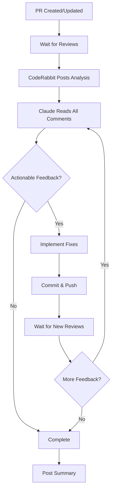

# Claude Iterative Review Handler

## Overview

This workflow creates an intelligent feedback loop where Claude automatically processes and addresses PR review comments, including those from CodeRabbit AI, GitHub Copilot, and human reviewers. The system iteratively reads comments, implements fixes, and pushes updates until all feedback is addressed.

## Key Features

### 🔄 Iterative Review Processing

- Continuously monitors PR comments and reviews
- Processes feedback from multiple sources:
  - **CodeRabbit AI** automated reviews
  - **GitHub Copilot** suggestions
  - **Human reviewer** comments
  - **CI/CD check** failures

### 🤖 Intelligent Response System

- Categorizes feedback into actionable items
- Implements valid suggestions automatically
- Documents reasoning for declined suggestions
- Maintains code quality and consistency

### 🔗 GitHub MCP Server Integration

The GitHub MCP server enables Claude to:

- Read all PR comments and reviews
- Access review threads and discussions
- Fetch issue and PR metadata
- Track review status and approvals

## How It Works



## Workflow Triggers

The workflow activates on:

1. **PR opened** with `claude-auto/` branch prefix
2. **New review comments** posted
3. **Review submitted** (approved/changes requested)
4. **Manual trigger** via workflow dispatch

## Configuration

### Required Secrets

```yaml
ANTHROPIC_API_KEY: Your Anthropic API key
GITHUB_TOKEN: Automatically provided (needs write permissions)
```

### MCP Servers Used

1. **GitHub MCP Server** (`@modelcontextprotocol/server-github`)
   - Reads PR comments, reviews, and metadata
   - Requires GITHUB_TOKEN environment variable

2. **Serena MCP Server**
   - Makes precise code modifications
   - Uses symbolic operations for accuracy

3. **Context7 MCP Server**
   - Retrieves latest library documentation
   - Helps implement best practices

4. **Playwright MCP Server** (optional)
   - Tests UI changes if needed
   - Validates user interactions

## Usage Examples

### Automatic Trigger

When a PR is created from a `claude-auto/` branch:

1. Initial implementation is pushed
2. CodeRabbit analyzes the code
3. This workflow automatically processes CodeRabbit's feedback
4. Fixes are implemented and pushed
5. Process repeats until no more actionable feedback

### Manual Trigger

```bash
# Trigger review processing for a specific PR
gh workflow run claude-iterative-review.yml \
  -f pr_number=140 \
  -f max_iterations=5
```

## Review Processing Logic

### Step 1: Fetch Reviews

Claude uses the GitHub MCP server to:

```javascript
// Pseudo-code of what Claude does
github.getPRComments(pr_number);
github.getPRReviews(pr_number);
github.getReviewThreads(pr_number);
```

### Step 2: Analyze Feedback

Claude categorizes comments:

- **Critical**: Must fix (security, bugs, broken functionality)
- **Important**: Should fix (performance, best practices)
- **Suggestions**: Nice to have (style, refactoring)
- **Questions**: Need clarification
- **False positives**: Won't fix (with explanation)

### Step 3: Implement Fixes

Using Serena's symbolic operations:

- Precisely modifies identified code sections
- Maintains code structure and formatting
- Ensures changes don't break other parts

### Step 4: Commit and Continue

- Commits with descriptive message
- Pushes to PR branch
- Waits for new reviews
- Repeats if needed (up to max iterations)

## CodeRabbit Integration

CodeRabbit typically provides:

1. **Code quality analysis**
2. **Security vulnerability detection**
3. **Performance suggestions**
4. **Best practice recommendations**
5. **Test coverage feedback**

Claude processes these by:

- Reading CodeRabbit's markdown-formatted comments
- Parsing specific suggestions and line references
- Implementing fixes for valid concerns
- Explaining why certain suggestions weren't followed

## Example Iteration

### Iteration 1: CodeRabbit finds issues

```markdown
CodeRabbit: "Hardcoded path '/home/runner/workspace' should use environment variable"
Claude: Implements fix using ${GITHUB_WORKSPACE}
```

### Iteration 2: Follow-up review

```markdown
CodeRabbit: "Good fix! Consider also updating the documentation"
Claude: Updates documentation to reflect the change
```

### Iteration 3: Final check

```markdown
CodeRabbit: "All issues resolved ✅"
Claude: Marks review as complete
```

## Customization Options

### Adjust Review Wait Times

```yaml
# In the workflow, modify sleep durations
sleep 30  # Initial wait for CodeRabbit
sleep 60  # Wait between iterations
```

### Set Maximum Iterations

```yaml
MAX_ITERATIONS: '5' # Prevent infinite loops
```

### Configure Review Sensitivity

```yaml
--temperature 0.2 # Lower = more conservative fixes
```

## Best Practices

1. **Set reasonable iteration limits** to prevent infinite loops
2. **Monitor the first few runs** to ensure quality
3. **Review Claude's fixes** before merging
4. **Customize prompts** for your specific needs
5. **Use branch protection** to require human approval

## Limitations and Considerations

1. **API Rate Limits**: GitHub and Anthropic have rate limits
2. **Context Windows**: Very large PRs may exceed token limits
3. **Complex Logic**: Some reviews may need human judgment
4. **Test Coverage**: Ensure automated tests validate changes
5. **Security**: Always review security-related changes manually

## Monitoring and Debugging

### Check Workflow Logs

```bash
# View workflow runs
gh run list --workflow=claude-iterative-review.yml

# View specific run logs
gh run view <run-id>
```

### Review Iteration Logs

Each iteration creates:

- `review-iteration-N.log`: Claude's processing log
- `review-prompt-N.md`: The prompt used
- Git commits with iteration numbers

### Debug MCP Connections

```bash
# Test GitHub MCP server
export GITHUB_TOKEN=<your-token>
npx @modelcontextprotocol/server-github test
```

## Security Considerations

1. **Token Permissions**: Ensure GITHUB_TOKEN has appropriate scope
2. **Secret Management**: Never commit API keys
3. **Code Validation**: Always validate generated code
4. **Access Control**: Limit who can trigger the workflow
5. **Audit Trail**: All changes are tracked in git history

## Future Enhancements

Potential improvements:

1. **Slack/Discord notifications** for review progress
2. **Custom review rules** per repository
3. **Learning from past reviews** to improve responses
4. **Integration with more review tools** (SonarQube, etc.)
5. **Parallel processing** of independent review comments
6. **Automatic test generation** for fixes
7. **Review comment templates** for common issues

## Troubleshooting

### Common Issues

| Problem                        | Solution                                                  |
| ------------------------------ | --------------------------------------------------------- |
| Can't read CodeRabbit comments | Ensure GitHub token has PR read permissions               |
| Changes not being made         | Check if comments are actionable (not just informational) |
| Infinite loop                  | Reduce MAX_ITERATIONS or add completion conditions        |
| MCP server connection fails    | Verify npm packages are installed correctly               |
| Commits rejected               | Check branch protection rules and permissions             |

## Example PR Flow with This System

1. Developer opens PR #140
2. CodeRabbit analyzes in ~30 seconds
3. CodeRabbit posts 5 suggestions
4. Claude reads all comments via GitHub MCP
5. Claude fixes 4 issues, explains why 1 is not applicable
6. Claude commits and pushes fixes
7. CodeRabbit re-analyzes
8. CodeRabbit approves changes
9. PR ready for human review
10. Human reviewer merges

This creates a highly efficient review cycle where most automated feedback is addressed without human intervention, allowing developers to focus on architectural and business logic reviews rather than style and convention issues.
