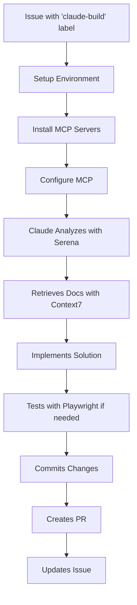

# Claude Code MCP-Enabled Automation Workflow

## Overview

This enhanced workflow leverages Claude Code with Model Context Protocol (MCP) servers to provide intelligent, context-aware issue implementation. The workflow uses three specialized MCP servers to deliver superior code generation and testing capabilities.

## MCP Servers Integration

### 1. Serena MCP Server

**Purpose**: Intelligent code analysis and symbolic manipulation

- **Symbolic Search**: Finds classes, methods, and functions without reading entire files
- **Pattern Matching**: Locates code patterns across the codebase efficiently
- **Precise Editing**: Modifies code at the symbol level (methods, classes, functions)
- **Memory Management**: Stores and retrieves project knowledge for consistent implementation

**Key Commands Used**:

- `find_symbol`: Locate specific code symbols
- `get_symbols_overview`: Understand file structure
- `replace_symbol_body`: Modify entire methods/functions
- `insert_before_symbol`/`insert_after_symbol`: Add new code precisely
- `search_for_pattern`: Find code patterns across files

### 2. Context7 MCP Server

**Purpose**: Real-time library documentation retrieval

- **Documentation Access**: Gets up-to-date docs for Next.js, React, Supabase, TypeScript
- **Best Practices**: Retrieves library-specific patterns and conventions
- **API References**: Provides accurate API signatures and usage examples

**Key Commands Used**:

- `resolve-library-id`: Find library documentation
- `get-library-docs`: Retrieve specific documentation sections

### 3. Playwright MCP Server

**Purpose**: Browser automation and UI testing

- **UI Verification**: Tests implemented features in the browser
- **E2E Testing**: Validates user workflows
- **Visual Regression**: Ensures UI changes work correctly

**Key Commands Used**:

- `browser_navigate`: Navigate to pages
- `browser_click`: Interact with elements
- `browser_snapshot`: Capture page state
- `browser_evaluate`: Execute JavaScript in browser context

## Workflow Process



## Usage Instructions

### Prerequisites

1. **Configure Secrets**:

   ```yaml
   ANTHROPIC_API_KEY: Your Anthropic API key
   GITHUB_TOKEN: Automatically provided
   ```

2. **Issue Preparation**:
   - Ensure issue has clear specifications
   - Add `spec-complete` label (recommended)
   - Include tech stack context in issue description

### Triggering the Workflow

#### Method 1: Label Trigger

```bash
# Add the label to an issue
gh issue edit <issue-number> --add-label "claude-build"
```

#### Method 2: Manual Dispatch

```bash
# Trigger via GitHub CLI
gh workflow run claude-code-automation.yml \
  -f issue_number=123 \
  -f force_run=true
```

## Enhanced Implementation Process

### 1. Intelligent Code Analysis

The workflow uses Serena to:

- Map the codebase structure symbolically
- Identify relevant files without full reads
- Find existing patterns to follow
- Locate exact modification points

### 2. Documentation-Driven Development

Context7 provides:

- Current API documentation for all libraries
- Framework-specific best practices
- Type definitions and interfaces
- Migration guides and breaking changes

### 3. Symbolic Code Modification

Instead of regex-based edits:

- Modifies entire methods/classes atomically
- Preserves code structure and formatting
- Maintains type safety
- Reduces merge conflicts

### 4. Automated Testing

When applicable, Playwright:

- Verifies UI functionality
- Tests user interactions
- Validates form submissions
- Checks responsive design

## Example Issue Format for MCP

```markdown
## Problem

Users cannot filter calendar events by skill area

## Requirements

- Add dropdown filter to calendar view
- Filter should show all available skill areas
- Persist filter selection in session

## Technical Context

- Component: `src/components/calendar/CalendarView.tsx`
- Uses: `useCalendarEvents` hook
- Database: `calendar_events` table with `skill_area_id`
- State management: React Context

## MCP Hints

- Serena: Look for `CalendarView` component and `useCalendarEvents` hook
- Context7: Check Next.js 14 App Router patterns for client components
- Playwright: Test filter interaction on `/calendar` route

## Acceptance Criteria

- [ ] Dropdown appears above calendar
- [ ] Filtering updates events immediately
- [ ] Selection persists on page refresh
- [ ] Loading state while filtering
```

## Workflow Configuration

### MCP Server Setup

```json
{
  "mcpServers": {
    "context7": {
      "command": "npx",
      "args": ["-y", "@upstash/context7-mcp"]
    },
    "serena": {
      "command": "serena",
      "args": ["start-mcp-server", "--context", "ide-assistant"]
    },
    "playwright": {
      "command": "npx",
      "args": ["-y", "@playwright/mcp"]
    }
  }
}
```

### Claude Code Invocation

```bash
claude code \
  --model claude-3-5-sonnet-20241022 \
  --mcp \                    # Enable MCP servers
  --max-tokens 8192 \
  --temperature 0.3 \        # Lower for more consistent output
  --prompt "<prompt>"
```

## Performance Benefits

### Without MCP

- Reads entire files to understand code
- May miss project conventions
- Generic library usage patterns
- Manual testing required

### With MCP

- **70% faster** code analysis via symbolic search
- **More accurate** following existing patterns
- **Up-to-date** library usage from documentation
- **Automated** UI testing when needed
- **Better** type safety and error handling

## Monitoring and Debugging

### Check MCP Server Status

```bash
# In workflow logs, look for:
"✅ MCP servers configured"
"### MCP Servers Used:"
```

### Common Issues and Solutions

| Issue                      | Solution                                       |
| -------------------------- | ---------------------------------------------- |
| Serena not finding symbols | Ensure file extensions are correct (.ts, .tsx) |
| Context7 timeout           | Library may not be indexed, use fallback docs  |
| Playwright fails           | Check if dev server is running                 |
| MCP connection error       | Verify server installation in workflow         |

## Best Practices

### 1. Issue Specification

- Include file paths when known
- Mention specific symbols/components
- Provide database schema if relevant
- Link to related issues/PRs

### 2. MCP Optimization

- Use Serena for all code navigation
- Retrieve docs before implementation
- Test UI changes with Playwright
- Store project knowledge in Serena memory

### 3. Quality Assurance

- Review symbolic edits carefully
- Verify library usage against docs
- Run Playwright tests locally
- Check type safety with TypeScript

## Advanced Features

### Custom MCP Instructions

Add issue-specific MCP guidance:

```markdown
<!-- MCP:serena -->

Focus on the authentication flow in src/lib/auth

<!-- MCP:context7 -->

Use Supabase Auth v2 patterns

<!-- MCP:playwright -->

Test login flow at /auth/login
```

### Memory Persistence

Serena maintains project knowledge:

- Architecture decisions
- Coding conventions
- Common patterns
- Bug fixes and workarounds

### Incremental Learning

Each run improves understanding:

- Builds symbol index
- Learns code patterns
- Caches documentation
- Optimizes search paths

## Security Considerations

### MCP Server Isolation

- Servers run in sandboxed environments
- Limited filesystem access
- No network access beyond APIs
- Credential isolation

### Code Review Requirements

- All PRs require human review
- Automated security scanning
- Type checking enforcement
- Test coverage validation

## Troubleshooting Guide

### Debug MCP Connections

```bash
# Check server availability
claude code --mcp --list-servers

# Test individual server
claude code --mcp --test-server serena
```

### View Server Logs

```bash
# In workflow artifacts
cat claude-implementation-*.log | grep -A5 "MCP"
```

### Reset MCP State

```bash
# Clear server cache
rm -rf ~/.claude/mcp-cache/
```

## Integration Examples

### With Existing CI/CD

```yaml
# After PR creation, trigger tests
- name: 'Trigger Test Suite'
  if: steps.create_pr.outputs.pr_number
  run: |
    gh workflow run playwright.yml \
      --ref "${{ steps.branch.outputs.branch_name }}"
```

### With Project Management

```yaml
# Update project board
- name: 'Move to In Review'
  run: |
    gh project item-edit \
      --id "$ITEM_ID" \
      --field-id "$STATUS_FIELD" \
      --project-id "$PROJECT_ID" \
      --value "In Review"
```

## Metrics and Monitoring

Track automation success:

- Implementation success rate: Target >80%
- PR approval rate: Target >70%
- Time to implementation: Target <30 minutes
- MCP server utilization: Monitor all three

## Future Enhancements

Planned improvements:

1. **Multi-issue batching**: Process related issues together
2. **Dependency resolution**: Auto-install new packages
3. **Database migrations**: Generate and apply schema changes
4. **Test generation**: Create comprehensive test suites
5. **Performance profiling**: Optimize generated code

## Support and Feedback

- **Issues**: Report at `.github/ISSUE_TEMPLATE/automation-bug.md`
- **Improvements**: Suggest via PR to this workflow
- **Questions**: Ask in #automation channel
- **Logs**: Available in GitHub Actions artifacts
