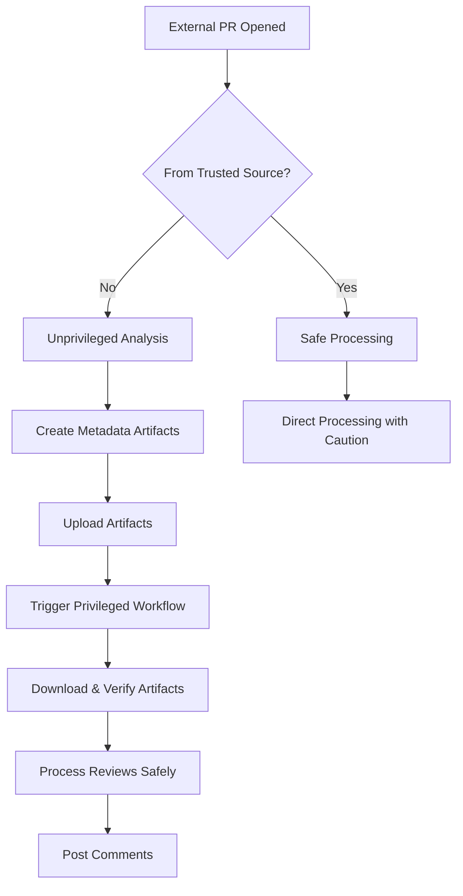

# Security Guide for Claude Automation Workflows

## Overview

This guide explains the security measures implemented in the Claude automation workflows to prevent unauthorized code execution and protect repository secrets.

## Security Architecture

### Two-Tier Workflow System

To prevent security vulnerabilities from untrusted PR code execution, we use a two-tier workflow system:

1. **Unprivileged Tier** (`claude-review-receiver.yml`)
   - Runs on `pull_request` events
   - Has NO access to secrets
   - Checks out PR code in isolated environment
   - Performs only static analysis
   - Creates artifacts with metadata

2. **Privileged Tier** (`claude-review-processor.yml`)
   - Runs on `workflow_run` completion
   - Has access to secrets (ANTHROPIC_API_KEY, GITHUB_TOKEN)
   - Does NOT checkout untrusted PR code
   - Downloads and validates artifacts
   - Processes reviews safely

## Security Principles

### 1. Never Execute Untrusted Code with Secrets

❌ **DANGEROUS** - What NOT to do:

```yaml
on: pull_request_target
jobs:
  build:
    steps:
      - uses: actions/checkout@v4
        with:
          ref: ${{ github.event.pull_request.head.sha }}
      - run: npm install # DANGER: Executes package.json scripts
      - run: npm test # DANGER: Runs potentially malicious tests
        env:
          API_KEY: ${{ secrets.API_KEY }} # DANGER: Exposes secrets
```

✅ **SAFE** - What we do instead:

```yaml
# Unprivileged workflow
on: pull_request
jobs:
  analyze:
    steps:
      - uses: actions/checkout@v4
      - run: echo "Safe static analysis only"
      # No secrets, no code execution

# Privileged workflow
on: workflow_run
jobs:
  process:
    steps:
      - name: Process safely
        env:
          API_KEY: ${{ secrets.API_KEY }}
        run: |
          # Process without checking out PR code
```

### 2. Validate All Inputs

All data from PRs is treated as untrusted and validated:

```bash
# Validate PR number is numeric
if ! [[ "$PR_NUMBER" =~ ^[0-9]+$ ]]; then
  echo "::error::Invalid PR number"
  exit 1
fi

# Sanitize branch names
PR_BRANCH=$(echo "$PR_BRANCH" | tr -cd '[:alnum:]/_-')
```

### 3. Trust Boundaries

We establish clear trust boundaries:

**Trusted Sources:**

- Repository maintainers (`bstewart2255`)
- Bot accounts (`dependabot[bot]`, `claude-automation[bot]`)
- Branches created by our automation (`claude-auto/*`)

**Untrusted Sources:**

- External fork PRs
- First-time contributors
- Any PR without explicit trust signals

### 4. Artifact Verification

Artifacts passed between workflows are verified:

```bash
# Create checksums
sha256sum pr_artifacts/* > pr_artifacts/checksums.txt

# Verify on download
if ! sha256sum -c checksums.txt; then
  echo "::error::Artifact tampering detected!"
  exit 1
fi
```

## Attack Vectors Mitigated

### 1. Malicious Package.json Scripts

**Attack:** PR modifies package.json to run malicious scripts during `npm install`
**Mitigation:** Never run `npm install` on PR code in privileged context

### 2. Secret Exfiltration

**Attack:** PR code tries to access and send secrets to external server
**Mitigation:** Untrusted code never runs with access to secrets

### 3. Workflow File Poisoning

**Attack:** PR modifies `.github/workflows/` files to add malicious steps
**Mitigation:** Workflow files from PR are not executed; only base branch workflows run

### 4. Path Traversal

**Attack:** PR tries to access files outside repository
**Mitigation:** PR code runs in unprivileged container without sensitive access

### 5. Command Injection

**Attack:** PR injects commands through environment variables or file names
**Mitigation:** All inputs are sanitized and validated before use

## Safe PR Processing Flow



## Manual Review Requirements

PRs from untrusted sources require manual review before automated processing:

1. Maintainer reviews PR code
2. Adds `safe-to-test` label if approved
3. Automation proceeds with processing

## Testing Security

### Local Testing

```bash
# Test with untrusted PR simulation
act pull_request -e test-pr.json --secret-file .env.test

# Verify no secrets exposed
grep -r "SECRET\|TOKEN\|KEY" workflow-logs/
```

### Security Checklist

- [ ] Workflows use `pull_request` not `pull_request_target` for untrusted code
- [ ] Secrets only available in `workflow_run` triggered workflows
- [ ] All PR data validated before use
- [ ] Artifacts verified with checksums
- [ ] Trust boundaries clearly defined
- [ ] No `npm install` or code execution on PR code with secrets

## Configuration

### Required Secrets

- `ANTHROPIC_API_KEY`: Only used in privileged workflows
- `GITHUB_TOKEN`: Automatic, but check permissions

### Security Settings

```yaml
# .github/dependabot.yml
version: 2
updates:
  - package-ecosystem: 'github-actions'
    directory: '/'
    schedule:
      interval: 'weekly'
    # Automatically update action versions for security
```

### Branch Protection Rules

- Require PR reviews before merge
- Dismiss stale reviews on new commits
- Require status checks to pass
- Include administrators in restrictions

## Incident Response

If a security issue is detected:

1. **Immediate:** Disable affected workflows
2. **Investigate:** Check audit logs for unauthorized access
3. **Remediate:** Rotate any potentially exposed secrets
4. **Document:** Create security incident report
5. **Improve:** Update workflows to prevent recurrence

## Best Practices

1. **Principle of Least Privilege**
   - Grant minimum necessary permissions
   - Use fine-grained PATs when possible

2. **Defense in Depth**
   - Multiple security layers
   - Assume breach and limit damage

3. **Regular Audits**
   - Review workflow permissions monthly
   - Check for deprecated actions
   - Update dependencies regularly

4. **Security Training**
   - All contributors should understand these principles
   - Document security requirements in CONTRIBUTING.md

## Additional Resources

- [GitHub Security Best Practices](https://docs.github.com/en/actions/security-guides/security-hardening-for-github-actions)
- [OWASP GitHub Actions Security](https://owasp.org/www-project-top-10-ci-cd-security-risks/)
- [Keeping your GitHub Actions and workflows secure](https://securitylab.github.com/research/github-actions-preventing-pwn-requests/)

## Contact

For security concerns or questions:

- Open a security advisory (private)
- Email: security@[your-domain].com
- Do NOT open public issues for security vulnerabilities
