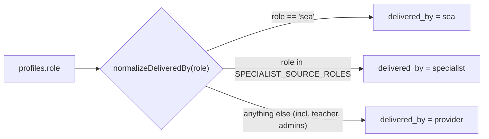
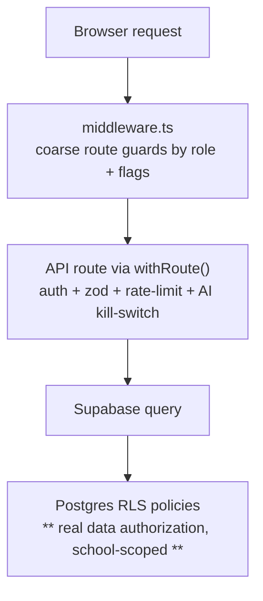
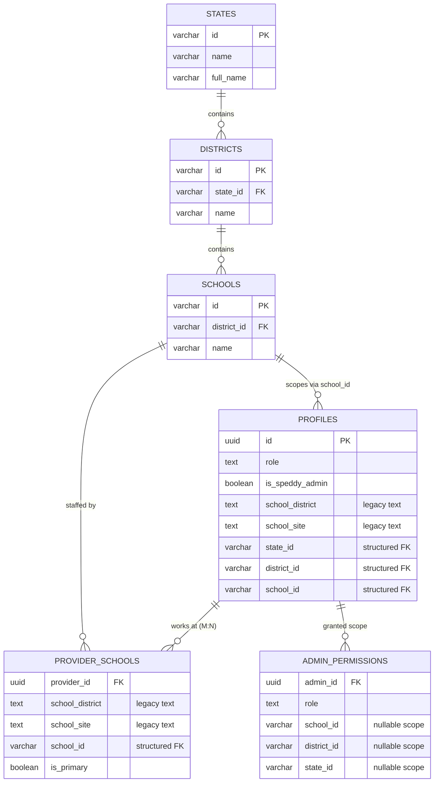
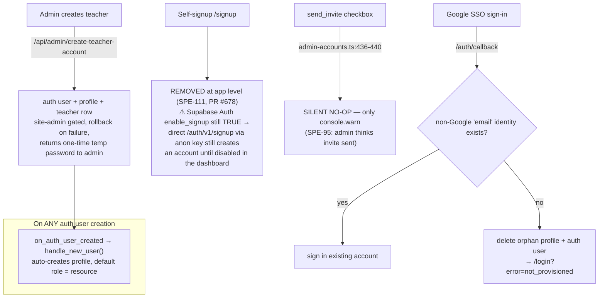
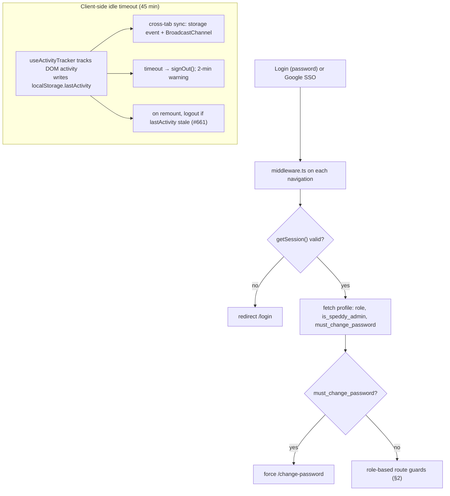
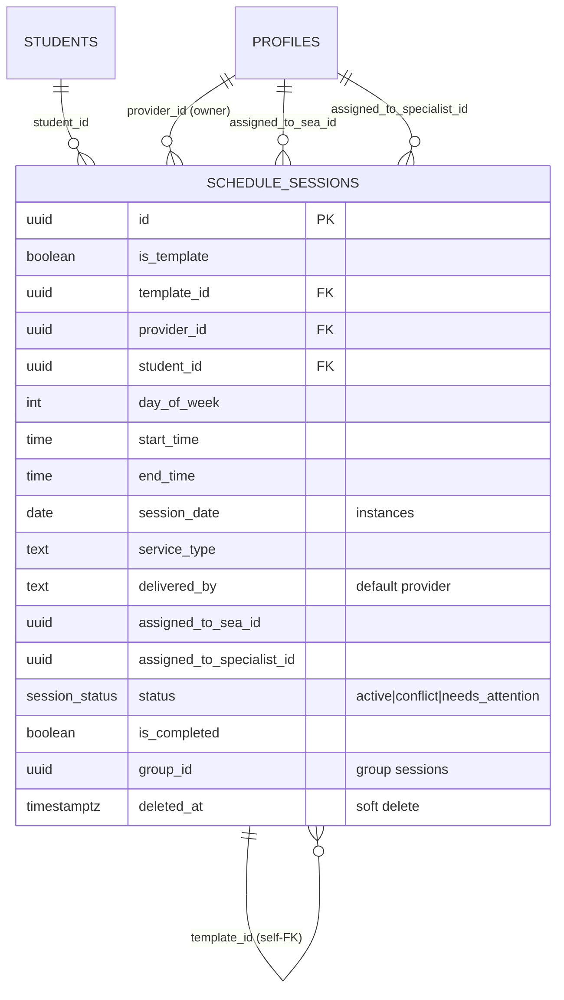
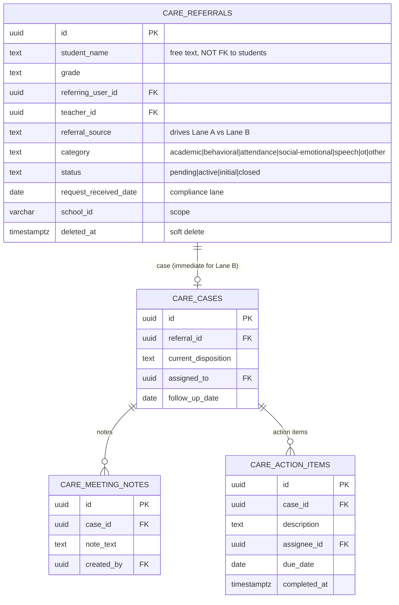
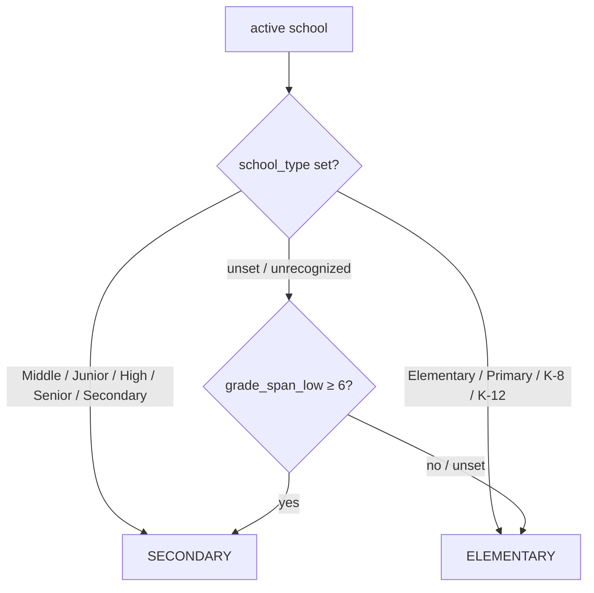

# Speddy — Architecture Reference

> **Purpose.** A grounded, how-it-works reference for the Speddy domain model:
> roles, permissions, org scoping, account creation, auth/session, scheduling,
> data retention, and the CARE module. Written for **both humans and AI coding
> agents** (e.g. future Claude Code sessions) so the system can be understood
> quickly without re-deriving it from scratch.
>
> **Companion to the Miro board** "Speddy" (team Copa) —
> <https://miro.com/app/board/uXjVHB37buI=/>. The board is the visual version of
> the same 8 sections; this file is the text version that lives next to the code
> (greppable, diffable, and readable by agents that don't have the Miro
> connector).
>
> **Last verified:** 2026-06-26, against the live Supabase schema (project
> `qkcruccytmmdajfavpgb`), `supabase/migrations/`, and the files cited in each
> section. Diagrams use [Mermaid](https://mermaid.js.org/) and render on GitHub.
>
> **Not** a quality review — see `docs/2025-09-18-architecture-review.md` for
> that. This describes how the system behaves today.
>
> ## Keeping this current
> Each section ends with a **Source of truth** list (the files/migrations the
> facts come from). When you change one of those, update the matching section.
> Re-verify a claim before relying on it; treat the **Known gaps** as live
> (they're cross-referenced to Linear `SPE-###` tickets that may close).

---

## TL;DR for an agent picking this up cold

- **Authorization is RLS-first.** Postgres Row-Level Security on each domain
  table is the real data-authorization layer, scoped by school/ownership.
  Middleware only does **coarse route redirects**; the API `withRoute` wrapper
  does auth + rate-limit + an AI kill-switch but **has no role gate**.
- **`profiles.role` has 11 values** (live CHECK constraint):
  `resource, speech, ot, counseling, specialist, sea, teacher, site_admin,
  district_admin, psychologist, intervention`.
- **`is_speddy_admin` is a separate boolean**, not a role — it gates `/internal`
  (platform/internal admin).
- **"provider" is not a role.** It's a *delivery category*. `delivered_by`
  (on `schedule_sessions`) is one of `provider | sea | specialist`, derived from
  the account role by `normalizeDeliveredBy()`.
- **Self-signup is dead** (admin-created accounts only) — see SPE-111. SSO
  (Google) can sign in existing users but **never creates** an account.
- **Org scoping uses two parallel systems** on `profiles`/`provider_schools`:
  legacy free-text (`school_district`, `school_site`) **and** structured FK ids
  (`state_id`, `district_id`, `school_id`). Both coexist today.
- **Audit logging is scaffolded but unwired** (`audit_logs` table is empty;
  `logAccess()` is never called) — SPE-169.
- **Elementary-first.** A school is *elementary* or *secondary* (`isSecondarySchool`,
  by `school_type` / `grade_span_low ≥ 6`); on a **secondary** site the scheduling
  surfaces (Schedule, Bell Schedules, Special Activities, Plan) are hidden for
  providers/teachers/SEAs. Client-side only — §9, SPE-193.

### Highest-value file map

| Concern | File / migration |
|---|---|
| Role enum (source of truth) | `supabase/migrations/20260410_add_intervention_role.sql` + live `profiles_role_check` |
| Role → delivery mapping | `lib/auth/role-utils.ts` (`normalizeDeliveredBy`, `SPECIALIST_SOURCE_ROLES`) |
| Role display labels | `lib/utils/role-utils.ts` (`formatRoleLabel`) |
| Route guards | `middleware.ts` |
| API wrapper (auth/rate-limit/AI gate) | `lib/api/with-route.ts` |
| Session idle timeout | `lib/config/session-timeout.ts`, `lib/hooks/use-activity-tracker.ts`, `app/components/providers/auth-provider.tsx` |
| SSO provisioning gate | `app/auth/callback/route.ts` |
| Admin teacher creation | `app/api/admin/create-teacher-account/route.ts` |
| Scheduling model | `schedule_sessions` table; `lib/scheduling/` |
| Retention cron jobs | `app/api/cron/*`, `vercel.json` |
| CARE module | `supabase/migrations/20251222_create_care_meeting_tables.sql`, `lib/supabase/queries/care-referrals.ts` |
| Elementary vs secondary split | `lib/school-helpers.ts` (`isSecondarySchool`); `app/components/providers/school-context.tsx`; `app/components/navigation/navbar.tsx` |

---

## Table of contents
1. [User Types & Roles](#1-user-types--roles)
2. [Permissions & Access Model](#2-permissions--access-model)
3. [Org Hierarchy & Scoping](#3-org-hierarchy--scoping)
4. [Account Creation & Invite Flows](#4-account-creation--invite-flows)
5. [Auth & Session Lifecycle](#5-auth--session-lifecycle)
6. [Scheduling / Session Data Model](#6-scheduling--session-data-model)
7. [Data Lifecycle & Retention](#7-data-lifecycle--retention)
8. [CARE / Referrals Model](#8-care--referrals-model)
9. [Elementary vs Secondary (school-level experience)](#9-elementary-vs-secondary-school-level-experience)
- [Appendix A — Known gaps (open Linear tickets)](#appendix-a--known-gaps-open-linear-tickets)

---

## 1. User Types & Roles

`profiles.role` is a single `text` column constrained to **11 values** (live
`profiles_role_check`). A separate boolean `profiles.is_speddy_admin` marks
platform/internal admins and is **orthogonal** to `role`.

Functionally the roles group like this:

| Group | Roles | Notes |
|---|---|---|
| **Service providers** | `resource`, `speech`, `ot`, `counseling`, `specialist`, `psychologist`, `intervention` | The clinicians who own sessions. All normalize to `delivered_by = 'specialist'`. |
| **SEA** (Special Ed Assistant) | `sea` | Delivers sessions under supervision. Intentionally **lesson view-only** at the RLS layer (`20260529_restrict_sea_lesson_access.sql`). Normalizes to `delivered_by = 'sea'`. |
| **Gen-ed teacher** | `teacher` | Routed to `/dashboard/teacher`. |
| **Org admins** | `site_admin`, `district_admin` | Routed to `/dashboard/admin`. Scope comes from `admin_permissions` (§3). |
| **Platform admin** | *(flag)* `is_speddy_admin = true` | Not a role. Gates `/internal`. |

### "provider" is a delivery category, not a role
There is **no `provider` role** in the enum, yet `schedule_sessions.delivered_by`
defaults to `'provider'` and `normalizeDeliveredBy()` falls back to `'provider'`.
`delivered_by ∈ { provider | sea | specialist }` describes **who runs a given
session**, derived from the owner's role:

`SPECIALIST_SOURCE_ROLES = [resource, specialist, speech, ot, counseling,
psychologist, intervention]` (`lib/auth/role-utils.ts`).

**Display labels** (`formatRoleLabel`, `lib/utils/role-utils.ts`): `speech→Speech`,
`ot→OT`, `counseling→Counseling`, `resource→Resource`, `psychologist→Psych`,
`specialist→Specialist`; anything else is capitalized.

**Source of truth:** `supabase/migrations/20260410_add_intervention_role.sql`
(latest `profiles_role_check`); `lib/auth/role-utils.ts`;
`lib/utils/role-utils.ts`; `supabase/migrations/20260529_restrict_sea_lesson_access.sql`.

---

## 2. Permissions & Access Model

Authorization is enforced at **three layers**, but only one of them actually
guards *data*:

1. **Middleware** (`middleware.ts`) — redirects only. Reads `role`,
   `is_speddy_admin`, `must_change_password` and bounces users to the right
   dashboard. Authenticates with `getSession()` (cookie-trusting, not
   `getUser()`) — tracked in **SPE-132**.
2. **`withRoute`** (`lib/api/with-route.ts`) — composable wrapper offering
   `auth` (via `getUser()`), zod `body`/`query` validation, per-user
   `rateLimit`, and `aiGated` (404s every gated route while
   `AI_FEATURES_ENABLED !== 'true'`). **There is no `role` option** — see the
   known gap below.
3. **RLS** — the authoritative layer. Domain tables (students, sessions, CARE,
   etc.) carry policies scoped to the user's school(s) and/or ownership. Admin
   scope is granted via `admin_permissions` (§3).

### Route-guard matrix (from `middleware.ts`)

| Path prefix | Who's allowed | Else → |
|---|---|---|
| `/`, `/how-it-works`, `/login`, `/signup`, `/terms`, `/privacy`, `/ferpa`, `/auth/callback` | public | — |
| `must_change_password = true` | only `/change-password` | `/change-password` |
| `/internal` | `is_speddy_admin` only | `/dashboard` |
| `/dashboard/admin` | `site_admin`, `district_admin` | `/dashboard` |
| `/dashboard/teacher` | `teacher` | `/dashboard` |
| `/dashboard/care` | **all authenticated users** | — |
| other `/dashboard/*` | authenticated; admins & teachers redirected to their own dashboards | — |

> **Known gap — SPE-187 (security, Medium):** the AI generation routes
> (`app/api/lessons/generate`, `lessons/v2`, `exit-tickets/generate`,
> `progress-check/generate`, `ai-upload`) are `aiGated` + rate-limited but have
> **no role check**. Any authenticated user — including `sea` (lesson view-only)
> and `teacher` — could call them once AI is enabled. Not exploitable today
> because `AI_FEATURES_ENABLED` is off (routes 404). For a non-lesson role,
> `isValidTeacherRole` (`lib/lessons/schema.ts:552`,
> `['resource','ot','speech','counseling']`) silently falls back to `resource`.

**Source of truth:** `middleware.ts`; `lib/api/with-route.ts`;
`lib/lessons/schema.ts`.

---

## 3. Org Hierarchy & Scoping

Two things live here: a **geographic hierarchy** (reference data) and the
**scoping fields** that bind a user to it.

- **Geographic hierarchy:** `states → districts → schools`, keyed by **string
  (`varchar`) ids**, not uuids. This is shared reference data.
- **`profiles` scoping uses two parallel systems — both present today:**
  - **Legacy free-text:** `school_district`, `school_site`, `district_domain`
    (all `NOT NULL`). The original model.
  - **Structured FK ids:** `state_id`, `district_id`, `school_id` (`varchar`,
    nullable) — the newer normalized refs into the hierarchy tables.
  - Treat this as a migration-in-progress: code may read either. Check which a
    given query uses before assuming.
- **`provider_schools` (M:N):** a provider can serve multiple schools; rows carry
  both the legacy text pair and structured ids, plus `is_primary`. RLS policies
  commonly union "my profile's school" with "my `provider_schools` schools".
- **`admin_permissions`:** grants an admin a scope at school/district/state
  level (`school_id`/`district_id`/`state_id` nullable; `granted_by`,
  `granted_at`). This is what gives `site_admin`/`district_admin` their reach in
  RLS — distinct from `is_speddy_admin`, which is platform-wide.

**Source of truth:** live tables `states`, `districts`, `schools`, `profiles`,
`provider_schools`, `admin_permissions`;
`supabase/migrations/20251112_add_admin_roles_and_school_scoped_teachers.sql`.

---

## 4. Account Creation & Invite Flows

Accounts are **created by admins**, not by end users. Self-signup has been
**removed** (SPE-111, PR #678); the remaining paths are one real (admin
creation), one broken (`send_invite`), plus Google SSO sign-in:

- **Real:** `app/api/admin/create-teacher-account/route.ts` — site-admin gated;
  creates the auth user (with a generated **temporary password**) + profile +
  teacher record, with rollback on failure. The temp password is **returned to
  the admin once** to relay to the teacher; the route does **not** set
  `must_change_password`, so the teacher is **not** force-redirected to
  `/change-password` on first login (that flag is set by the admin
  password-reset flow, not creation — see §5; tracked in **SPE-190**).
- **Profile auto-creation trigger:** `on_auth_user_created → handle_new_user()`
  creates a `profiles` row (default role `resource`) for **every** new auth
  user. This is why the SSO gate (§5) can't rely on "profile exists".
- **Removed — SPE-111 (done, PR #678):** the self-signup UI (`app/(auth)/signup/*`),
  `app/api/auth/signup/route.ts`, the auth-provider `signUp()`, and the `/signup`
  route-allowlist entries are **deleted** — account creation is admin-only. (There
  were no real subscription/billing remnants — only an unused `STRIPE_ERROR` enum.)
  > **Residual gap (open):** the app-level removal does **not** disable Supabase
  > Auth itself. `enable_signup = true` (`supabase/config.toml`) plus the
  > `handle_new_user` trigger means a direct `POST /auth/v1/signup` with the public
  > anon key still creates an auth user + profile. To fully enforce admin-only,
  > **disable Auth-level email signup in the production Supabase dashboard.** Safe:
  > all admin flows use `auth.admin.createUser`, which bypasses `enable_signup`.
- **Broken — SPE-95 (Urgent):** the `send_invite` branch in
  `lib/supabase/queries/admin-accounts.ts:436-440` only `console.warn`s — no
  invite, no auth user. Admins believe a teacher was invited when nothing
  happened.

**Source of truth:** `app/api/admin/create-teacher-account/route.ts`;
`app/auth/callback/route.ts`; `lib/supabase/queries/admin-accounts.ts`;
`supabase/migrations/20250117_create_profile_on_signup.sql`.

---

## 5. Auth & Session Lifecycle

- **Middleware** authenticates with `getSession()` and fetches the profile on
  each navigation; sets `x-user-id/-email/-role` headers downstream.
- **`must_change_password`** locks the user to `/change-password` until cleared.
  It is set by the **admin password-reset** flow (`app/api/admin/reset-password`),
  enforced by middleware + `app/api/auth/login`, and cleared by
  `app/api/auth/change-password`. Account *creation* does **not** set it (SPE-190).
- **Idle timeout** (`lib/config/session-timeout.ts`): default **45 min**
  (`NEXT_PUBLIC_SESSION_TIMEOUT`, `2_700_000` ms), **2-min** warning,
  **30 s** activity throttle, with `KEEP_ALIVE_ACTIVITIES`
  (`ai-upload`, `lesson-generation`, `file-upload`, `worksheet-generation`) and
  `EXEMPT_ROUTES`. Wired by `useActivityTracker` + `auth-provider.tsx`;
  cross-tab via storage event + `BroadcastChannel`; #661 enforces the window
  across tab/browser close.
- **SSO provisioning gate** (`app/auth/callback/route.ts`): allows a Google
  sign-in only if a non-Google (`email`) identity already exists; otherwise it
  deletes the orphan profile + auth user and redirects
  `/login?error=not_provisioned`. SSO never creates accounts.

> **Known gaps:**
> - **SPE-188 (security, Low):** the idle logout is **client-side only**. The
>   Supabase access/refresh token lifetimes are independent of the 45-min idle
>   window; a client without JS, or one holding tokens directly, isn't subject
>   to it. Matters for shared school devices (FERPA threat model).
> - **SPE-132 (perf/security):** middleware uses `getSession()` (cookie-trusting)
>   rather than `getUser()`, and runs a `profiles` query on every navigation.

**Source of truth:** `middleware.ts`; `lib/config/session-timeout.ts`;
`lib/hooks/use-activity-tracker.ts`;
`app/components/providers/auth-provider.tsx`; `app/auth/callback/route.ts`.

---

## 6. Scheduling / Session Data Model

`schedule_sessions` is the core table. It uses a **template → instance** pattern:
a template defines a recurring weekly slot; instances are the dated occurrences.

- **Template vs instance:** `is_template = true` rows hold the recurring
  definition (`day_of_week`, `start_time`, `end_time`); instances reference the
  template via `template_id` and carry a concrete `session_date`.
- **Who delivers it:** `delivered_by` (`provider | sea | specialist`, default
  `provider`) plus the optional `assigned_to_sea_id` / `assigned_to_specialist_id`
  delegations. A DB trigger (`handle_assignee_deletion`) reverts `delivered_by`
  back to `provider` if the assignee profile is deleted.
- **Status:** `session_status` enum = `active | conflict | needs_attention`;
  companion flags `has_conflict`, `conflict_reason`, `outside_schedule_conflict`,
  `manually_placed`.
- **Completion & grouping:** `is_completed` / `completed_at` / `completed_by` /
  `session_notes`; group sessions via `group_id` / `group_name` / `group_color`.
- **Soft delete:** `deleted_at` (rows are not always hard-deleted here).

**Source of truth:** live `schedule_sessions` table + `session_status` enum;
`lib/scheduling/`; `lib/auth/role-utils.ts` (delivered_by derivation).

---

## 7. Data Lifecycle & Retention

### Scheduled cleanup (cron)
Both cron routes authenticate with a shared `CRON_SECRET` (header
`x-cron-secret` or `Authorization: Bearer …`) and are scheduled in `vercel.json`.

| Job | Schedule (UTC) | What it deletes |
|---|---|---|
| `cleanup-uploads` | `0 8 * * *` (08:00 daily) | `upload_rate_limits` older than **7 days**; optionally `analytics_events` older than **90 days** when `CLEANUP_ANALYTICS=true`. |
| `cleanup-worksheet-images` | `0 9 * * *` (09:00 daily) | `worksheet_submissions` older than **12 months** + their Storage objects (storage-first, chunked, `moreRemaining` flag for backlog). |
| `health` | — | unauthenticated, read-only status. |

### Deletion semantics
- **Soft delete:** `schedule_sessions.deleted_at`, `care_referrals.deleted_at`.
- **Hard delete (admin "delete student"):**
  `app/api/admin/students/[studentId]` runs the row delete under the **admin's
  own RLS session** (keeps the DB authz backstop), cascades FK children, then
  uses the **service role** only for what RLS/cascade can't reach:
  1. **Storage objects** (worksheets / submissions buckets) — cascade deletes
     rows, never Storage objects.
  2. **CARE referrals** — linked to a student only by **free-text name**, so
     they never cascade; name matches are **surfaced for the admin to confirm**
     and deleted via `app/api/admin/care-referrals/[referralId]`, never
     auto-deleted (a name match can be ambiguous).

### Audit logging — scaffolded but unwired
> **Known gap — SPE-169 (security, High).** An `audit_logs` table exists in the
> DB (columns `id, user_id, action, resource_type, resource_id, metadata,
> timestamp, created_at`) but holds **0 rows**, and the helper
> `lib/supabase/audit-log.ts` (`logAccess()`, fire-and-forget insert) is **never
> imported or called anywhere**. So there is no functioning audit trail today.
> The FERPA page wording was softened to the truthful interim language (RLS +
> auth) under **SPE-134**; SPE-169 is the "build real audit logging" ticket and
> should restore the wording once shipped. Whoever builds it should decide
> whether to wire up / replace this existing scaffold.

**Source of truth:** `app/api/cron/cleanup-uploads/route.ts`;
`app/api/cron/cleanup-worksheet-images/route.ts`; `vercel.json`;
`app/api/admin/students/[studentId]/route.ts`;
`app/api/admin/care-referrals/[referralId]/route.ts`;
`lib/supabase/audit-log.ts`; `docs/CRON_CLEANUP.md`.

---

## 8. CARE / Referrals Model

CARE (the student-support / referral workflow) is a self-contained set of four
tables. Crucially, a referral identifies the student by **free-text name** — it
is **not** foreign-keyed to `students` (which is why student deletion can only
surface CARE by name match; see §7).

- **Two intake lanes**, chosen at submit time by `referral_source`
  (`lib/constants/care.ts`; `addCareReferral` in `care-referrals.ts`):
  - **Lane A — discussion** (most sources, e.g. `teacher_concern`): the referral
    starts `status = 'pending'`; a `care_cases` row is created when it becomes
    `active`; notes and action items hang off the case; it resolves to `closed`.
  - **Lane B — compliance** (`parent_written_request`, `private_school`): the
    referral is born directly into `status = 'initial'` with a case created
    immediately and an `ap_due_date` pre-filled to `request_received_date + 15
    days` (CA Ed. Code 56321 assessment-plan timeline).
  - Live values — `status`: `pending | active | initial | closed`; `category`:
    `academic | behavioral | attendance | social-emotional | speech | ot | other`.
- **Access:** the CARE dashboard (`/dashboard/care`) is open to **all
  authenticated users** (middleware §2).
- **RLS:** school-scoped — `school_id IN (profile's school ∪ provider_schools)`;
  notes/action-items reach scope via the `case → referral` join; insert policies
  require `referring_user_id` / `created_by = auth.uid()`.
- **Cascade & soft delete:** `care_cases`, `care_meeting_notes`,
  `care_action_items` are all `ON DELETE CASCADE` from their parents — deleting a
  referral removes its entire tree. Referrals also support **soft delete**
  (`deleted_at`, `softDeleteReferral`). Admin hard-delete goes through
  `app/api/admin/care-referrals/[referralId]` (service role after a school-scope
  check, so it also covers the district-admin-over-another-school case RLS
  doesn't).

**Source of truth:** live `care_referrals` CHECK constraints + columns;
`supabase/migrations/20251222_create_care_meeting_tables.sql`,
`20260106_care_status_and_initial_stage.sql`,
`20260107_add_speech_ot_care_categories.sql`,
`20260516_care_lane_b_compliance.sql`; `lib/constants/care.ts`;
`lib/supabase/queries/care-referrals.ts`;
`app/api/admin/care-referrals/[referralId]/route.ts`.

---

## 9. Elementary vs Secondary (school-level experience)

Speddy is **elementary-first**. Every school is classified **elementary** or
**secondary** (middle/high), and that flag trims the provider/teacher/SEA
experience. It is a property of the **school**, not the user's role or a
student's grade — an itinerant provider gets the elementary UX at one site and
the trimmed secondary UX at another, on the same login.

**How it's decided** — `lib/school-helpers.ts` → `isSecondarySchool()` (SPE-146),
evaluated for the **active** school via `useSchool().isSecondary`:

K-8 and K-12 combined sites are treated as **elementary** by product decision
(they run elementary-style scheduling for their lower grades).

**What a secondary site changes** (all client-side, in the six files that read
`isSecondary`):

| Surface | Behavior on secondary | Where |
|---|---|---|
| Nav (`SECONDARY_HIDDEN_HREFS`) | Hides Schedule, Bell Schedules, Special Activities, Plan, teacher Special Activities | `app/components/navigation/navbar.tsx` |
| Dashboard | Hides the provider Weekly-view + Attendance widget | `app/(dashboard)/dashboard/page.tsx` |
| Students list | Hides the "unscheduled sessions" alert | `app/(dashboard)/dashboard/students/page.tsx` |
| Student modal | Hides the Attendance tab + Sessions/Minutes fields | `app/components/students/student-details-modal.tsx` |
| Teacher student view | "Resource Specialist" → "Case Manager"; accommodations surfaced first | `app/(dashboard)/dashboard/teacher/my-students/[studentId]/page.tsx` |

**Unchanged across both:** students/caseload, AI lessons/worksheets/exit tickets
(grade-driven, not school-type-driven), IEP goals/accommodations, sign-up.
**Admin and Speddy-Internal portals are unaffected** — admins manage both kinds
of school (Master Schedule stays), and Internal sets the `school_type` /
`grade_span` that drive the split.

> **Known gap — SPE-193 (Low):** the gating is **presentation-only**.
> `middleware.ts` has no school-level guard and the hidden pages don't self-check
> `isSecondary`, so `/dashboard/schedule`, `/dashboard/bell-schedules`,
> `/dashboard/special-activities`, and `/dashboard/plan` stay reachable by direct
> URL on a secondary site (RLS still scopes data).
>
> **Known gap — SPE-194 (Medium):** the model is **one teacher per student**
> (`students.teacher_id`, a single FK; the Teacher roster query is
> `students … eq('teacher_id', …)`). Secondary students have **many** teachers
> (one per subject/period), which the current model can't represent —
> foundational for real secondary support; complements the SPE-181 rostering spike.

**Source of truth:** `lib/school-helpers.ts` (`isSecondarySchool`,
`classifyByType`, `parseGradeLevel`); `app/components/providers/school-context.tsx`
(`useSchool().isSecondary`); `app/components/navigation/navbar.tsx`;
`schools.school_type` / `grade_span_low`.

---

## Appendix A — Known gaps (open Linear tickets)

Captured while mapping the model (the board + this doc). Status as of
2026-06-26 — re-check Linear for current state.

| Ticket | Pri | Area | Summary |
|---|---|---|---|
| **SPE-95** | Urgent | Account creation | `send_invite` teacher flow is a silent no-op (`admin-accounts.ts:436-440`). |
| **SPE-111** | High | Cleanup / Security | ✅ App-level self-signup removed (PR #678). **Still open:** disable production Supabase Auth `enable_signup` — a direct `/auth/v1/signup` via the anon key still creates an account (see §4 residual gap). No real billing remnants existed. |
| **SPE-169** | High | Security/FERPA | Build real audit logging; `audit_logs` table + `logAccess()` exist but are unwired/empty. |
| **SPE-187** | Medium | Security | AI generation routes have no role authz; `withRoute` has no `roles` option. Not live (AI off). |
| **SPE-188** | Low | Security | Idle logout is client-side only; no server-side session-lifetime backstop. |
| **SPE-190** | Low | Security | Admin-created teachers get a temp password that's never force-rotated (no `must_change_password` on creation). |
| **SPE-193** | Low | UX / robustness | Elementary/secondary feature gating is client-side only; hidden routes reachable by URL on secondary sites. |
| **SPE-194** | Medium | Data model | One-teacher-per-student (`students.teacher_id` single FK) can't represent secondary's many-teachers-per-student; foundational for secondary rollout. |

**Related context tickets:** SPE-132 (middleware `getSession()` + per-nav
profile query), SPE-134 (FERPA wording reworded to match reality), SPE-142
(defense-in-depth grants), SPE-143 (student-deletion / retention work), SPE-174
(AI-enablement runbook — gate SPE-187 before flipping `AI_FEATURES_ENABLED`), SPE-146 (elementary/secondary school classification, drives §9).
