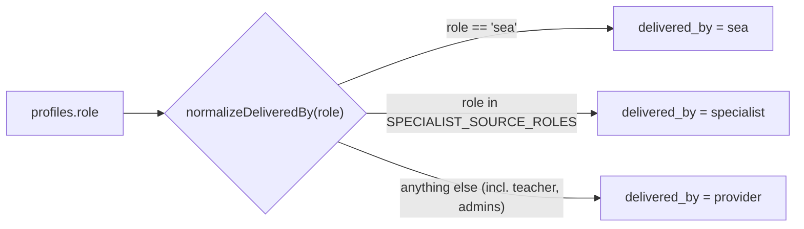
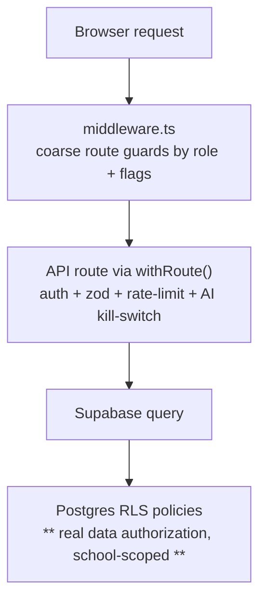
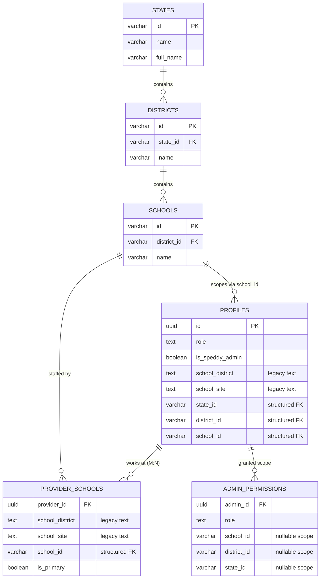
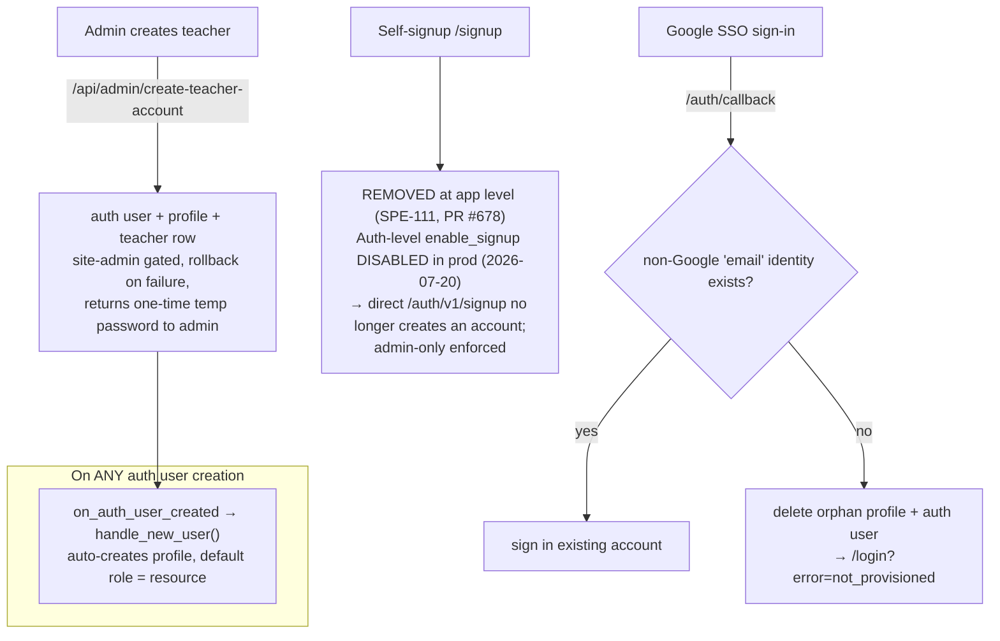
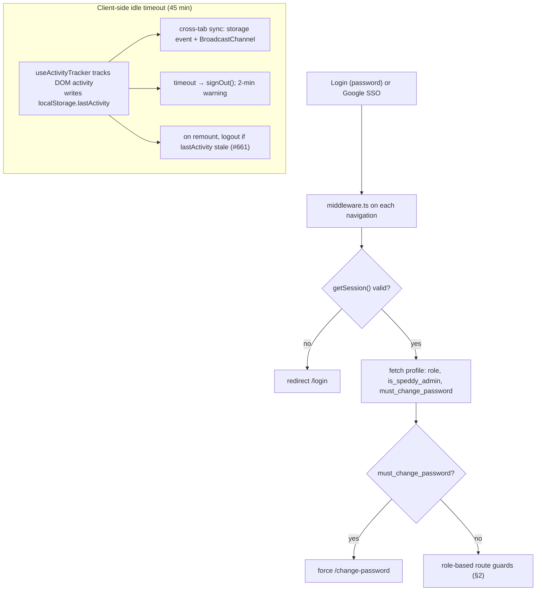
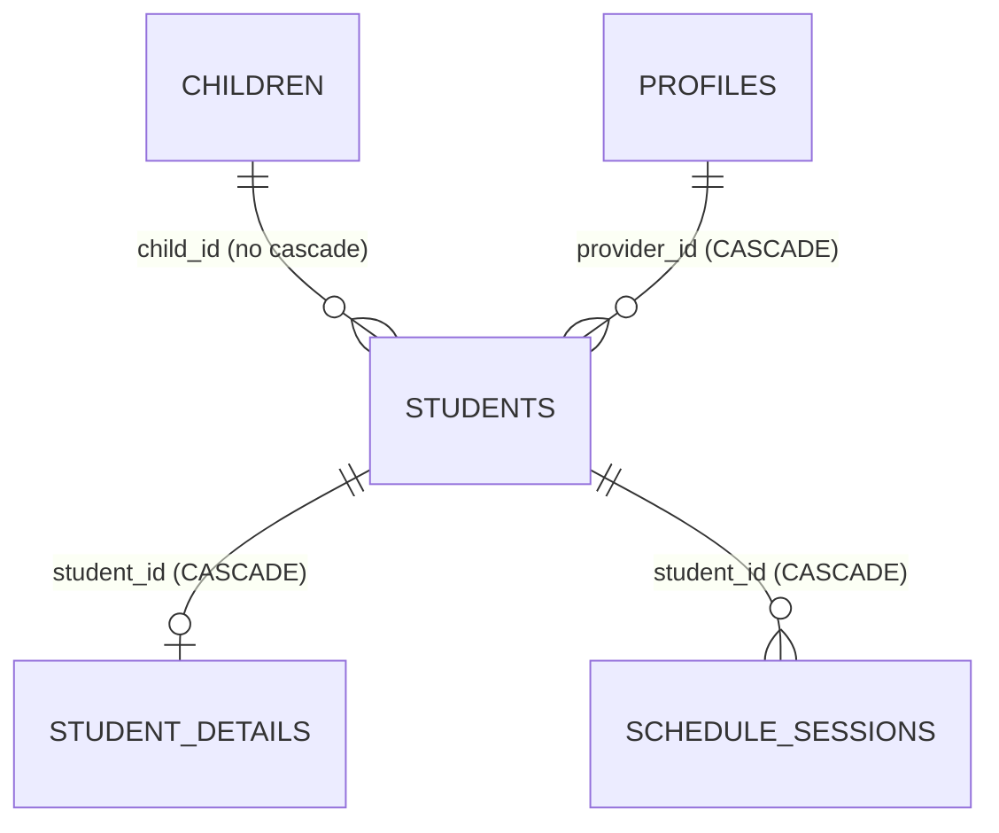
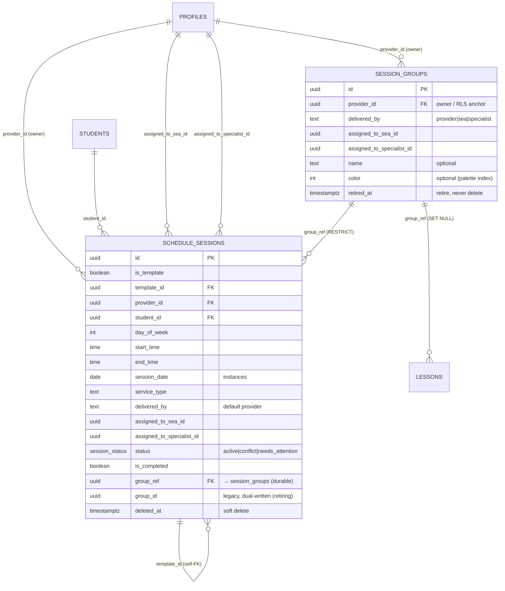
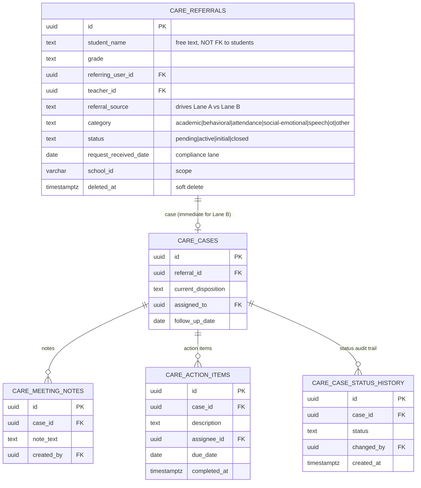
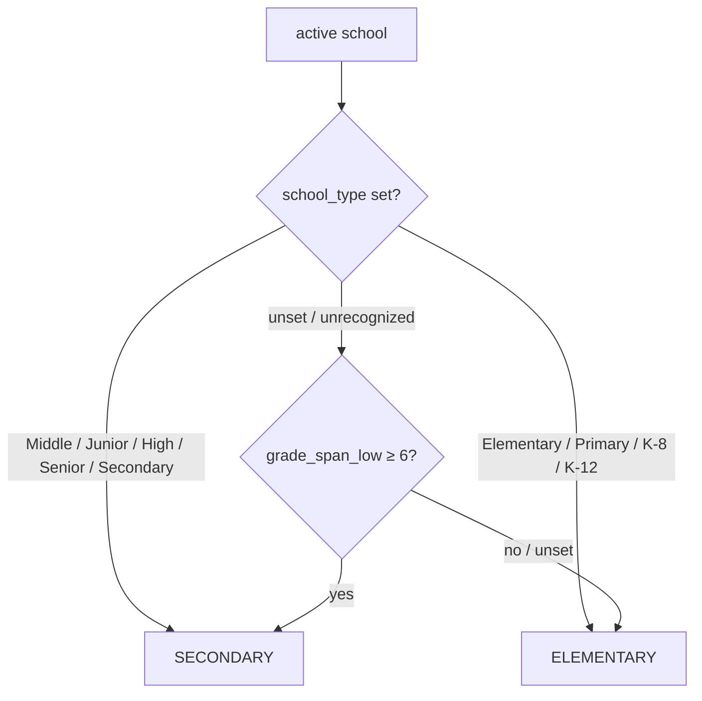

# Speddy — Architecture Reference

> **Purpose.** A grounded, how-it-works reference for the Speddy domain model:
> roles, permissions, org scoping, account creation, auth/session, scheduling,
> data retention, and the CARE module. Written for **both humans and AI coding
> agents** (e.g. future Claude Code sessions) so the system can be understood
> quickly without re-deriving it from scratch.
>
> **Companion to the Miro board** "Speddy" (team Copa) —
> <https://miro.com/app/board/uXjVHB37buI=/>. The board is the visual version of
> the same 8 sections; this file is the text version that lives next to the code
> (greppable, diffable, and readable by agents that don't have the Miro
> connector).
>
> **Last verified:** 2026-06-26, against the live Supabase schema (project
> `qkcruccytmmdajfavpgb`), `supabase/migrations/`, and the files cited in each
> section. Diagrams use [Mermaid](https://mermaid.js.org/) and render on GitHub.
>
> **Not** a quality review — see the [September 2025 architecture review](https://linear.app/speddy/document/architecture-review-september-18-2025-historical-06b074c25082)
> in Linear for that (historical). This describes how the system behaves today.
>
> ## Keeping this current
> Each section ends with a **Source of truth** list (the files/migrations the
> facts come from). When you change one of those, update the matching section.
> Re-verify a claim before relying on it; treat the **Known gaps** as live
> (they're cross-referenced to Linear `SPE-###` tickets that may close).

---

## TL;DR for an agent picking this up cold

- **Authorization is RLS-first.** Postgres Row-Level Security on each domain
  table is the real data-authorization layer, scoped by school/ownership.
  Middleware only does **coarse route redirects**; the API `withRoute` wrapper
  does auth + rate-limit + an AI kill-switch but **has no role gate**.
- **`profiles.role` has 12 values** (live CHECK constraint):
  `resource, speech, ot, counseling, specialist, sea, teacher, site_admin,
  district_admin, psychologist, intervention, district_tech`.
- **`is_speddy_admin` is a separate boolean**, not a role — it gates `/internal`
  (platform/internal admin).
- **"provider" is not a role.** It's a *delivery category*. `delivered_by`
  (on `schedule_sessions`) is one of `provider | sea | specialist`, derived from
  the account role by `normalizeDeliveredBy()`.
- **Self-signup is dead** (admin-created accounts only) — see SPE-111. SSO
  (Google) can sign in existing users but **never creates** an account.
- **Org scoping uses two parallel systems** on `profiles`/`provider_schools`:
  legacy free-text (`school_district`, `school_site`) **and** structured FK ids
  (`state_id`, `district_id`, `school_id`). Both coexist today.
- **Audit logging covers SIS credentials only.** `audit_logs` is written by
  `lib/sis/connections.ts` (SPE-395) and by nothing else; the older
  `logAccess()` helper is still never called, and no student-data access is
  audited — SPE-169.
- **Elementary-first.** A school is *elementary* or *secondary* (`isSecondarySchool`,
  by `school_type` / `grade_span_low ≥ 6`); on a **secondary** site the scheduling
  surfaces (Schedule, Bell Schedules, Special Activities, Plan) are hidden for
  providers/teachers/SEAs. Client-side only — §9, SPE-193.

### Highest-value file map

| Concern | File / migration |
|---|---|
| Role enum (source of truth) | `supabase/migrations/20260806_spe393_add_district_tech_role.sql` + live `profiles_role_check` |
| Role → delivery mapping | `lib/auth/role-utils.ts` (`normalizeDeliveredBy`, `SPECIALIST_SOURCE_ROLES`) |
| Role display labels | `lib/utils/role-utils.ts` (`formatRoleLabel`) |
| Route guards | `middleware.ts` |
| API wrapper (auth/rate-limit/AI gate) | `lib/api/with-route.ts` |
| Session idle timeout | `lib/config/session-timeout.ts`, `lib/hooks/use-activity-tracker.ts`, `app/components/providers/auth-provider.tsx` |
| SSO provisioning gate | `app/auth/callback/route.ts` |
| Admin teacher creation | `app/api/admin/create-teacher-account/route.ts` |
| Student identity (child vs caseload row) | `children` table + `students.child_id`; `supabase/migrations/20260729_spe347_children_foundation.sql` |
| Scheduling model | `schedule_sessions` table; `lib/scheduling/` |
| Retention cron jobs | `app/api/cron/*`, `vercel.json` |
| CARE module | `supabase/migrations/20251222_create_care_meeting_tables.sql`, `lib/supabase/queries/care-referrals.ts` |
| Elementary vs secondary split | `lib/school-helpers.ts` (`isSecondarySchool`); `app/components/providers/school-context.tsx`; `app/components/navigation/navbar.tsx` |

---

## Table of contents
1. [User Types & Roles](#1-user-types--roles)
2. [Permissions & Access Model](#2-permissions--access-model)
3. [Org Hierarchy & Scoping](#3-org-hierarchy--scoping)
4. [Account Creation Flows](#4-account-creation-flows)
5. [Auth & Session Lifecycle](#5-auth--session-lifecycle)
6. [Scheduling / Session Data Model](#6-scheduling--session-data-model)
   — incl. [Student identity — `children` ↔ caseload rows](#student-identity--children--caseload-rows-spe-347),
   [`school_year` — the Aug 1 flip, and who scopes on it](#school_year--the-aug-1-flip-and-who-scopes-on-it-spe-470)
7. [Data Lifecycle & Retention](#7-data-lifecycle--retention)
8. [CARE / Referrals Model](#8-care--referrals-model)
9. [Elementary vs Secondary (school-level experience)](#9-elementary-vs-secondary-school-level-experience)
- [Appendix A — Known gaps (open Linear tickets)](#appendix-a--known-gaps-open-linear-tickets)

---

## 1. User Types & Roles

`profiles.role` is a single `text` column constrained to **12 values** (live
`profiles_role_check`). A separate boolean `profiles.is_speddy_admin` marks
platform/internal admins and is **orthogonal** to `role`.

Functionally the roles group like this:

| Group | Roles | Notes |
|---|---|---|
| **Service providers** | `resource`, `speech`, `ot`, `counseling`, `specialist`, `psychologist`, `intervention` | The clinicians who own sessions. All normalize to `delivered_by = 'specialist'`. |
| **SEA** (Special Ed Assistant) | `sea` | Delivers sessions under supervision. Intentionally **lesson view-only** at the RLS layer (`20260529_restrict_sea_lesson_access.sql`). Normalizes to `delivered_by = 'sea'`. |
| **Gen-ed teacher** | `teacher` | Routed to `/dashboard/teacher`. |
| **Org admins** | `site_admin`, `district_admin` | Routed to `/dashboard/admin`. Scope comes from `admin_permissions` (§3). |
| **District tech admin** | `district_tech` | Routed to `/dashboard/tech`. District IT, not SpEd staff: sees the SIS integrations portal and `/dashboard/settings` and **nothing else** — no students, no CARE, no chat, no scheduling, no admin pages. Scope comes from `admin_permissions` (§3); see the carve-out note below. |
| **Platform admin** | *(flag)* `is_speddy_admin = true` | Not a role. Gates `/internal`. |

### What actually keeps `district_tech` out of the data (SPE-393)

Worth writing down, because it is **not** the role string. Nothing in RLS
mentions `district_tech`. As seeded, the role reads no domain data because it
holds none of the keys the policies are written against:

- `profiles.school_id` is null and it has no `provider_schools` rows, so every
  "my school ∪ my provider schools" predicate resolves to the empty set.
- It owns no `students`, no `schedule_sessions`, and no `teachers.account_id`
  row, so every ownership predicate misses.
- Its `admin_permissions` grant has `role = 'district_tech'`, and **every**
  policy consulting that table constrains `ap.role` to
  `site_admin`/`district_admin`.

Verified with a real signed-in session (not by reading policies): the role reads
0 rows from `students`, `children`, `schedule_sessions`, the five `care_*`
tables, `teachers`, `staff`, `bell_schedules`, `special_activities`, and
`attendance`.

**Two honest caveats — this is protection by *absence*, and absence is not a
guard:**

1. **`holidays` IS readable.** Its SELECT policy matches the caller's
   `profiles.district_id` and — unlike the CARE policies — its `EXISTS`
   subquery reads only the caller's own `profiles` row, so nothing filters it.
   A district-scoped role sees its district's holidays. Accepted: holidays are
   calendar dates with no student or staff data attached. (The equivalent CARE
   policies *are* saved by nested RLS — their subqueries read `care_referrals` /
   `care_cases`, which are themselves filtered. A `teacher`, who also carries
   `district_id`, reads 0 `care_case_status_history` rows for that reason.)
2. ~~**`provider_schools` has no INSERT guard.**~~ **Closed by SPE-399.** All
   three write commands were gated on ownership alone
   (`provider_id = auth.uid()`), so any authenticated user could self-attach to
   any school and unlock every `get_my_school_ids()`-scoped policy —
   reproduced for `district_tech`, `teacher` and `sea` alike. The table is now
   admin/service-role-writable only; see §3.

So the guard that matters is never granting this role a school, a caseload, or a
`site_admin`/`district_admin` grant. The sim walk asserts that negative space, so
a change that hands it one of those turns the fixture red.

### "provider" is a delivery category, not a role
There is **no `provider` role** in the enum, yet `schedule_sessions.delivered_by`
defaults to `'provider'` and `normalizeDeliveredBy()` falls back to `'provider'`.
`delivered_by ∈ { provider | sea | specialist }` describes **who runs a given
session**, derived from the owner's role:


```mermaid
flowchart LR
    R["profiles.role"] --> N{"normalizeDeliveredBy(role)"}
    N -->|"role == 'sea'"| SEA["delivered_by = sea"]
    N -->|"role in SPECIALIST_SOURCE_ROLES"| SPEC["delivered_by = specialist"]
    N -->|"anything else (incl. teacher, admins)"| PROV["delivered_by = provider"]
```

`SPECIALIST_SOURCE_ROLES = [resource, specialist, speech, ot, counseling,
psychologist, intervention]` (`lib/auth/role-utils.ts`).

**Display labels** (`formatRoleLabel`, `lib/utils/role-utils.ts`): `speech→Speech`,
`ot→OT`, `counseling→Counseling`, `resource→Resource`, `psychologist→Psych`,
`specialist→Specialist`, `district_tech→District Tech Admin`; anything else is
capitalized.

**Source of truth:** `supabase/migrations/20260806_spe393_add_district_tech_role.sql`
(latest `profiles_role_check`); `lib/auth/role-utils.ts`;
`lib/utils/role-utils.ts`; `supabase/migrations/20260529_restrict_sea_lesson_access.sql`.

---

## 2. Permissions & Access Model

Authorization is enforced at **three layers**, but only one of them actually
guards *data*:


```mermaid
flowchart TD
    A["Browser request"] --> B["middleware.ts<br/>coarse route guards by role + flags"]
    B --> C["API route via withRoute()<br/>auth + zod + rate-limit + AI kill-switch"]
    C --> D["Supabase query"]
    D --> E["Postgres RLS policies<br/>** real data authorization, school-scoped **"]
```

1. **Middleware** (`middleware.ts`) — redirects only. Reads `role`,
   `is_speddy_admin`, `must_change_password` and bounces users to the right
   dashboard. Authenticates with `getSession()` (cookie-trusting, not
   `getUser()`) — tracked in **SPE-132**.
2. **`withRoute`** (`lib/api/with-route.ts`) — composable wrapper offering
   `auth` (via `getUser()`), zod `body`/`query` validation, per-user
   `rateLimit`, and `aiGated` (404s every gated route while
   `AI_FEATURES_ENABLED !== 'true'`). A gated route may also declare its own
   `aiEnableFlag` env var that enables just that route while the master switch
   stays off — the assistant uses `ASSISTANT_ENABLED` this way (SPE-450/452).
   **There is no `role` option** — see the known gap below.
3. **RLS** — the authoritative layer. Domain tables (students, sessions, CARE,
   etc.) carry policies scoped to the user's school(s) and/or ownership. Admin
   scope is granted via `admin_permissions` (§3).

### `SECURITY DEFINER` RPCs — the layer that opts *out* of RLS (SPE-511)

A `SECURITY DEFINER` function runs as its **owner**, not its caller. Whether that
bypasses RLS depends on the owner: a role is exempt from a table's policies if it
owns the table and the table is not `FORCE ROW LEVEL SECURITY`, or if it is a
superuser / has `BYPASSRLS`. Here it does bypass — ours are owned by `postgres`,
which also owns the domain tables, and none of them sets `FORCE ROW LEVEL
SECURITY` (`relforcerowsecurity = false`).

So for our functions, **RLS does not apply to anything they do**. Layer 3 above is
not protecting these. Whatever check the function body performs *is* the entire
authorization, and most of them are granted `EXECUTE` to `authenticated` — i.e.
to every signed-in user.

That makes two rules non-negotiable for this class of function:

- **The gate lives in the body.** A caller-supplied `p_school_id` /
  `p_provider_id` is an argument, not a credential. Client-side checks are not
  gates: the browser can call `supabase.rpc(...)` directly with the session it
  already holds.
- **Any `CREATE OR REPLACE` must carry the gate forward.** `copy_schedule_to_year`
  shipped with a site-admin gate in `20260402`, and three later migrations
  (`20260407`, `20260409`, `20260413`) each replaced the body to add columns and
  each silently dropped it. For ~4 months any signed-in user could write
  scheduling rows into any school in any district (SPE-511).

Nothing in the test suite can catch this: **unit tests mock the Supabase client,
so they cannot see grants or `SECURITY DEFINER` behaviour at all** — they pass
identically whether the gate is present or absent. It was found by *calling* the
function with a real signed-in session, and it is pinned that way now
(`npm run sim:verify-scheduling-rpc`, `npm run sim:verify-import-rpc`).

Current gates:

| function | who may call it | refusal |
| -- | -- | -- |
| `copy_schedule_to_year` | `site_admin` of that school; `district_admin` of the school's district (resolved via `schools.district_id`) | `42501` / `Not authorized …` |
| `upsert_students_atomic` | the provider named in `p_provider_id`, and only themselves | `42501` / `Unauthorized` |

Note `district_admin` is presently a **policy** allowance, not a reachable path:
the only caller (`admin/master-schedule`) resolves a `site_admin` grant, so no
UI reaches the RPC as a district admin today.

**Source of truth:** `supabase/migrations/20260814_spe511_authorize_copy_schedule_to_year.sql`,
`lib/supabase/queries/school-year-copy.ts`,
`scripts/sim-district/verify-scheduling-rpc.ts`,
`scripts/sim-district/verify-import-rpc.ts`.

### Column-level grants — when RLS is not enough (SPE-395)

**RLS is row-level and cannot hide a column.** A policy that lets someone read
a row lets them read *every column of it*. For most tables that is fine. For
`district_sis_connections` — which holds each district's encrypted SIS
credentials — it is not: a district's Aeries certificate unlocks every student
record in that district, and it would otherwise sit in a browser's memory and
network log on every page that renders connection status.

So that table layers **column-level `GRANT`s** on top of row-level RLS:

```sql
REVOKE ALL ON district_sis_connections FROM authenticated, anon;
GRANT SELECT (id, district_id, sis_type, base_url, token_url, credential_hint,
              status, dpa_cleared_at, last_tested_at, last_test_result,
              created_by, created_at, updated_at)
  ON district_sis_connections TO authenticated;
```

`authenticated` therefore cannot *name* a credential column — PostgREST refuses
with **HTTP 403 / `42501`** rather than returning it. The service role is
unaffected and is how the server-side encrypt/decrypt paths read them.

**Consequence that will bite you:** `select('*')` on this table **fails** for a
browser session, because `*` expands to columns the grant excludes. That is
deliberate — a loud error beats silently shipping a certificate because someone
reached for the usual shorthand. Callers name their columns; see
`CONNECTION_COLUMNS` in `app/(dashboard)/dashboard/tech/page.tsx` and
`SUMMARY_COLUMNS` in `lib/sis/connections.ts`, both of which mirror the GRANT.

Browser **writes** are denied outright (`WITH CHECK (false)` on insert/update,
`USING (false)` on delete) — every mutation involves crypto and runs
server-side. Same reasoning as `provider_schools` after SPE-399.

Verified against a real signed-in session, not assumed:
`npm run sim:verify-sis-rls`.

**Source of truth:**
`supabase/migrations/20260806_spe395_district_sis_connections.sql`;
`lib/sis/connections.ts`; `scripts/sim-district/verify-sis-connections-rls.ts`.

### SIS credentials: encryption, the DPA gate, and egress (SPE-395/396)

- **Encrypted app-side**, never in plaintext: AES-256-GCM, envelope
  `v1.<iv>.<ct>.<tag>`, under `SIS_CREDENTIAL_ENCRYPTION_KEY` — deliberately a
  *separate* key from `CALENDAR_TOKEN_ENCRYPTION_KEY`, because the blast radii
  differ by orders of magnitude. Only `credential_hint` (the mask plus the last
  four characters) is ever readable by a client.
- **The DPA gate exists twice.** `storeCredential()` refuses a credential when
  `dpa_cleared_at IS NULL`, and a CHECK constraint refuses it again — so the
  rule survives a future route that forgets it. Speddy staff set the flag from
  the `/internal` district page; districts cannot.
- **Outbound requests are guarded** (`lib/sis/ssrf-guard.ts`). The district
  supplies the address we then dial with their credential, so IP literals,
  internal-only names and any host resolving into private/loopback/link-local/
  CGNAT/multicast space are refused, and redirects are refused outright. The
  remaining hole — DNS rebinding between the check and the connection — is
  documented in that file and tracked as **SPE-406**.

- **Staff can ask whether the key is live** (SPE-420). `GET
  /api/internal/sis-key-health`, behind the `is_speddy_admin` gate, round-trips
  a fixed non-secret probe in memory and reports *working* / *key missing* /
  *key malformed*, naming the build that answered. It exists because the failure
  is invisible elsewhere: the Vercel dashboard shows a variable is set but not
  whether the **running build** has it, and a value damaged by a trailing
  newline on paste looks identical to a missing one — which is what refused a
  live district's certificate in SPE-417. It reads no district data and writes
  nothing. Note the limit: it round-trips the *current* key, so after a
  **rotation** a green result means new credentials can be saved, never that
  ones already stored are still readable.

**Source of truth:** `lib/sis/credential-crypto.ts`; `lib/sis/connections.ts`;
`lib/sis/ssrf-guard.ts`; `lib/sis/aeries-setup.ts`;
`app/api/tech/sis/aeries/`; `app/api/internal/sis-connections/`;
`app/api/internal/sis-key-health/`.

### `profiles` self-updates: policy + trigger (SPE-332)

`profiles_update` has three branches — the row owner, `service_role`, and a
site admin for the row's `school_id`. A user may edit their **own** row but must
not change `role`, `is_speddy_admin`, `school_id` or `district_id`.

That immutability rule lives in a **BEFORE UPDATE trigger**
(`profiles_guard_immutable_columns`), **not** in the policy's `WITH CHECK`. An
RLS policy cannot reference `OLD`, so the original implementation compared the
incoming row against stored values by selecting from `profiles` *inside the
policy on* `profiles` — which Postgres re-evaluates recursively, so **every**
`UPDATE` failed with `42P17 infinite recursion detected in policy`. It failed
closed (no escalation was ever possible) but silently broke every self-serve
write for ~7 months: the SPE-320 daily-schedule toggle, the settings
"Request Password Reset" button, and dismissing the onboarding banners.

**Consequence for feature work:** anything a user saves to their own profile from
the browser goes through this policy. Mocked unit tests cannot see RLS at all, so
a self-write path is only genuinely covered by a **sim-district walk with a real
signed-in session** — that is the gate that catches this class of bug, and it is
why SPE-320 shipped broken with three green test files.

**Source of truth:** `supabase/migrations/20260724_fix_profiles_update_rls_recursion.sql`;
live `profiles_update` policy + `profiles_guard_immutable_columns` trigger.

### `profiles_select`: school-scoped, plus a district branch (SPE-394)

Most branches of `profiles_select` find people by **school** — the school-ids
union, providers-at-my-schools, the site-admin branch, and the district admin's
"anyone at a school in my district" branch. That works for everyone who has a
school, and silently fails for everyone who doesn't.

`district_tech` has `school_id IS NULL` by design, so the district-admin branch
(which joins `schools.id = profiles.school_id`) could never match it: a district
admin could not see the tech admin they had just created. Verified live — 0 rows,
against a control teacher in the same district returning 1. The same blind spot
applied to `district_admin` profiles, which are equally school-less.

A district branch now sits alongside the school one, matching
`ap.district_id = profiles.district_id` for a `district_admin` caller. The
widening is bounded to the caller's own grant rows, and the guard pins where it
stops: a site admin still cannot see the tech admin, the tech admin gains no
extra reads, and nothing crosses district lines.

**Generalisation worth remembering:** a policy written in terms of `school_id` is
invisible to district-scoped roles. When adding a role without a school, check
every policy that identifies people by school — absence of a match reads exactly
like "no permission", so it fails quietly rather than loudly.

**Source of truth:** `supabase/migrations/20260806_spe394_profiles_select_district_scope.sql`;
guarded by `npm run sim:verify-rls` ("district-scoped profile visibility").

### Route-guard matrix (from `middleware.ts`)

| Path prefix | Who's allowed | Else → |
|---|---|---|
| `/`, `/how-it-works`, `/login`, `/signup`, `/terms`, `/privacy`, `/ferpa`, `/auth/callback`, `/auth/reset-callback`, `/reset-password` | public | — |
| `must_change_password = true` | only `/change-password` (public routes, incl. `/reset-password`, are exempt — see §5) | `/change-password` |
| `/internal` | `is_speddy_admin` only | `/dashboard` |
| `/dashboard/admin` | `site_admin`, `district_admin` | `/dashboard` |
| `/dashboard/teacher` | `teacher` | `/dashboard` |
| `/dashboard/tech` | `district_tech` only | `/dashboard` |
| `/dashboard/care` | all authenticated users **except `district_tech`** | `/dashboard/tech` |
| other `/dashboard/*` | authenticated; admins & teachers redirected to their own dashboards; `district_tech` redirected to `/dashboard/tech` (its only other allowed page is `/dashboard/settings`) | — |

> **Ordering matters:** the `district_tech` branch runs *before* the
> CARE/Chat early return. That return is unconditional for every authenticated
> user, so an "everything except" rule placed after it would wave the role
> straight into both surfaces (SPE-393).

> **Removed — the dark Tools suite (SPE-497, 2026-08):** the AI generation
> routes this section used to flag (`lessons/generate`, `lessons/v2`,
> `exit-tickets/generate`, `progress-check/generate`, plus the anonymous
> `submit-worksheet` endpoint and the QR upload pages) were deleted with the
> hidden Tools suite, which closed SPE-187's missing-role-check gap by
> removal. The only `aiGated` routes left are the accommodations PDF import
> (`students/[studentId]/extract-accommodations`) and the assistant
> (`assistant/chat`, which its own `ASSISTANT_ENABLED` flag can enable
> independently).

**Source of truth:** `middleware.ts`; `lib/api/with-route.ts`.

---

## 3. Org Hierarchy & Scoping

Two things live here: a **geographic hierarchy** (reference data) and the
**scoping fields** that bind a user to it.


```mermaid
erDiagram
    STATES    ||--o{ DISTRICTS        : "contains"
    DISTRICTS ||--o{ SCHOOLS          : "contains"
    SCHOOLS   ||--o{ PROFILES         : "scopes via school_id"
    PROFILES  ||--o{ PROVIDER_SCHOOLS : "works at (M:N)"
    SCHOOLS   ||--o{ PROVIDER_SCHOOLS : "staffed by"
    PROFILES  ||--o{ ADMIN_PERMISSIONS: "granted scope"

    STATES {
        varchar id PK
        varchar name
        varchar full_name
    }
    DISTRICTS {
        varchar id PK
        varchar state_id FK
        varchar name
    }
    SCHOOLS {
        varchar id PK
        varchar district_id FK
        varchar name
    }
    PROFILES {
        uuid id PK
        text role
        boolean is_speddy_admin
        text school_district "legacy text"
        text school_site "legacy text"
        varchar state_id "structured FK"
        varchar district_id "structured FK"
        varchar school_id "structured FK"
    }
    PROVIDER_SCHOOLS {
        uuid provider_id FK
        text school_district "legacy text"
        text school_site "legacy text"
        varchar school_id "structured FK"
        boolean is_primary
    }
    ADMIN_PERMISSIONS {
        uuid admin_id FK
        text role
        varchar school_id "nullable scope"
        varchar district_id "nullable scope"
        varchar state_id "nullable scope"
    }
```

- **Geographic hierarchy:** `states → districts → schools`, keyed by **string
  (`varchar`) ids**, not uuids. This is shared reference data.
- **`profiles` scoping uses two parallel systems — both present today:**
  - **Legacy free-text:** `school_district`, `school_site`, `district_domain`
    (all `NOT NULL`). The original model.
  - **Structured FK ids:** `state_id`, `district_id`, `school_id` (`varchar`,
    nullable) — the newer normalized refs into the hierarchy tables.
  - Treat this as a migration-in-progress: code may read either. Check which a
    given query uses before assuming.
- **`provider_schools` is an authorization input, not user data (SPE-399).**
  `get_my_school_ids()` returns `profiles.school_id` **UNION** the caller's
  `provider_schools.school_id`, so a row here *grants* a school's worth of
  reads. It is therefore **admin/service-role-writable only** — all three write
  policies are `false` for browser sessions. Both application writers
  (`app/api/admin/district/providers/**`) use the service-role client, and
  signup writes via `handle_new_user_schools()`, a postgres-owned
  `SECURITY DEFINER` trigger; neither is affected. Reads are unchanged.
  Guarded by `npm run sim:verify-provider-schools-rls`.
  The general lesson: when a table feeds an authorization function, "it's my
  row" is not a sufficient write check — ownership is the thing being escalated.
- **`provider_schools` (M:N):** a provider can serve multiple schools; rows carry
  both the legacy text pair and structured ids, plus `is_primary`. RLS policies
  commonly union "my profile's school" with "my `provider_schools` schools".
- **`admin_permissions`:** grants an admin a scope at school/district/state
  level (`school_id`/`district_id`/`state_id` nullable; `granted_by`,
  `granted_at`). This is what gives `site_admin`/`district_admin` their reach in
  RLS — distinct from `is_speddy_admin`, which is platform-wide.
  Two CHECK constraints guard it: one enumerating the allowed
  `role` values, one pairing each role with the scope column it requires
  (`site_admin ⇒ school_id`, `district_admin ⇒ district_id`,
  `district_tech ⇒ district_id`). Both must be updated together when a role is
  added, or the insert fails on whichever was missed.
  A `district_tech` grant is a **scope marker only** and confers no data access:
  every policy that consults this table constrains `ap.role` to
  `site_admin`/`district_admin`, so the row matches none of them. That is the
  point — it gives the role a district without giving it the district's data
  (SPE-393; see §1 for what actually keeps the role out).

### District-scoped configuration tables (SPE-395, SPE-422)

Two tables hang configuration directly off a district, with the same
access shape: **district members (and district admins via their grant) read;
browser writes are denied outright; mutations run server-side with the service
role after an `admin_permissions` check** in the API route.

- **`district_sis_connections`** — per-district SIS credentials (§2's
  column-level-grants example).
- **`district_curriculums`** — the curriculums a district has enabled for
  lesson planning (SPE-422). District admins curate it at
  `/dashboard/admin/curriculums` from the master catalog in
  `lib/curriculums/catalog.ts`; the session/group modal picker offers exactly
  this list (plus whatever the session already tracks), and stays empty-with-a-
  note until it's configured. Its read policy has two branches: caller's
  `profiles.district_id` matches, or the caller holds a `district_admin` grant
  for the district — the latter because admin profiles are school-less and may
  predate the `profiles.district_id` backfill.

**Source of truth:** live tables `states`, `districts`, `schools`, `profiles`,
`provider_schools`, `admin_permissions`;
`supabase/migrations/20251112_add_admin_roles_and_school_scoped_teachers.sql`;
`supabase/migrations/20260807_spe422_district_curriculums.sql`;
`app/api/admin/district/curriculums/route.ts`; `lib/curriculums/catalog.ts`.

---

## 4. Account Creation Flows

Accounts are **created by admins**, not by end users. Self-signup has been
**removed** (SPE-111, PR #678), so there is exactly **one** way an account comes
into existence — an admin creating it — plus Google SSO sign-in for accounts that
already exist:


```mermaid
flowchart TD
    subgraph Trigger["On ANY auth user creation"]
      T["on_auth_user_created → handle_new_user()<br/>auto-creates profile, default role = resource"]
    end

    A["Admin creates teacher"] -->|"/api/admin/create-teacher-account"| OK["auth user + profile + teacher row<br/>site-admin gated, rollback on failure,<br/>returns one-time temp password to admin"]
    OK --> T

    B["Self-signup /signup"] --> GONE["REMOVED at app level (SPE-111, PR #678)<br/>Auth-level enable_signup DISABLED in prod (2026-07-20)<br/>→ direct /auth/v1/signup no longer creates an account;<br/>admin-only enforced"]

    G["Google SSO sign-in"] -->|"/auth/callback"| GATE{"non-Google 'email' identity exists?"}
    GATE -->|yes| GIN["sign in existing account"]
    GATE -->|no| GDEL["delete orphan profile + auth user<br/>→ /login?error=not_provisioned"]
```

- **Real:** `app/api/admin/create-teacher-account/route.ts` — site-admin gated;
  creates the auth user (with a generated **temporary password**) + profile +
  teacher record, with rollback on failure. The temp password is **returned to
  the admin once** to relay to the teacher; the route does **not** set
  `must_change_password`, so the teacher is **not** force-redirected to
  `/change-password` on first login (that flag is set by the admin
  password-reset flow, not creation — see §5; tracked in **SPE-190**).
  `app/(dashboard)/dashboard/admin/create-account/page.tsx` is the single UI
  entry point, and it picks its route by the admin's scope and the account type:
  `/api/admin/district/teachers`, `/api/admin/district/providers`, or
  `/api/admin/create-teacher-account`. (`/api/admin/district/site-admin`,
  `/api/admin/district/tech-admin` and `/api/internal/create-admin-account`
  cover the admin-creating-an-admin cases.)
- **`district_tech` is the exception to the paragraph above (SPE-394).**
  `/api/admin/district/tech-admin` **does** set `must_change_password: true` at
  creation, so its temp password is force-rotated at first login — verified live:
  the account is redirected to `/change-password`, cannot reach `/dashboard/tech`
  until it rotates, and lands there once it does. The middleware ordering this
  relies on is load-bearing: the `must_change_password` check (`middleware.ts`
  ~line 107) runs **before** the `district_tech` route pinning (~line 149), so
  the rotation wins over the role's portal redirect. `/internal` sets the same
  flag for this role so it behaves identically however it is minted. The
  pre-existing roles are deliberately unchanged here — that is SPE-364's call.
  The creator is a **district admin**, not Speddy staff: the district's own admin
  provisions their IT contact, with `/internal` as an onboarding fallback.
  **All of them** call `auth.admin.createUser` with `email_confirm: true`, so an
  admin-created user's email is pre-verified and they can use "Forgot password"
  on the sign-in page without ever having signed in — they don't need the temp
  password to be relayed successfully.
- **Profile auto-creation trigger:** `on_auth_user_created → handle_new_user()`
  creates a `profiles` row (default role `resource`) for **every** new auth
  user. This is why the SSO gate (§5) can't rely on "profile exists".
- **Removed — SPE-111 (done, PR #678):** the self-signup UI (`app/(auth)/signup/*`),
  `app/api/auth/signup/route.ts`, the auth-provider `signUp()`, and the `/signup`
  route-allowlist entries are **deleted** — account creation is admin-only. (There
  were no real subscription/billing remnants — only an unused `STRIPE_ERROR` enum.)
  > **Residual gap — CLOSED 2026-07-20:** production Supabase Auth email signup was
  > **disabled in the dashboard**, so a direct `POST /auth/v1/signup` with the public
  > anon key no longer creates an account — admin-only provisioning is now enforced
  > at the auth layer. Admin flows use `auth.admin.createUser`, which bypasses this
  > setting, so account creation is unaffected. (Note: `supabase/config.toml` still
  > shows `enable_signup = true`; that is the local-CLI config and does not govern
  > the hosted project — the dashboard setting is authoritative.)
- **Removed — SPE-95:** `admin-accounts.ts` used to carry unused
  `createTeacherAccount()` / `createSpecialistAccount()` client helpers whose
  `send_invite` branch only `console.warn`ed. They were **dead code — nothing
  ever called them**, and no UI ever rendered a `send_invite` checkbox, so the
  "admin thinks an invite was sent" scenario this doc previously described was
  never reachable. Deleted rather than implemented; the admin UI has always
  posted to the real API routes above.
  > **Not to be confused with:** teacher *roster* rows that legitimately have no
  > login. `teachers` is a directory — a row there is a person a provider can
  > reference on a schedule, and only some of them are also users. As of
  > 2026-08-05 no real teacher row has an email on file without a matching
  > `auth.users` row; the 18 that look that way are Sim-district fixtures
  > (`@sim.speddy.test`), which seed directory-only teachers by design.

**Source of truth:** `app/api/admin/create-teacher-account/route.ts`;
`app/auth/callback/route.ts`; `lib/supabase/queries/admin-accounts.ts`;
`supabase/migrations/20250117_create_profile_on_signup.sql`.

---

## 5. Auth & Session Lifecycle


```mermaid
flowchart TD
    L["Login (password) or Google SSO"] --> M["middleware.ts on each navigation"]
    M --> S{"getSession() valid?"}
    S -->|no| LOGIN["redirect /login"]
    S -->|yes| P["fetch profile: role, is_speddy_admin, must_change_password"]
    P --> PW{"must_change_password?"}
    PW -->|yes| CP["force /change-password"]
    PW -->|no| RG["role-based route guards (§2)"]

    subgraph Idle["Client-side idle timeout (45 min)"]
      AT["useActivityTracker tracks DOM activity<br/>writes localStorage.lastActivity"]
      AT --> X["cross-tab sync: storage event + BroadcastChannel"]
      AT --> Y["timeout → signOut(); 2-min warning"]
      AT --> Z["on remount, logout if lastActivity stale (#661)"]
    end
```

- **Middleware** authenticates with `getSession()` and fetches the profile on
  each navigation; sets `x-user-id/-email/-role` headers downstream.
- **`must_change_password`** locks the user to `/change-password` until cleared.
  It is set by the **admin password-reset** flow (`app/api/admin/reset-password`),
  enforced by middleware + `app/api/auth/login`, and cleared by
  `app/api/auth/change-password` **or** by a self-service reset (below). Account
  *creation* does **not** set it (SPE-190).
- **Self-service password reset (SPE-68).** Two reset paths now exist and they
  converge on the same flags:
  1. `/login` → "Forgot password?" → `supabase.auth.resetPasswordForEmail()`.
     **Supabase Auth owns the token** (generation, expiry, single use,
     invalidation on redemption); delivery is Resend via the project's custom
     SMTP settings. The response to the user is identical whether or not the
     account exists — no email enumeration.
  2. The emailed link lands on **`app/auth/reset-callback/route.ts`**, which
     establishes the session and forwards to `/reset-password`. It accepts two
     link shapes, and **the difference is operationally important**:
     - `?token_hash=&type=recovery` → `verifyOtp()`. **The intended path.** No
       browser-bound secret, so it works when the reset is requested on one
       device and the email is opened on another — the normal case for a user
       who requests on a classroom desktop and reads mail on a phone. Requires
       the **custom email template** below.
     - `?code=` → `exchangeCodeForSession()`. The PKCE shape Supabase's *default*
       template sends. `@supabase/ssr` clients are PKCE by default and keep the
       code verifier in a browser cookie, so this shape **only works in the same
       browser that requested the reset**; from another device it fails as an
       expired link. Kept only as a fallback.

     Deliberately **separate from `/auth/callback`**: that route carries the SSO
     provisioning gate, which *deletes* an auth user + profile it judges
     unprovisioned, and a reset link must never traverse delete-the-account code.
     Expired, used, or malformed links bounce to
     `/login?error=reset_expired|reset_invalid`.
  3. `app/(auth)/reset-password/page.tsx` re-verifies server-side and posts to
     **`POST /api/auth/reset-password`**, which calls `updateUser()` and then
     clears **both** `must_change_password` and `password_reset_requested_at` on
     the **service client** (per SPE-280 — reusing the request-scoped client
     after `updateUser()` rotates tokens hangs the request).
  - **Recovery marker gate.** The callback issues a short-lived (15 min) httpOnly
     cookie (`lib/auth/password-reset.ts`) *only* after a link verifies, and the
     reset endpoint 403s without a valid one. An authenticated session is **not**
     proof of mailbox control — every signed-in user has one — so without this
     gate any live session could drive the reset endpoint to set a password and
     clear its own admin-reset flags. (Raised by Codex on PR #781.)

     The marker is **HMAC-signed and bound to the user id** (`<userId>.<expiry>.<hmac>`,
     keyed on `SUPABASE_SERVICE_ROLE_KEY`), and the endpoint verifies signature +
     bound user, not mere presence. A first cut used the literal string `"1"`,
     which is not a boundary at all: `httpOnly` stops *page scripts* from touching
     the cookie but says nothing about a hand-crafted request, so a bare flag was
     forgeable by exactly the actor the gate exists to refuse (caught by
     CodeRabbit on PR #781). Stateless by design — the reset token is already
     single-use at Supabase and the cookie is cleared on success, so there is no
     nonce store to keep consistent. Both call sites fail closed if the signing
     key is absent. Note that rotating the service-role key invalidates in-flight
     markers; the blast radius is a 15-minute window and the user simply requests
     a new link.

     Burned on success so a redeemed link can't be replayed, and kept on
     validation failure so a user who picks a weak or breached password can retry
     without going back to email.
  - `/reset-password` and `/auth/reset-callback` are **public** in `middleware.ts`:
    the user arrives with no session, and listing `/reset-password` there also
    keeps it clear of the `must_change_password` redirect (a user with an admin
    reset also queued would otherwise be bounced to `/change-password`).
  - **Dashboard config this depends on:** Auth → SMTP pointed at Resend on
    `speddy.xyz` (its `sender_name` / `admin_email` are what make the **From**
    line read "Speddy", so set them); the reset-callback URL allow-listed under
    Auth → URL Configuration; and the **"Reset Password" template** replaced with
    `supabase/templates/recovery.html`.
  - **The email template is checked in** at `supabase/templates/recovery.html`
    and wired into `supabase/config.toml` for local dev. The hosted project still
    reads templates from the dashboard, so that file is the reviewable source and
    the dashboard is the deployed copy — edit the file, then paste it over.
    Keeping it in-repo recovers most of what Option A gave up (an unreviewable
    template) at no cost. It must use
    `{{ .SiteURL }}/auth/reset-callback?token_hash={{ .TokenHash }}&type=recovery`
    rather than the default `{{ .ConfirmationURL }}`: the default is a PKCE
    `?code=` link and works only in the browser that requested the reset.
    Styling mirrors `lib/email/daily-schedule.ts` so Speddy mail reads as one
    sender, and stays image-free/single-CTA per Supabase's auth-mail
    deliverability guidance.
  - The admin "Reset password" button (`app/api/admin/reset-password/route.ts`)
    **remains** as the backup for users who cannot reach their email — a district
    mailbox problem, a departing-staff handover.
  - **The old "ask your admin" request workflow is gone (SPE-330).** Before
    self-service existed, a user pressed a Settings button that set
    `password_reset_requested_at`, which raised a red dot beside their name in the
    admin provider list *and* on the "Providers" nav item, and they were told to
    collect a temporary password from their site admin. Removed in full: the
    Settings card, `POST /api/provider/request-password-reset`, both red dots, and
    `getPasswordResetRequestCount()`. (The public `/api/auth/forgot-password`
    endpoint that also fed the flag went earlier, in SPE-68 — it only ever set a
    flag, **sent no email at all**, and silently did nothing for non-provider roles.)
  - **`profiles.password_reset_requested_at` is retained but dead.** Nothing
    writes it and no UI reads it; dropping the column is a schema migration left
    for another day. `/api/auth/reset-password` still nulls it so rows carrying a
    timestamp from before the removal get tidied as their owners reset.
- **Idle timeout** (`lib/config/session-timeout.ts`): default **45 min**
  (`NEXT_PUBLIC_SESSION_TIMEOUT`, `2_700_000` ms), **2-min** warning,
  **30 s** activity throttle, with `KEEP_ALIVE_ACTIVITIES`
  (`lesson-generation`, `file-upload`, `worksheet-generation`) and
  `EXEMPT_ROUTES`. Wired by `useActivityTracker` + `auth-provider.tsx`;
  cross-tab via storage event + `BroadcastChannel`; #661 enforces the window
  across tab/browser close.
- **SSO provisioning gate** (`app/auth/callback/route.ts`): allows a Google
  sign-in only if a non-Google (`email`) identity already exists; otherwise it
  deletes the orphan profile + auth user and redirects
  `/login?error=not_provisioned`. SSO never creates accounts.

> **Known gaps:**
> - **SPE-188 (security, Low):** the idle logout is **client-side only**. The
>   Supabase access/refresh token lifetimes are independent of the 45-min idle
>   window; a client without JS, or one holding tokens directly, isn't subject
>   to it. Matters for shared school devices (FERPA threat model).
> - **SPE-132 (perf/security):** middleware uses `getSession()` (cookie-trusting)
>   rather than `getUser()`, and runs a `profiles` query on every navigation.

**Source of truth:** `middleware.ts`; `lib/config/session-timeout.ts`;
`lib/hooks/use-activity-tracker.ts`;
`app/components/providers/auth-provider.tsx`; `app/auth/callback/route.ts`;
`app/auth/reset-callback/route.ts`; `app/(auth)/reset-password/*`;
`app/api/auth/reset-password/route.ts`; `app/api/auth/change-password/route.ts`;
`app/api/admin/reset-password/route.ts`.

---

## 6. Scheduling / Session Data Model

### Student identity — `children` ↔ caseload rows (SPE-347)

**One child = one `children` row. A `students` row is one provider's caseload
entry for that child, not the child.** A pupil served by an RSP and an SLP is
**one** `children` row and **two** `students` rows, each pointing at it via
`students.child_id`.

That split is new (SPE-347) and, so far, invisible: nothing in the app reads
`children` yet. Every surface still reads the `students` row it always read, and
`students` still carries its own copy of the child facts. Retiring those
duplicated columns is a separate contract ticket (**SPE-350**) after a bake.


```mermaid
erDiagram
    CHILDREN ||--o{ STUDENTS : "child_id (no cascade)"
    PROFILES ||--o{ STUDENTS : "provider_id (CASCADE)"
    STUDENTS ||--o| STUDENT_DETAILS : "student_id (CASCADE)"
    STUDENTS ||--o{ SCHEDULE_SESSIONS : "student_id (CASCADE)"
```

- **What lives where.** `children` holds the child-level facts — name, DOB,
  initials, grade, school/district/state, `district_student_id`, IEP + triennial
  dates, accommodations. `students` keeps the per-provider **service** facts:
  `provider_id`, `sessions_per_week`, `minutes_per_session`, per-discipline
  goals. All 18 FK dependents (including 11k+ `schedule_sessions`) still key off
  `students.id` — nothing was re-keyed.
- **`district_student_id` is unique per district** on `children`
  (`ux_children_district_student_id`, normalized `upper(btrim(...))`). On
  `students` the same column had to be **provider**-scoped, because that table
  holds one row per provider per child. Cross-district recurrence stays legal.
- **Rows are created by the database, never by a caller.** A `BEFORE INSERT`
  trigger (`trg_students_child_link` → `students_child_link()`, SECURITY DEFINER)
  creates the child for every new `students` row. Manual add and roster import
  were not modified. **It never attaches to an existing child on its own**,
  deliberately: an earlier cut attached when `(district_id, district_student_id)`
  matched, and because both columns are client-supplied and unconstrained
  (`students_insert` pins only `provider_id`), any provider could link themselves
  to any child in any district and read or overwrite its name and DOB — verified
  exploitable on a replica before merge. When the claimed id is already held in
  that district, the trigger creates this provider's child **without** it and
  logs the collision; the caseload row still lands and the two children stay
  separate until a human reconciles them at import (create-or-attach, below).
- **`child_id` is not the caller's to set.** The same trigger refuses (`42501`)
  any attempt by an end-user session to set or change it. `students_insert`'s
  `WITH CHECK` only constrains `provider_id`, so without that guard a signed-in
  user could insert a throwaway caseload row carrying someone else's `child_id`
  and inherit that child's read **and write** access. Re-pointing an *existing*
  caseload row is refused outright, with no exception — that is a merge, and
  nothing in the plan merges.
- **Create-or-attach: the one door, and it needs a human (SPE-348).** At import,
  a **new** row that looks like a child a colleague at the same school already
  serves surfaces a "same child?" offer in the review screen's *Needs your
  review* queue. Answering yes sends the child id to
  `upsert_students_atomic`, which **re-validates the claim** before honouring it
  — the client's word is never enough. Declining, or ignoring the offer, creates
  a fresh child exactly as before. Nothing auto-attaches and nothing auto-merges.
  - **One ladder, two callers.** `import_child_candidates(school_id, rows)` holds
    the matching: `district_student_id` → full name + grade → initials + grade +
    teacher (the SPE-339 precedence, the rungs
    `matching_provider_student_ids` already uses). The offer
    (`find_shared_child_candidates`, which adds the co-serving provider's name +
    role) and the write-time re-validation both call it, so the screen and the
    database cannot disagree about what "matches". Candidates are children **at
    that school, served by another provider, not already served by the caller**.
  - **The offer is narrower than the guard.** An ambiguous match (two candidate
    children) or an id-vs-name disagreement is *reported* and never offered —
    SPE-339's conflict rule. Validation refuses a contested row outright, but
    otherwise accepts any candidate for the row rather than only the unique one,
    so a second candidate appearing between preview and confirm can't turn a
    human's correct answer into a hard error.
  - **How the validated id gets past the trigger.** `upsert_students_atomic` sets
    a transaction-local `app.spe348_confirmed_child_id` to the exact validated id
    immediately before its INSERT, and the trigger honours `child_id` only when
    it matches. Not forgeable from a client: `set_config` lives in `pg_catalog`
    (not exposed by PostgREST), no exposed RPC sets a caller-controlled GUC, and
    `is_local` scopes it to the transaction — and PostgREST gives every request
    its own. Everything else still gets the flat `42501`.
  - **Scope is the school, not the district.** The ticket said "same
    school/district", but `students.district_id` is stamped from the importing
    provider's profile and is inconsistent in production (one school carries
    three distinct values, two of them on one provider's own rows, plus NULLs).
    Gating on it would suppress exactly the legitimate offers this exists to make
    while adding nothing: a school belongs to one district.
  - **Not covered:** manual add (the students page) — it writes through a
    different path and would be a second user-visible surface; split out per the
    ticket's own escape hatch. Also unchanged: the update-only import mode, which
    creates no new caseload rows.
- **Dual-write.** `AFTER` triggers mirror child facts from `students` and
  `student_details` onto the linked child. Last write wins, but **NULL never
  overwrites** — writes on both tables are routinely partial (the import RPC
  `COALESCE`s almost every column; a PostgREST `PATCH` carries only what the
  caller sent), so an absent value means "not provided", not "cleared".
  `district_student_id` is stricter still: the mirror only ever **fills an empty
  one**, because it is an identity claim, and overwriting it made the value flap
  between two merged rows on every write. Divergence on a child more than one
  caseload row points at is `RAISE LOG`ged.
- **The mirrors authorize nothing — the source table's policy is the gate.**
  Both are SECURITY DEFINER. That has one consequence worth knowing:
  `student_details`'s UPDATE policy has an SEA branch with no column
  restriction, so an SEA **can** change a child's name/DOB/IEP dates *through
  `student_details`* even though `children_update` refuses them a direct write.
  Not a new capability (they can already write those columns) and invisible
  while nothing reads `children` — but at the cross-provider read switch it
  would start reaching the co-serving provider's view of the child, so that
  ticket decides whether to narrow it. Pinned by an assertion in
  `sim:verify-children-rls`.
- **RLS.** `children_select` **mirrors every branch of `students_select`**
  through the link — owning provider, the student's teacher, an assigned
  specialist or SEA, an SEA at the school, a site admin for that school — so
  nobody who can see a student is blind to its child. `children_update` is
  narrower: only a **linked provider**, and the UPDATE **grant is column-scoped**
  to the identity/compliance fields (name, DOB, initials, grade, IEP + triennial
  dates, accommodations). The scoping and identifier columns — `district_id`,
  `school_id`, `state_id`, `district_student_id` — are database-managed: they are
  mirrored from the caseload row, and letting a provider rewrite one would move a
  child between districts or re-stamp its district identifier. That edit scope is
  otherwise deliberately coarse (any co-serving provider may edit), matching
  today's reality where each copy-owner edits freely; case-manager-only
  tightening is **SPE-201**. There is **no INSERT or DELETE policy, and no
  INSERT/DELETE grant** — the definer trigger is the only way a row is born, and
  nothing deletes one.
  No policy on `students` references `children`, so there is no recursion
  surface (§2, SPE-332).
- **Retention: children survive provider offboarding.** `students` is
  `ON DELETE CASCADE` from `profiles`, so deleting a provider destroys their
  caseload rows and everything hanging off them. `children` is a *parent* —
  nothing cascades into it — so the child record outlives that. **Caveat worth
  knowing:** once its last caseload row is gone the child has no link for RLS to
  reach it by, so it survives in the data but is invisible to every non-service
  caller until something re-links it. Re-attaching orphaned children is part of
  the cross-provider read-switch step, not this one (§7).

**Source of truth:** `supabase/migrations/20260729_spe347_children_foundation.sql`
+ `20260729_spe347_children_hardening.sql`
+ `20260729_spe348_import_create_or_attach.sql`;
live `children` table + `children_select` / `children_update` policies;
`students_child_link()`, `students_mirror_child_facts()`,
`student_details_mirror_child_facts()`, `import_child_candidates()`,
`find_shared_child_candidates()`, `upsert_students_atomic()`;
`lib/import/child-match.ts`; `scripts/sim-district/manifest.ts`
(`childKey` / `childId` / `TOTAL_CHILDREN`).

### Teacher links — `student_teachers` (SPE-334)

**A child has a *set* of teachers, and the set lives on the child.**
`student_teachers` is `(child_id, teacher_id)` + optional `subject` / `period`,
unique per pair. It anchors on `children.id`, not `students.id`: "who teaches
this kid" is a fact about the kid, so a child served by an RSP and an SLP has
two caseload rows but **one** teacher set.

Elementary students have one teacher (or two co-teachers); secondary students
have one per subject/period. The table is what makes the second case
representable — and it is the shape the SIS syncs (**SPE-342** Aeries,
**SPE-414** OneRoster) will write into, since a SIS knows children and class
schedules, not Speddy caseloads.

- **Co-teachers are equals.** There is deliberately **no primary/secondary
  flag** — the set is unordered (product decision 2026-07-26). `subject` and
  `period` are **display labels only**: Speddy does not schedule at secondary
  (§9, SPE-149/193), and nothing may read them as scheduling semantics.
- **One school per link.** `trg_student_teachers_school_consistency` refuses a
  link whose teacher is at a different school than the child (precedent:
  `staff_teacher_assignments`). It **abstains when either side has no school** —
  20 legacy accountless `teachers` rows carry none, and one of them is named by
  a live caseload row, so a hard NOT NULL rule would silently drop a real link.
- **Reads go through one seam.** `get_teacher_student_ids()` (SECURITY DEFINER)
  resolves teacher account → links → every caseload row of the linked children,
  and the teacher branch of `students_select`, `children_select`,
  `student_details` and `schedule_sessions_select` all call it. That is
  load-bearing, not stylistic: reading the junction inline would put its
  policies (which read `students`) inside `students`' own policy — the exact
  cycle the 2025-11 recursion fixes undid (§2, SPE-332).
- **Dual-write, in both directions, until SPE-341 retires the old columns.**
  A write to `students.teacher_id` mirrors into the link set (and withdraws the
  previous teacher, unless another caseload row of the same child still names
  them). A link change points the legacy `teacher_id` / `teacher_name` pair at
  the child's first listed link — but **only** on caseload rows whose current
  teacher is not, or is no longer, one of the child's teachers, so it can never
  fight the edit that triggered it. Deleting a `students` row withdraws
  **nothing**: links carry no provenance, so guessing would destroy links added
  by hand or by the SIS.
- **Access mirrors the student.** `student_teachers_select` reproduces every
  branch of `children_select` (provider, teacher, assigned specialist,
  delivering SEA, site admin). Writes are coarser — a provider with a caseload
  row for the child, or a site admin at its school — matching `children_update`'s
  posture; case-manager-only narrowing is **SPE-201**.
- **Behaviour-identical at the switch.** Verified against production
  2026-08-07: 284 teacher-bearing caseload rows collapsed to 282 links (the
  2-row gap is the one real shared child whose copies name the same teacher),
  and **no** child had copies naming different teachers — so every read set was
  unchanged. Where copies ever do disagree the link set is their union.

#### Who reads the link set (SPE-336)

Every teacher-facing read resolves through the junction rather than the legacy
column. Two shapes, both in `lib/supabase/queries/student-teachers.ts`:

- **"my students"** (teacher portal roster + today view) → `getMyLinkedStudentIds`,
  which calls the `get_teacher_student_ids` seam. Keyed on the **account**, so
  it returns exactly what RLS allows and covers an account holding teacher rows
  at more than one school — which `getCurrentTeacher()`'s `.single()` cannot.
- **"this teacher's students"** (admin directory, teacher details) →
  `getLinkedStudentIds`, keyed on a `teachers` row.

Also switched: the site-admin directory's per-teacher count and the
**district teacher-delete guard** (both now count links — a teacher who is only
ever a *co*-teacher has no `students.teacher_id` pointing at them, so the old
check would have reported zero and let the cascade destroy their links); the
SEA RPC `get_sea_students`, whose unchanged two teacher columns now carry the
joined set and the first link; `groupStudentsByIdentity`, rekeyed onto
`child_id`; and IEP-meeting attendee assembly. `getStudentDetails` /
`getStudentResourceSchedule` gained caller-side scoping on top of RLS —
defense in depth, so a policy regression alone cannot widen a teacher's reach.

#### Editing the set (SPE-337)

`StudentTeachersField` is the one editor, in two shapes over identical data.
**Elementary** keeps the single "Teacher" picker the form always had, plus an
"Add co-teacher" link that reveals a second one — a co-taught class is the
exception, so the second picker stays out of the way until asked for.
**Secondary** shows a list with optional subject/period labels. Nothing ranks
the teachers: no "primary" badge, no reordering, and removing the first is as
easy as removing the last (product decision 2026-07-26).

It **composes** `TeacherAutocomplete` rather than replacing it — that component
is single-select by contract and six other surfaces (special activities, CARE
referrals, import review) genuinely want one teacher.

Writes go through `saveTeacherLinksForStudent`, a **diff**: untouched links keep
their `created_at`, which is the order the legacy-column mirror calls "first
listed", so editing one label cannot silently repoint `students.teacher_id`.
Deletes run last, because emptying the set first would make the mirror null out
the legacy pair on every caseload row of the child mid-save.

Displays follow the same split: elementary lists every name ("Davis /
Winbery"), secondary summarises ("6 teachers") and expands on click. The
students-page teacher modal is keyed by `teachers.id` — it used to open on the
free-text name, so a typo opened the wrong record or minted a duplicate; the
name-matching helper that made that possible is deleted.

**Rows read in period order.** `sortTeachersByPeriod` puts a set on screen in
the order its classes run — first period at the top — everywhere a student's
teachers are listed: the details-modal editor, the students-page cell, and the
service-time modal's class picker. The set is still unordered; this ranks
nothing, it just spares a secondary provider scanning six link-ordered rows for
the one they want. Because `period` is display-only free text written by two
hands (SIS labels like `5 (1:30 PM - 2:25 PM)`, hand-typed `3` or `Period 3`),
the helper reads the label: first clock time, then first whole number, then
unlabeled rows last in arrival order. It sorts a **copy** and no query returns
it, so the two places that read meaning into link order are untouched — the
legacy-column mirror's "first listed", and the single gen-ed teacher secondary
IEP planning takes off the front of the set (`iep-meetings.ts`, until SPE-322's
picker). Elementary carries no periods, so every row ties and nothing moves.

**IEP attendees differ by level, deliberately.** Elementary invites *every*
linked teacher and constrains the schedule on all of them: a single-teacher
class behaves exactly as before, a co-taught class invites both, since they
share the class. Secondary takes the **first** linked teacher only — the legal
minimum is at least one gen-ed teacher of the student, not all of them
(`docs/IEP_MEETING_SCHEDULING_SPEC.md` §8), and auto-constraining on six
calendars would make a meeting unschedulable. Choosing which one is a human's
job: **SPE-322**'s attendee picker consumes this same set as its options.

**Source of truth:** `supabase/migrations/20260807_spe334_student_teachers.sql`,
`20260807_spe336_get_sea_students_teacher_set.sql`;
live `student_teachers` table + its four policies;
`get_teacher_student_ids()`, `chat_is_student_participant()`,
`get_student_chat_participants()`, `get_my_chat_students()`,
`matching_provider_student_ids()`,
`verify_student_teacher_school_consistency()`,
`students_mirror_teacher_link()`, `student_teachers_mirror_legacy()`;
`lib/supabase/queries/student-teachers.ts`;
`scripts/sim-district/manifest.ts` (`studentTeacherLinkId` /
`studentTeacherLinks` / `SECONDARY_PERIODS` / `TOTAL_STUDENT_TEACHER_LINKS`);
`app/components/teachers/student-teachers-field.tsx`,
`app/components/teachers/teacher-set-cell.tsx`,
`app/components/teachers/teacher-details-modal.tsx`,
`lib/supabase/queries/teacher-details.ts`;
`scripts/sim-district/verify-student-teachers-rls.ts`,
`scripts/sim-district/verify-teacher-set-reads.ts`,
`scripts/sim-district/verify-teacher-link-writes.ts`.

### The session tables

`schedule_sessions` is the core table. It uses a **template → instance** pattern:
a template defines a recurring weekly slot; instances are the dated occurrences.


```mermaid
erDiagram
    SCHEDULE_SESSIONS ||--o{ SCHEDULE_SESSIONS : "template_id (self-FK)"
    PROFILES  ||--o{ SCHEDULE_SESSIONS : "provider_id (owner)"
    STUDENTS  ||--o{ SCHEDULE_SESSIONS : "student_id"
    PROFILES  ||--o{ SCHEDULE_SESSIONS : "assigned_to_sea_id"
    PROFILES  ||--o{ SCHEDULE_SESSIONS : "assigned_to_specialist_id"
    SESSION_GROUPS ||--o{ SCHEDULE_SESSIONS : "group_ref (RESTRICT)"
    SESSION_GROUPS ||--o{ LESSONS : "group_ref (SET NULL)"
    PROFILES  ||--o{ SESSION_GROUPS : "provider_id (owner)"

    SCHEDULE_SESSIONS {
        uuid id PK
        boolean is_template
        uuid template_id FK
        uuid provider_id FK
        uuid student_id FK
        int day_of_week
        time start_time
        time end_time
        date session_date "instances"
        text service_type
        text delivered_by "default provider"
        uuid assigned_to_sea_id
        uuid assigned_to_specialist_id
        session_status status "active|conflict|needs_attention"
        boolean is_completed
        uuid group_ref FK "→ session_groups (durable)"
        uuid group_id "legacy, dual-written (retiring)"
        timestamptz deleted_at "soft delete"
    }
    SESSION_GROUPS {
        uuid id PK
        uuid provider_id FK "owner / RLS anchor"
        text delivered_by "provider|sea|specialist"
        uuid assigned_to_sea_id
        uuid assigned_to_specialist_id
        text name "optional"
        int color "optional (palette index)"
        timestamptz retired_at "retire, never delete"
    }
```

- **Template vs instance:** `is_template = true` rows hold the recurring
  definition (`day_of_week`, `start_time`, `end_time`); instances reference the
  template via `template_id` and carry a concrete `session_date`.
- **Who delivers it:** `delivered_by` (`provider | sea | specialist`, default
  `provider`) plus the optional `assigned_to_sea_id` / `assigned_to_specialist_id`
  delegations. A DB trigger (`handle_assignee_deletion`) reverts `delivered_by`
  back to `provider` if the assignee profile is deleted.
- **Status:** `session_status` enum = `active | conflict | needs_attention`;
  companion flags `has_conflict`, `conflict_reason`, `outside_schedule_conflict`,
  `manually_placed`.
- **Slot capacity (per provider):** a provider may run at most
  `maxConcurrentSessions` (8, `lib/scheduling/scheduling-config.ts`) sessions
  concurrent in an overlapping time band on a given weekday — the group-session
  size ceiling. Enforced in the app (`checkConcurrentSessionLimit`; the
  auto-scheduler's placement gate) **and**, as a DB backstop against the stale
  ≤15-min client cache, by a DB trigger (`trg_flag_session_over_capacity`,
  SPE-141 §2) — it counts fresh committed state at write time and serializes a
  provider's concurrent writers (a blocking, per-provider `pg_advisory_xact_lock`,
  held only for the brief auto-commit write) so a simultaneous save can't read a
  stale under-cap count and slip an unflagged row past it. The guard is **soft**: a write that would exceed the cap is not
  rejected (the interactive override is preserved) — it is **flagged**
  (`has_conflict` + `needs_attention` + reason), reusing the same surface that
  `reconcileStaleConflictsForProvider` re-derives (same per-minute peak rule) and
  auto-clears once the slot is no longer over capacity. Scoped to live recurring
  template rows (`session_date IS NULL`); dated instances inherit the cap from
  their template and are separately anti-double-booked by `unique_session_per_date`.
- **Completion & notes:** `is_completed` / `completed_at` / `completed_by` /
  `session_notes`.
- **Grouping (Groups v2):** durable `group_ref` → `session_groups` (see the
  subsection below); the legacy `group_id` / `group_name` / `group_color` columns
  remain dual-written, and their removal is deferred to a separately-approved
  migration after a bake period (tracked on SPE-315) — not yet dropped.
- **Soft delete:** `deleted_at` (rows are not always hard-deleted here).
- **Instance horizon (SPE-291):** dated instances are materialized to a
  **rolling 12-week horizon** by `topup_session_instances()` (set-based,
  `ON CONFLICT DO NOTHING`), triggered daily from the `cleanup-uploads` cron.
  Scheduling a template by drag also generates instances immediately
  (`/api/sessions/generate-instances`, legacy school-year-end horizon); the
  calendar's client-side virtual layer renders slots beyond the horizon and
  persists them on first touch (`lib/services/session-persistence.ts`).

### Mainstreaming blocks — SDC students into gen-ed classes (SPE-478)

`mainstreaming_blocks` is the third member of the recurring-constraint family:
bell schedules key on a **grade**, special activities on a **teacher's class**,
mainstreaming blocks on a **student** — plus a recorded destination
(`teacher_id` → the teacher directory), which is what makes a
time-in-general-education (LRE) tally possible later. Template-only like its
siblings (day_of_week 1–5 + times + school_year, no dated instances), owned by
the creating provider, hard-deleted (no `deleted_at` — SPE-468 is the
cautionary tale for soft-deleting constraint tables).

**Blocks resolve through the CHILD, not the caseload row.** A co-served child
has one `students` row per provider (SPE-347), and the block carries the SDC
teacher's row id — so every consumer (drag warning, auto-scheduler,
availability bands, the modal's overlap pre-check) matches on the
trigger-maintained `child_id` as well as `student_id`. Without that, the
cross-provider warning — the whole point of protected time — would miss
whenever another provider serves the same child through their own row
(caught on PR #856 review). Falls back to row matching for legacy students
without a child link.

The semantics are a pull-out session **inverted**: the student *leaves* the SDC
room to *join* a gen-ed class, so the destination class's bell/activity blocks
are targets, not conflicts — while the block itself is **protected time** for
the student (owner decision, 2026-08-13):

- **Interactive drag** (`validateSessionMove`, session-update-service): a new
  `mainstreaming` conflict type warns any provider placing a session over a
  student's block — overridable via the existing confirm flow, like every other
  conflict there. The check is deliberately NOT scoped to the caller's
  provider_id: the point is warning provider B about provider A's block.
- **Auto-scheduler** (`hasMainstreamingConflict`, optimized-scheduler): a hard
  skip like the SPE-287 cross-provider check — no human in the loop, so
  protected means protected. Blocks load through the SchedulingDataManager
  (`loadMainstreamingBlocks`, school-wide, year-scoped) and are indexed
  per student — wired in for real from day one. (Special activities caught up
  in SPE-484/318/468: see the paragraph below.) The shared pure overlap rule
  (`findOverlappingMainstreamingBlock`) lives in session-update-service so the
  two paths can't drift.
- **Grid**: the owner's blocks render as teal blocks on their Main Schedule;
  other providers see a student's blocks as teal availability bands when
  filtering by that student (mirroring other-provider sessions).

**The SDC gate is the dual-role link, not a role.** "Add Mainstreaming Block"
appears only for providers whose account is linked to their own
classroom-teacher entry (`teachers.account_id`, the SPE-355 onboarding
pattern). No new role or flag — SPE-358 stays parked. The sim fixture carries
one such persona (Derek, `rsp.juniper`, `SDC_LINKED_PROVIDERS` in the
manifest).

**The link creates itself (SPE-481).** Database triggers auto-link the two
halves in EITHER entry order — a new classroom entry matching a Resource
Specialist profile, or a new/updated resource profile matching a waiting
entry — on exact email + same school, `resource` role only, never
overwriting, only when unambiguous. This exists because nothing else made
the link for the SDC shape (teacher-login creation and the SIS sync link
only the accounts THEY create), which left all four Rodeo Hills SDC teachers
and both JSHS hybrids unlinked until the SPE-481 backfill. Multi-school
caveat: matching uses the profile's primary school only.
`sdc_autolink_on_teacher_write` / `sdc_autolink_on_profile_write`
(20260813_spe481_sdc_auto_link.sql; superseded in place by `_v2` — links on
email/school edits too, one linked row per account — and `_v3` — per-account
advisory lock serializing concurrent linkers, SPE-141 pattern; read all three
as one unit).

**RLS**: SELECT = own rows ∪ any school in `get_my_school_ids()` (the
school-wide breadth is what makes cross-provider protection work) ∪ blocks
naming the caller's linked classroom as **destination** (a gen-ed teacher sees
who joins THEIR class, not the school's every block). Writes are owner-only,
caseload-scoped (`students.provider_id = auth.uid()`), and school-bound: the
student AND the destination teacher must belong to the block's school. The
SDC gate itself (the dual-role link) is deliberately **UI-only** — a display
condition Blair can flip cheaply after pilot feedback, not an RLS predicate;
any provider writing blocks for their own caseload is caseload-scoped planning
data, not an escalation.

**Source of truth:**
`supabase/migrations/20260813_spe478_mainstreaming_blocks.sql` (table + RLS);
`lib/supabase/queries/mainstreaming-blocks.ts`;
`lib/services/session-update-service.ts` (`checkMainstreamingConflicts`,
`findOverlappingMainstreamingBlock`); `lib/scheduling/scheduling-data-manager.ts`
(`loadMainstreamingBlocks`); `lib/scheduling/optimized-scheduler.ts`
(`hasMainstreamingConflict`);
`app/components/schedule/add-mainstreaming-block-modal.tsx`;
`app/(dashboard)/dashboard/schedule/` (page gate, grid + availability layer).

### Auto-Schedule strategies (SPE-473)

Clicking **Auto-Schedule Sessions** on the Main Schedule opens a picker before
the run (replacing the old native `confirm()`), offering four strategies:

| Strategy | What it optimizes for |
|---|---|
| `balanced` (default) | Even distribution — the emptiest slot wins, same-grade company breaks ties. The pre-SPE-473 behavior, unchanged. |
| `grade-grouped` | Slots already holding a same-grade student win, so a grade can be run as one group. |
| `teacher-grouped` | Slots already holding a classmate win (keyed by `teacher_id`, falling back to a normalized `teacher_name`), so each teacher is interrupted once. |
| `morning-first` | Earliest slot wins, leaving afternoons freer. |

Two things are worth knowing about the boundary here:

- **A strategy never changes what is legal.** Bell schedules, work days, per-slot
  capacity, consecutive/break rules and cross-provider conflicts are all
  validated downstream and are identical for every strategy. A strategy only
  reorders the candidate slots that get *tried*, plus the order students are
  placed in (grouping strategies place peers consecutively so each one can join
  the slot the previous peer landed in). Special activities joined that
  validated list in SPE-484/318/468 ("activities protect the way they
  display"): the DataManager feeds the scheduler the school's live,
  year-scoped activities (`getSpecialActivitiesFlat`; deleted rows filtered at
  fetch — SPE-468), indexed under BOTH `teacher_name` and `teacher_id` so an
  id match survives name drift; and the interactive drag warning
  (`checkSpecialActivityConflicts`) is school-wide, no longer scoped to
  activities the dragging provider created themselves (SPE-484's legacy
  quirk). The shared teacher-matching rule is the pure
  `findOverlappingSpecialActivity` in session-update-service (id preferred;
  exact-name fallback; disagreeing ids veto a name coincidence).
- **Grouping is decided at the day level as well as the slot level.** Days
  holding same-group peers sort ahead of the emptiest day. Without that, grouping
  is self-defeating: each peer placed makes its day one session busier, so the
  emptiest-day rule pushes the next peer to the next day and the group ends up
  spread across the week exactly as `balanced` would spread it.
- **Slot-level grouping scores exact start-time alignment, not overlap** — group
  membership derives from `day_of_week` + `start_time` (see Groups v2 below), so
  a session merely overlapping the group is not in it. Scoring by overlap
  actively produces those near-misses, since an overlapping earlier slot ties on
  peer count and then wins the chronological tiebreak.
- **A groupable student opens at the full group ceiling**
  (`DEFAULT_SCHEDULING_CONFIG.maxConcurrentSessions`) rather than the
  conservative first pass of 3 — otherwise a grade group would cap at three
  students and the fourth would start a second group. Decided per student, not
  per run: in a `teacher-grouped` run a student with no teacher recorded is
  placed by the balanced rules and keeps the balanced ladder. The cap itself is
  unchanged, and the DB soft guard still applies.

Grouping keys are built from **every student at the school**, passed in as a
roster, not just the students in the current run — otherwise a grouping run can
only see its own batch, and a newly added 3rd grader could never join the 3rd
grade group already on the calendar.

`balanced` is deliberately untouched by all of this: it produces no grouping
keys, so the day ordering, slot ordering and capacity ladder all reduce to their
previous form, and its own same-grade tiebreak still reads a batch-only grade map
(widening that to the roster would silently shift default placements — worth
doing, but not as a side effect of adding options).

**Source of truth:** `lib/scheduling/scheduling-strategy.ts` (strategies +
grouping keys), `lib/scheduling/optimized-scheduler.ts`
(`sortStudentsForStrategy` / `sortSlotsForStrategy` / `getPassCapacities`),
`lib/supabase/hooks/use-auto-schedule.ts` (roster grouping per school),
`app/components/schedule/auto-schedule-options-modal.tsx` (picker).

### Groups v2 — schedule-derived groups

A **group is a durable record** (`session_groups`), not denormalized columns.
Membership **derives from the schedule**: sessions in the same slot
(`day_of_week` + `start_time`) delivered by the same person (provider, SEA, or
specialist) are one group. `schedule_sessions.group_ref` and `lessons.group_ref`
point at the record; the Main Schedule renders a group as a neutral plate
**derived at read time**, so co-scheduled clusters show as a group even before a
record materializes (the popover materializes one on first edit).

Invariants, enforced by the transactional RPC layer (`groups_v2_form` / `join` /
`leave` / `split` / `merge` / `rename` / `assign`, dispatched from
`app/api/groups/mutate/route.ts`):

- **Future-only, past immutable.** Every mutation touches the template + instances
  dated `>= CURRENT_DATE` only; historical instances keep whatever `group_ref`
  they carried. Stamping one session's group onto its instances matches by
  `template_id` **and** the `(provider, student, day_of_week, start_time)` natural
  key, so instances predating `template_id` linkage are still covered
  (`_groups_v2_stamp`).
- **Retire, never delete (by group ops).** Group emptying/mutation never
  hard-deletes a record — it sets `retired_at`; and `group_ref` is
  `ON DELETE RESTRICT` from sessions / `ON DELETE SET NULL` from lessons, so group
  content can't strand a live record. Caveat: `session_groups.provider_id` is
  `ON DELETE CASCADE`, so deleting a provider profile still cascades away their
  group records — a hardening item (SPE-315) to reconcile with "never delete".
- **Dormant at < 2.** A group with fewer than two live member sessions renders as
  plain pills; the record persists and revives when someone rejoins (replaces the
  old "must have ≥ 2" rule).
- **Delegation preserves identity.** Assigning a whole group to an SEA/specialist
  updates the record's deliverer + the members' delivery fields, group and threads
  intact — replacing the old trigger that force-ungrouped on a `delivered_by`
  change.
- **Access by record (lessons + curriculum).** Group **lessons** and the
  curriculum-continuity lookup authorize via the owning provider or current
  assignee of the `group_ref` record (`lib/groups/access.ts#hasGroupAccess`), so a
  reshuffle never orphans them; continuity walks the `group_ref` chain per
  curriculum. **Gap (SPE-315):** the group **documents** route and its RLS still
  authorize by live `group_id` membership, so a fully-reshuffled group's documents
  can 403 until they are switched to the record path.
- **`group_ref` rides instance top-up** (`topup_session_instances()` and the JS
  `session-instance-generator`), so newly materialized future instances inherit
  their template's group.

Group color is a small accent only (popover + Week planning card, from a stored
palette index) — it never tints the Main Schedule board, where a pill's fill
always means grade.

**Source of truth:** live `schedule_sessions` + `session_groups` tables +
`session_status` enum; `lib/scheduling/`; `lib/groups/` (access resolution +
palette); `app/api/groups/mutate/route.ts` + the `groups_v2_*` RPCs
(`supabase/migrations/20260723_groups_v2_*`); `lib/auth/role-utils.ts`
(delivered_by derivation); `lib/services/session-instance-topup.ts` +
`topup_session_instances()` fn (rolling horizon); slot-capacity guard
`supabase/migrations/20260724_slot_capacity_soft_guard.sql`
(`trg_flag_session_over_capacity`) + `checkConcurrentSessionLimit`
(`lib/services/session-update-service.ts`) +
`DEFAULT_SCHEDULING_CONFIG.maxConcurrentSessions`. Full design: the project doc
**"Groups v2 — Design Spec"** (SPE-308…315).

### `school_year` — the Aug 1 flip, and who scopes on it (SPE-470)

13 tables carry a `school_year` column: `activated_school_years`,
`activity_type_availability`, `bell_schedules`, `instruction_schedules`,
`mainstreaming_blocks`, `rotation_activity_pairs`, `rotation_group_members`,
`rotation_groups`, `rotation_week_assignments`, `special_activities`,
`student_blocked_times`, `teacher_availability_prefs`, `yard_duty_assignments`.
**`school_hours` conspicuously does not** — it cannot be year-scoped without a
schema migration, a gap `school_year_config`'s own year-unawareness shares
(SPE-461, open).

This section exists because four bugs traced back to this one column in a
single week (SPE-459, SPE-460, SPE-458, SPE-461), each found the hard way by
tracing behavior back to it rather than by reading anything written down.

- **The flip.** `getCurrentSchoolYear()` (`lib/school-year.ts`) and the SQL
  `public.current_school_year()` both compute the same label —
  `"YYYY-YYYY"`, flipping on **August 1 UTC** — and must stay in lockstep;
  nothing enforces that beyond a comment on each pointing at the other.
  `current_school_year()` is also the column default on the seven tables that
  had a hardcoded `'2025-2026'` default before SPE-460 (`bell_schedules`,
  `special_activities`, `activity_type_availability`,
  `rotation_activity_pairs`, `rotation_groups`, `rotation_group_members`,
  `rotation_week_assignments`), so an insert that omits `school_year` now gets
  *this instant's* year rather than a stale literal — including on Aug 1
  itself.
- **Two distinct failure shapes, both from this one column.**
  - **A write stamped the wrong (stale) year while a read filters to the
    current one → the row goes invisible.** This is the more dangerous shape
    because nothing errors — the row exists, just not where anything looks.
    - **SPE-460** — new bell schedules/special activities were born under a
      hardcoded `'2025-2026'` default while every read filtered on
      `getCurrentSchoolYear()`. Once the calendar passed 2025-2026, a row
      born under the stale default vanished the moment it was saved. Fixed
      by wiring the default to `current_school_year()`.
    - **SPE-459** — real-school rows were correctly tagged `'2025-2026'`
      when written; the bug was that **nothing carried them forward** when
      `getCurrentSchoolYear()` flipped to `'2026-2027'` on Aug 1. No school
      had activated the next year yet, so there was no copy/retag
      transition, and every read pins to the current label with no in-app
      path back to a prior one. 819 rows across 9 tables went silently
      unreachable until a one-off migration re-tagged them forward.
  - **A read is unscoped (no year filter at all) → it unions every year at
    once,** which is indistinguishable from correct right up until a school
    has two years of data live simultaneously, because before that point an
    unscoped read and a correctly-scoped one return the same rows.
    - **SPE-458** — the scheduler's `SchedulingDataManager` read every year
      of `bell_schedules`/`special_activities` at once, unioning last year's
      rows into this year's conflict checks. Fixed for the data manager
      only.
  - **SPE-461** (open) — `school_year_config` isn't year-aware and still
    holds last year's dates; a third shape (no `school_year` column at all
    to scope by), not yet fixed.
- **Who filters on it and who doesn't, today — and it's uneven even within one
  file.** The provider Settings pages, the scheduler's
  `SchedulingDataManager` (post-SPE-458), and `session-update-service`'s
  `checkSpecialActivityConflicts` (via `fetchSpecialActivitiesForStudent`,
  SPE-484) all filter on `getCurrentSchoolYear()`. Its sibling
  `checkBellScheduleConflicts` in the same file does **not** — it filters
  `provider_id`/`day_of_week`/`school_id` only, no year. The **schedule
  grid**'s two display fetches (`use-schedule-data.ts`, both
  `bell_schedules` and `special_activities`) are unscoped as well, by design
  (SPE-487, open). Net effect once a school holds two years: bell-schedule
  display and its drag-check agree with each other (both unscoped, so a
  stale-year period still shows *and* still warns/blocks — consistently
  wrong), but special-activity display and its drag-check disagree — the
  grid can show a stale-year activity band that the drag-check, correctly
  scoped, no longer warns about or protects. **Dormant today:** no school
  holds two years of bell-schedule/special-activity rows yet in production,
  so none of this is firing — the first real year-activation copy trips it.
- **The year-activation copy flow is what puts a school into two years.** An
  admin on the Master Schedule page (`SchoolYearToggle` /
  `YearActivationDialog`) activates the next year for a school by picking one
  of two options the dialog offers: **copy forward** or **start blank**.
  Blank only calls `activateSchoolYear()` — one year stays live, nothing
  duplicates. Copy calls `copyScheduleToNextYear()`, which invokes the
  `copy_schedule_to_year(school_id, from_year, to_year)` RPC and then
  `activateSchoolYear()`; the RPC copies
  `bell_schedules`, `special_activities`, `activity_type_availability`,
  `rotation_activity_pairs`, `rotation_groups`, `rotation_group_members`,
  `yard_duty_assignments`, and `instruction_schedules` forward under the new
  year label — the source rows are left untouched, so choosing copy is what
  puts the school in two live years at once; choosing blank never does.
  Either path finishes by upserting a row into `activated_school_years`,
  which `checkYearActivated()` (and the toggle) treats as the source of
  truth for "has this year started,"
  falling back to a plain data check for schools activated before that table
  existed. `mainstreaming_blocks`, `student_blocked_times`, and
  `teacher_availability_prefs` are not copied forward by this RPC.

**Source of truth:** `lib/school-year.ts`; SQL `public.current_school_year()`
(`supabase/migrations/20260812_spe460_current_school_year_default.sql`);
`copy_schedule_to_year()`
(`supabase/migrations/20260413_update_copy_schedule_instruction.sql` +
predecessors); `lib/supabase/queries/school-year-copy.ts`;
`app/(dashboard)/dashboard/admin/master-schedule/page.tsx`
(`SchoolYearToggle`, `YearActivationDialog`);
`lib/services/session-update-service.ts` (`checkBellScheduleConflicts`
unscoped; `checkSpecialActivityConflicts` / `fetchSpecialActivitiesForStudent`
scoped); `lib/supabase/hooks/use-schedule-data.ts` (both display fetches
unscoped).

---

## 7. Data Lifecycle & Retention

### Scheduled cleanup (cron)
All cron routes authenticate with a shared `CRON_SECRET` (header
`x-cron-secret` or `Authorization: Bearer …`); the scheduled ones live in
`vercel.json`.

| Job | Schedule (UTC) | What it does |
|---|---|---|
| `cleanup-uploads` | `0 8 * * *` (08:00 daily) | Runs the **session-instance top-up** (SPE-291): extends every active scheduled template's dated instances to a rolling 12-week horizon. (The `upload_rate_limits` purge it was named for and the optional `analytics_events` sweep both went away with the Tools-suite teardown, SPE-497 — those tables no longer exist.) |
| `topup-session-instances` | — (not scheduled) | Same top-up, standalone. Manual/ops trigger only — Vercel Hobby caps cron jobs at two, so the daily trigger rides on `cleanup-uploads`; becomes its own cron slot on a paid plan. |
| `daily-schedule-emails` | `0 14 * * 1-5` (14:00 UTC weekdays → 7am PDT / 6am PST) | **SPE-320.** Emails each opted-in provider/SEA their day's schedule (student **initials only**). Recipients = profiles with `daily_schedule_email_enabled = true`; sessions come from `SessionGenerator` (service client injected) filtered to the **"my sessions"** predicate (what the user actually delivers — delegated-out sessions go to the assignee, not the delegating provider); zero-session days are skipped; per-email `Idempotency-Key` guards against retry double-sends. Sent via Resend from `Speddy <schedule@speddy.xyz>`. |

> **Cron count / plan note (SPE-320, updated SPE-497).** `vercel.json` now
> declares **two** scheduled crons (`cleanup-uploads`, `daily-schedule-emails`)
> after the worksheet-images job was retired — exactly the **Vercel Hobby cap of
> two**, so the schedule deploys on any plan again. The cap is also why
> `topup-session-instances` still rides on `cleanup-uploads` rather than owning
> a slot.

### Deletion semantics
- **Soft delete:** `schedule_sessions.deleted_at`, `care_referrals.deleted_at`.
- **Children are not deleted (SPE-347).** `children` has no DELETE policy and no
  DELETE grant, and nothing cascades into it — so deleting a provider (which
  cascades away their `students` rows) no longer destroys the child record.
  The unfinished half: a child whose last caseload row is gone has no link for
  RLS to reach it by, so it is retained but invisible to non-service callers,
  and the admin "delete student" flow above does not yet consider whether the
  child should go with it. Both are on the cross-provider read-switch step.
- **Hard delete (admin "delete student"):**
  `app/api/admin/students/[studentId]` runs the row delete under the **admin's
  own RLS session** (keeps the DB authz backstop), cascades FK children, then
  uses the **service role** only for what RLS/cascade can't reach:
  **CARE referrals** — linked to a student only by **free-text name**, so
  they never cascade; name matches are **surfaced for the admin to confirm**
  and deleted via `app/api/admin/care-referrals/[referralId]`, never
  auto-deleted (a name match can be ambiguous).

### Audit logging — wired for SIS credentials only (SPE-395)

The `audit_logs` table (`id, user_id, action, resource_type, resource_id,
metadata, timestamp, created_at`) now has exactly **one** real writer:
`lib/sis/connections.ts`, via `logServerAuditEvent()`
(`lib/supabase/audit-log-server.ts`). Every mutation of a district's SIS
connection is recorded — `sis_connection_created`, `sis_credential_stored`,
`sis_credential_rotated`, `sis_connection_tested`, `sis_dpa_cleared`,
`sis_dpa_revoked`, `sis_connection_disconnected`. Rotation and first-time
storage are separate actions on purpose: during an incident review they mean
different things.

Two properties worth knowing before relying on it:

- **It is best-effort.** `logServerAuditEvent` catches and logs its own
  failures rather than breaking the action being audited, so a mutation can
  succeed with no audit row. Fine for a diagnostic trail; not sufficient if
  the trail ever needs to be evidential.
- **Nothing else writes it.** Student-data access is still unaudited.

> **Known gap — SPE-169 (security, High).** The older helper
> `lib/supabase/audit-log.ts` (`logAccess()`) remains **unused**, and no
> student-data access is logged anywhere. The FERPA page wording was softened
> to truthful interim language (RLS + auth) under **SPE-134**; SPE-169 is the
> "build real audit logging" ticket and should restore the wording once
> shipped. It should also decide whether to fold the unused `audit-log.ts`
> scaffold into the `audit-log-server.ts` path SPE-395 established.

**Source of truth:** `app/api/cron/cleanup-uploads/route.ts`;
`app/api/cron/daily-schedule-emails/route.ts`; `lib/email/daily-schedule.ts`;
`lib/email/resend.ts`; `vercel.json`;
`app/api/admin/students/[studentId]/route.ts`;
`app/api/admin/care-referrals/[referralId]/route.ts`;
`lib/supabase/audit-log.ts`.

---

## 8. CARE / Referrals Model

> **Naming — read this before you grep.** The module is called **"Referrals"**
> everywhere a user can see it (nav label, page headings, modal titles, toasts,
> API error messages, landing-page copy). Everything *underneath* still carries
> the original **CARE** name and was deliberately left alone: the five `care_*`
> tables, their RLS policies, indexes and constraints, `get_care_assignable_users`,
> the `/dashboard/care` routes, the `Care*` TypeScript types, and the
> `lib/supabase/queries/care-*.ts` files. That mismatch is intentional, not drift
> — renaming the schema would invalidate the district data-privacy paperwork in
> `docs/ndpa/`, which cites `care_referrals.student_name`,
> `care_referrals.referral_reason`, `care_referrals.requested_by`,
> `care_meeting_notes` and `care_action_items` by exact table/column name as the
> inventory of what Speddy collects. Code comments and server logs keep saying
> "CARE" on purpose, so they still point at the tables they describe.

CARE (the student-support / referral workflow) is a self-contained set of five
tables. Crucially, a referral identifies the student by **free-text name** — it
is **not** foreign-keyed to `students` (which is why student deletion can only
surface CARE by name match; see §7).


```mermaid
erDiagram
    CARE_REFERRALS    ||--o| CARE_CASES         : "case (immediate for Lane B)"
    CARE_CASES        ||--o{ CARE_MEETING_NOTES : "notes"
    CARE_CASES        ||--o{ CARE_ACTION_ITEMS  : "action items"
    CARE_CASES        ||--o{ CARE_CASE_STATUS_HISTORY : "status audit trail"

    CARE_REFERRALS {
        uuid id PK
        text student_name "free text, NOT FK to students"
        text grade
        uuid referring_user_id FK
        uuid teacher_id FK
        text referral_source "drives Lane A vs Lane B"
        text category "academic|behavioral|attendance|social-emotional|speech|ot|other"
        text status "pending|active|initial|closed"
        date request_received_date "compliance lane"
        varchar school_id "scope"
        timestamptz deleted_at "soft delete"
    }
    CARE_CASES {
        uuid id PK
        uuid referral_id FK
        text current_disposition
        uuid assigned_to FK
        date follow_up_date
    }
    CARE_MEETING_NOTES {
        uuid id PK
        uuid case_id FK
        text note_text
        uuid created_by FK
    }
    CARE_ACTION_ITEMS {
        uuid id PK
        uuid case_id FK
        text description
        uuid assignee_id FK
        date due_date
        timestamptz completed_at
    }
    CARE_CASE_STATUS_HISTORY {
        uuid id PK
        uuid case_id FK
        text status
        uuid changed_by FK
        timestamptz created_at
    }
```

- **Two intake lanes**, chosen at submit time by `referral_source`
  (`lib/constants/care.ts`; `addCareReferral` in `care-referrals.ts`):
  - **Lane A — discussion** (most sources, e.g. `teacher_concern`): the referral
    starts `status = 'pending'`; a `care_cases` row is created when it becomes
    `active`; notes and action items hang off the case; it resolves to `closed`.
  - **Lane B — compliance** (`parent_written_request`, `private_school`): the
    referral is born directly into `status = 'initial'` with a case created
    immediately and an `ap_due_date` pre-filled to `request_received_date + 15
    days` (CA Ed. Code 56321 assessment-plan timeline).
  - Live values — `status`: `pending | active | initial | closed`; `category`:
    `academic | behavioral | attendance | social-emotional | speech | ot | other`.
- **Access:** the CARE dashboard (`/dashboard/care`) is open to **all
  authenticated users** (middleware §2).
- **RLS:** school-scoped — `school_id IN (profile's school ∪ provider_schools)`;
  notes/action-items reach scope via the `case → referral` join; insert policies
  require `referring_user_id` / `created_by = auth.uid()`.
- **Cascade & soft delete:** `care_cases`, `care_meeting_notes`,
  `care_action_items`, `care_case_status_history` are all `ON DELETE CASCADE`
  from their parents — deleting a
  referral removes its entire tree. Referrals also support **soft delete**
  (`deleted_at`, `softDeleteReferral`). Admin hard-delete goes through
  `app/api/admin/care-referrals/[referralId]` (service role after a school-scope
  check, so it also covers the district-admin-over-another-school case RLS
  doesn't).

**Source of truth:** live `care_referrals` CHECK constraints + columns;
`supabase/migrations/20251222_create_care_meeting_tables.sql`,
`20260106_care_status_and_initial_stage.sql`,
`20260107_add_speech_ot_care_categories.sql`,
`20260516_care_lane_b_compliance.sql`; `lib/constants/care.ts`;
`lib/supabase/queries/care-referrals.ts`;
`app/api/admin/care-referrals/[referralId]/route.ts`.

---

## 9. Elementary vs Secondary (school-level experience)

Speddy is **elementary-first**. Every school is classified **elementary** or
**secondary** (middle/high), and that flag trims the provider/teacher/SEA
experience. It is a property of the **school**, not the user's role or a
student's grade — an itinerant provider gets the elementary UX at one site and
the trimmed secondary UX at another, on the same login.

**How it's decided** — `lib/school-helpers.ts` → `isSecondarySchool()` (SPE-146),
evaluated for the **active** school via `useSchool().isSecondary`:


```mermaid
flowchart TD
    A["active school"] --> B{"school_type set?"}
    B -->|"Middle / Junior / High / Senior / Secondary"| S["SECONDARY"]
    B -->|"Elementary / Primary / K-8 / K-12"| E["ELEMENTARY"]
    B -->|"unset / unrecognized"| C{"grade_span_low ≥ 6?"}
    C -->|yes| S
    C -->|"no / unset"| E
```

K-8 and K-12 combined sites are treated as **elementary** by product decision
(they run elementary-style scheduling for their lower grades).

**What a secondary site changes** (all client-side, in the six files that read
`isSecondary`):

| Surface | Behavior on secondary | Where |
|---|---|---|
| Nav (`SECONDARY_HIDDEN_HREFS`) | Hides Schedule, Bell Schedules, Special Activities, Plan, teacher Special Activities | `app/components/navigation/navbar.tsx` |
| Dashboard | Hides the provider Weekly-view + Attendance widget | `app/(dashboard)/dashboard/page.tsx` |
| Students list | Hides the "unscheduled sessions" alert; for a **resource** provider, service minutes display/edit as a weekly total ("570 min/week") instead of sessions × minutes | `app/(dashboard)/dashboard/students/page.tsx` |
| Student modal | Hides the Attendance tab; Sessions/Minutes fields hidden — except a **resource** provider gets a single "Service Minutes per Week" field | `app/components/students/student-details-modal.tsx` |
| Teacher student view | "Resource Specialist" → "Case Manager"; elementary scheduling/service-minute cards dropped. (Accommodations show at both elementary and secondary sites since SPE-488 — no longer a secondary-only surface.) | `app/(dashboard)/dashboard/teacher/my-students/[studentId]/page.tsx` |

**Secondary-resource weekly bucket (2026-08, John Swett pilot).** Secondary
resource service is embedded in class periods, not pull-out sessions, so for a
`resource` provider at a secondary school service minutes are stored as ONE
weekly bucket — `sessions_per_week = 1`, `minutes_per_session` = the full
weekly amount (the `check_minutes_per_session` cap was widened 120 → 1800 for
this) — never chopped into 30-minute sessions. The decision point is
`shouldUseWeeklyBucket(role, school)` in `lib/services/weekly-minutes.ts`,
which also owns the one conversion table for IEP-stated periods
(daily ×5, monthly ÷4, yearly ÷36, round up — 36-week school year). Applied by
the Deliveries import (`lib/parsers/deliveries-parser.ts` via
`lib/import/pipeline.ts`), the extension import
(`app/api/extension/import/route.ts`), and the students-page forms. Other
roles (speech/OT/counseling) keep discrete sessions everywhere; elementary
resource keeps the 30-minute chop.

**Unchanged across both:** students/caseload, IEP goals/accommodations, sign-up.
**Admin and Speddy-Internal portals are unaffected** — admins manage both kinds
of school (Master Schedule stays), and Internal sets the `school_type` /
`grade_span` that drive the split.

> **Known gap — SPE-193 (Low):** the gating is **presentation-only**.
> `middleware.ts` has no school-level guard and the hidden pages don't self-check
> `isSecondary`, so `/dashboard/schedule`, `/dashboard/bell-schedules`,
> `/dashboard/special-activities`, and `/dashboard/plan` stay reachable by direct
> URL on a secondary site (RLS still scopes data).
>
> **Known gap — SPE-194 (Medium): closed as of 2026-08-07**, bar the cleanup.
> The data model holds many teachers per student (`student_teachers`, SPE-334,
> §6), every read resolves through it (SPE-336), and the links are editable by
> hand (SPE-337). Every linked teacher sees their student — all subject
> teachers at secondary, both co-teachers at elementary — and a case manager
> can add or remove one. What is left is bookkeeping, not capability: retiring
> `students.teacher_id` / `teacher_name` (**SPE-341**) once the dual-write has
> baked. Bulk entry at secondary scale is the SIS syncs (**SPE-342** /
> **SPE-414**), not manual entry; complements the SPE-181 spike.

**Source of truth:** `lib/school-helpers.ts` (`isSecondarySchool`,
`classifyByType`, `parseGradeLevel`); `app/components/providers/school-context.tsx`
(`useSchool().isSecondary`); `app/components/navigation/navbar.tsx`;
`schools.school_type` / `grade_span_low`; `lib/services/weekly-minutes.ts`
(`shouldUseWeeklyBucket`, conversion table);
`supabase/migrations/20260807_widen_minutes_per_session_weekly_bucket.sql`.

---

## Appendix A — Known gaps (open Linear tickets)

Captured while mapping the model (the board + this doc). Table snapshot as of
2026-06-26; individual rows may note later updates (e.g., SPE-111 on 2026-07-20).
Re-check Linear for current state.

| Ticket | Pri | Area | Summary |
|---|---|---|---|
| **SPE-111** | High | Cleanup / Security | ✅ App-level self-signup removed (PR #678); production Supabase Auth `enable_signup` **disabled in the dashboard 2026-07-20** → direct `/auth/v1/signup` no longer creates an account; admin-only enforced. No real billing remnants existed. |
| **SPE-169** | High | Security/FERPA | Build real audit logging. `audit_logs` is now written for SIS-credential mutations only (SPE-395); student-data access is still unaudited and the older `logAccess()` helper remains unused. |
| **SPE-187** | Medium | Security | AI generation routes have no role authz; `withRoute` has no `roles` option. Not live (AI off). |
| **SPE-188** | Low | Security | Idle logout is client-side only; no server-side session-lifetime backstop. |
| **SPE-190** | Low | Security | Admin-created teachers get a temp password that's never force-rotated (no `must_change_password` on creation). |
| **SPE-193** | Low | UX / robustness | Elementary/secondary feature gating is client-side only; hidden routes reachable by URL on secondary sites. |
| **SPE-194** | Medium | Data model | ✅ Closed 2026-08-07 (SPE-334 + SPE-336 + SPE-337): N teachers per child, every read through the junction, and hand-editable links. Remaining bookkeeping only — column retirement (SPE-341). Bulk secondary entry comes from the SIS syncs (SPE-342/SPE-414). |

**Related context tickets:** SPE-132 (middleware `getSession()` + per-nav
profile query), SPE-134 (FERPA wording reworded to match reality), SPE-142
(defense-in-depth grants), SPE-143 (student-deletion / retention work), SPE-174
(AI-enablement runbook — gate SPE-187 before flipping `AI_FEATURES_ENABLED`), SPE-146 (elementary/secondary school classification, drives §9).
