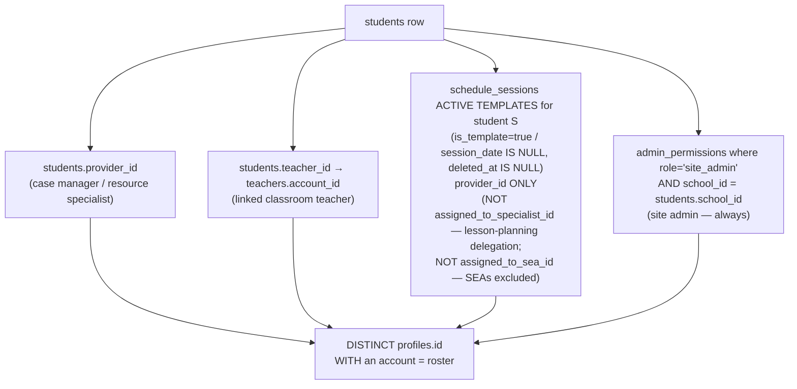
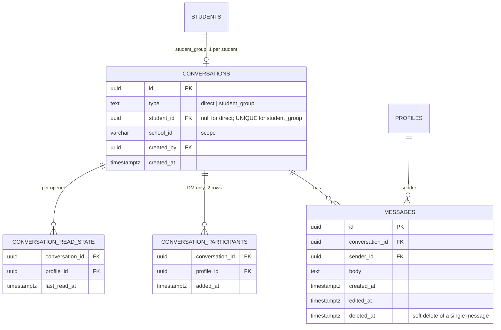

# Speddy — Chat Module Design

> **Status:** Design draft (2026-06-26). Not yet built. This is the design of
> record for the in-app messaging module; it realizes and generalizes the
> **Communications Hub** Linear project
> (<https://linear.app/speddy/project/communications-hub-c70cbc2328e1>).
>
> **Companion docs:** `docs/ARCHITECTURE.md` (domain model — roles, scoping,
> RLS, the student↔team links this module derives from).
>
> **Author:** Blair Stewart (product) + Claude Code (design). Decisions in §3 are
> locked per the 2026-06-26 design conversation; items in §10 are still open.

---

## 1. Summary

A chat module, available in the **site-admin, teacher, and provider** portals,
that gives people who already share context two ways to talk:

1. **Direct messages (DMs)** — 1:1 conversations between any two people who share
   a **site**.
2. **Student group chats** — one chat per **student**, whose participants are
   **automatically derived** from everyone currently linked to that student
   (site admin, case manager / resource specialist, other assigned providers, and
   the linked teacher). The student is the spine; the roster is a live projection
   of the existing assignment data and is **not hand-editable**.

This is **greenfield** — there is no existing messaging, chat, notification, or
Supabase Realtime code in the repo today (verified 2026-06-26). Every primitive
below is new.

### How this relates to the Communications Hub project
The Communications Hub project framed a **case-manager ↔ gen-ed-teacher**,
per-student, logged channel as the long-term secondary north star, sequenced
*after* SSO and the Middle/High module. This module **pulls that forward and
generalizes it**: it's elementary-first too, includes the full student team (not
just CM↔teacher), and adds same-site DMs. The Hub's principles still hold and are
adopted here: anchored to a student, not a compliance/enforcement tool, case
manager owns the truth (chat does not edit accommodations).

**Sequencing:** this module may be built **before or in parallel with SSO**
(decided 2026-06-26) — it is not gated on the SSO project. Login friction for
teachers without accounts is handled by the account caveat (§4), not by blocking
the build.

---

## 2. Conversation types

| | **Direct (DM)** | **Student group** |
|---|---|---|
| Cardinality | Exactly 2 people | N people (derived) |
| Who's eligible | Two people who **share a site** | Everyone currently **linked to the student** who has an account |
| Membership source | **Explicit** (stored) | **Derived** (computed live, not stored) |
| Editable roster | n/a (always the 2) | **No** — not hand-editable |
| Anchored to | nothing | a `students` row (one chat per student) |
| Created | on first message between the pair | lazily, on first open/message for the student |

DMs are **1:1 only** in v1. Ad-hoc multi-person DMs are explicitly out of scope
(see §11).

---

## 3. Locked decisions (the load-bearing ones)

These were decided in the 2026-06-26 design conversation and drive the schema.

1. **Roster is a live projection, not a snapshot.** Student-group membership is
   recomputed from current assignments on every access. Reassign a provider and
   they drop off; assign a new one and they appear — with no background job and no
   stored roster to drift.

2. **Messages belong to the student and are never deleted on membership change.**
   History is permanent regardless of who comes or goes. A message from a case
   manager who later gets reassigned **stays** in the chat.

3. **Access follows current linkage — for the *whole* conversation, history
   included.**
   - **Lose your link** to the student → you lose access to the entire chat,
     including everything you previously wrote and read. (Your messages remain
     visible to those still linked; you just can't see the chat anymore.)
   - **Gain a link** to the student → you immediately get access to the **full
     back-history** of that student's chat, including messages sent before you
     arrived. This is intentional: you're now on the student's team.

4. **DMs are 1:1, between people who share a site.**

5. **Realtime is in v1, polish is not.** Core live message streaming (Supabase
   Realtime) ships in v1 because realtime is the end goal and it's *additive* on
   top of the same schema/RLS. Deferred: typing indicators, presence/online
   dots, read receipts, push/email notifications.

> **Why "derive, don't materialize" is the right call.** Decisions 1–3 together
> mean access is a pure function of *current linkage*, and history is immutable.
> That is exactly what a derived-membership model gives you for free: there is no
> participant table to keep in sync with assignment changes (which would require
> fragile triggers on `students` and `schedule_sessions`), and there is no
> per-message access bookkeeping. One function answers "can this user see this
> conversation right now?" and it's always correct.

---

## 4. Who is "linked to a student"

The student-group roster is the union of four existing link sources (see
`docs/ARCHITECTURE.md` §3, §6). Each must resolve to a `profiles.id` that has a
real account.



- **Case manager / resource specialist** — `students.provider_id`. Almost always
  present.
- **Linked classroom teacher** — `students.teacher_id → teachers.account_id`.
- **Providers who deliver the student's sessions** — distinct `provider_id`s from
  the student's **active *template*** `schedule_sessions`, where
  **`is_template = true` (equivalently `session_date IS NULL`) and
  `deleted_at IS NULL`**. This is how a speech/OT/counseling provider (who is
  never the `students.provider_id` case manager) links to a student they serve.
  **`assigned_to_specialist_id` is deliberately omitted** — a specialist assigned
  to a session purely for **lesson planning** on a student owned by another case
  manager is *not* on that student's chat team (decided 2026-06-26).
  **`assigned_to_sea_id` is also omitted** — SEAs are excluded (see below).
  **Not** all non-deleted session rows.
  > **Why templates only:** `schedule_sessions` retains dated *instance* rows as
  > history (completed/past occurrences are not always soft-deleted), and the
  > scheduler models a *current* assignment as the template row, not its
  > instances (`session_date IS NULL` — see `lib/services/session-update-service.ts:493`,
  > `lib/scheduling/optimized-scheduler.ts:734`, `lib/scheduling/session-requirement-sync.ts:149`).
  > Unioning all non-deleted rows would keep a **former** assignee in the roster
  > via their leftover historical instances, contradicting §3 (lost linkage →
  > lost access). Narrowing to active templates makes "currently assigned" exact.
- **Site admin** — anyone with a `site_admin` grant in `admin_permissions`
  scoped to the student's `school_id`. Always included.

**District admins are *not* chat participants** (decided 2026-06-26). Only
**site** admins are auto-added. District admins retain their oversight access to
the underlying data via existing RLS, but are not added to student chats.

**SEAs / paraprofessionals do *not* get chat at all** (decided 2026-06-26). The
`sea` role is excluded from the entire module — neither auto-added to student
group chats (hence `assigned_to_sea_id` is omitted above) nor given the DM
surface. They are still on the student's care team operationally; they just don't
participate in chat. **This is enforced at the authorization layer, not just the
UI:** `is_chat_eligible()` returns false for `sea` and is a factor of every
`can_access` check and the `conversation_participants` insert policy (§6), so a
SEA can't read or send even if a participant row is somehow created for them.

### The account caveat (must be surfaced in UI, not hidden)
A teacher (`teachers.account_id`) can be **linked to a student but have no
login**. Someone with no account literally cannot be a chat participant. So
"everyone linked is automatically included" carries an asterisk: *everyone linked
**who has an account***. The UI should state this honestly (e.g. "4 of 6 team
members have accounts") rather than implying full coverage.

### Decisions deferred to §10
- **Secondary / many-teachers (SPE-194):** today `students.teacher_id` is a
  single FK, so on secondary sites the "linked teachers" set is structurally
  incomplete. The roster will inherit that gap until rostering lands; the
  function should be written so it picks up multiple teachers automatically once
  the data model supports it.

---

## 5. Data model

Three new tables. No participant table for student groups (membership is
derived); DMs store their two participants.



- **`conversations`** — `type` is `direct | student_group`. For `student_group`,
  `student_id` is set and **unique** (one chat per student); created lazily on
  first open/message. For `direct`, `student_id` is null. `school_id` carries
  scope for RLS and cleanup. A DM pair **must** be deduped by a **unique index on
  the normalized participant pair** (the source of truth, race-safe under
  concurrent creation); a deterministic pre-insert lookup is only an optimization
  to avoid a failed insert, not the dedupe guarantee.
- **`messages`** — append-only in spirit. `deleted_at` allows soft-deleting a
  *single* message (author/admin moderation) without breaking history; it does
  **not** model the membership-driven access in §3 (that's RLS).
- **`conversation_participants`** — **DM only.** Exactly two rows per direct
  conversation. Student groups have **no** rows here; their membership is the
  function in §6.
- **`conversation_read_state`** — one row per (conversation, person who has
  opened it), holding `last_read_at`. Drives unread badges/counts. Written when a
  user opens a conversation. Works identically for both types.

---

## 6. Access control (RLS)

RLS is the real authorization layer (`docs/ARCHITECTURE.md` §2). Two helper
functions, both `SECURITY DEFINER`:

1. **`chat_is_student_participant(student_id uuid, uid uuid) returns boolean`** —
   true iff `uid` is in the union of the four sources in §4 for that student,
   *right now*. This is the live-membership check.
2. **`get_student_chat_participants(student_id uuid) returns setof uuid`** — the
   same union, returned as a set, for **display** ("who's in this chat") and for
   the account-coverage note.

A single boolean gate per conversation drives all message RLS:

```text
can_access(conversation c, uid) :=
    is_chat_eligible(uid)                            -- excludes sea and district_admin (see below)
    AND (
      c.type = 'direct'
        ? EXISTS (conversation_participants where conversation_id = c.id and profile_id = uid)
    : c.type = 'student_group'
        ? chat_is_student_participant(c.student_id, uid)
    : false
    )
```

`is_chat_eligible(uid)` is a `SECURITY DEFINER` boolean that returns false for the
`sea` and `district_admin` roles, evaluated against `profiles.role`. It is the
**authorization-layer** enforcement of the SEA and district-admin exclusions
(§4) — not a UI concern. Because it's a factor of `can_access`, an excluded role
can never read or send in *any* conversation (group or DM) even if a
`conversation_participants` row is created for them by a buggy API path or an
admin action. It also gates DM eligibility: `open_direct_conversation` requires
both people to be chat-eligible (so you cannot start a DM with a SEA or district
admin), in addition to sharing a site.

Policy sketch (illustrative, not final SQL):

- **`conversations` SELECT** — `can_access(row, auth.uid())`.
- **`messages` SELECT / INSERT** — the message's conversation passes
  `can_access(...)` for `auth.uid()`; INSERT additionally requires
  `sender_id = auth.uid()`.
- **`conversation_participants`** — visible to the two members; **INSERT requires
  `is_chat_eligible(profile_id)`** (so a `sea` row is rejected at the DB, not just
  hidden in the UI) and is created only via the DM-creation path (server-side),
  constrained to same-site eligibility.
- **`conversation_read_state`** — a user may read/write **only their own** row.

> **Performance.** `chat_is_student_participant` runs inside RLS, so it must be
> cheap: indexed lookups on `students.provider_id`, `students.teacher_id`,
> `schedule_sessions(student_id)`, and `admin_permissions(school_id, role)`, and
> marked `STABLE`. If per-row RLS evaluation becomes hot (e.g. listing many
> messages), the message-list query should gate **once at the conversation
> level** in the API layer and rely on the conversation-scoped `WHERE` rather
> than re-evaluating membership per message row.

> **Why a reassigned person loses history access "for free":** they simply stop
> satisfying `chat_is_student_participant`, so `can_access` returns false for the
> whole conversation on their next request. Nothing is deleted; visibility is
> recomputed. Symmetrically, a newly-assigned person starts satisfying it and
> sees the full history. This is decision §3.3 implemented as one predicate.

---

## 7. Realtime

- **In v1:** Supabase Realtime on `messages` (Postgres changes), so new messages
  stream into an open conversation without a refresh. Realtime respects RLS, so
  the same `can_access` gate governs what a subscriber receives — no separate
  authorization path. Work involved: enable replication on `messages`, a client
  subscription hook scoped to the open `conversation_id`, and
  reconnection/backfill handling (on reconnect, fetch missed messages using a
  **stable monotonic cursor** — order and page by `(created_at, id)`, not
  `created_at` alone, so colliding timestamps can't skip or duplicate a message).
- **Deferred (post-v1 polish):** typing indicators, presence/online status, read
  receipts, and out-of-app notifications (push/email/digest). None block a
  usable chat.

---

## 8. FERPA, retention, and audit

These messages are **student-linked PII**. This module is a natural first
consumer of real audit logging.

- **Audit (SPE-169).** `audit_logs` is scaffolded but unwired (table empty,
  `logAccess()` never called). Chat is the **first** real consumer. **Decided
  (Phase 3):** log **message sends, conversation opens, and deletes**
  **server-side** so it can't be skipped — a trigger on `messages` INSERT
  (`chat.message_sent`), a `log_conversation_open(conversation_id)` RPC
  (`chat.conversation_opened`), and the delete RPC (`chat.message_deleted`). Audit
  rows are **kept forever**. Per the Hub principle, this is access logging, **not**
  a teacher "scorecard" — no per-teacher analytics surface.
- **Moderation.** **Decided (Phase 3):** a sender may **soft-delete their own**
  message and a **site admin may soft-delete any** message in chats they're in;
  **no editing**. Enforced via a `delete_chat_message(message_id)` SECURITY
  DEFINER RPC (messages have no UPDATE RLS policy, so the RPC is the sole write
  path) setting `deleted_at = now()`; deleted messages render as "message
  deleted". `messages.edited_at` stays provisioned but unused.
- **Retention / deletion.** **Decided (Phase 3): keep history forever.** Student
  deletion (`app/api/admin/students/[studentId]`, `docs/ARCHITECTURE.md` §7)
  already cascades the `student_group` conversation, its messages, and all derived
  per-conversation state (`conversation_read_state`) via `ON DELETE CASCADE` from
  `conversations` — verified in the DB, so nothing is orphaned and the Realtime
  publication stays consistent, with no age-out job. DMs are not student-anchored
  and are unaffected by student deletion.
- **Scope containment.** A `direct` conversation is constrained to two people who
  share a site at creation time; a `student_group` is school-scoped via
  `students.school_id`. RLS never lets a message escape these scopes.

---

## 9. Surfaces (where it lives)

Available in the **site-admin, teacher, and provider** portals only (not the
public site, not `/internal`, and **not the SEA experience** — SEAs are excluded
from chat, see §4). Likely shape:

- A **chat entry point** in the navbar (with an unread badge) opening a
  conversation list: student group chats the user is in + their DMs.
- A **per-student chat** reachable from the student's detail view, so the chat
  sits next to the student context it's about (matches the Hub's "messages live
  in context, not a generic inbox").
- **Middleware** route guard for the chat routes; RLS is the real gate.

**SEAs are excluded from chat entirely** (§4) — they get no navbar entry point,
no student group chats, and no DMs, even for students they serve via
`assigned_to_sea_id`.

---

## 10. Open questions

All of the original build-blocking questions are now decided across Phases 1–3.

**Resolved:**
- *District admins are not chat participants* — only site admins are auto-added
  (2026-06-26; §4).
- *SEAs / paraprofessionals are excluded entirely* — no group chats, no DMs, no
  surface; enforced at the authorization layer via `is_chat_eligible` (which also
  excludes `district_admin`) (2026-06-26; §4, §6).
- *DM eligibility ("share a site")* — the union of `provider_schools`,
  `profiles.school_id`, and site-admin `admin_permissions`; the people picker is
  scoped to the active school and DM threads are school-scoped (Phase 2,
  2026-06-27; §6).
- *Empty / again-eligible chats* — acceptable; a student with one linked account
  still has a (single-participant) chat.
- *Moderation* — sender **soft-deletes their own** message; a **site admin
  soft-deletes any** message in chats they're in; **no editing** (2026-06-27; §8).
- *Audit granularity* — log message **sends, conversation opens, and deletes**,
  **server-side**; audit rows kept forever; not a teacher "scorecard"
  (2026-06-27; §8).
- *Message retention* — **keep forever**; student deletion cascades the chat +
  messages + read-state, no age-out job (2026-06-27; §8).
- *Notifications / presence / typing / receipts* — **deferred** to a later polish
  pass: in-app first, then a "respects teacher time" email digest (Hub open item).

---

## 11. Out of scope (for now)

- Ad-hoc / hand-picked group DMs (only 1:1 DMs and derived student groups).
- Editable student-group rosters (membership is always derived).
- Family-facing channel — a later Hub phase, gated on DPA/FERPA work (SPE-59).
- File/image attachments in messages.
- Typing indicators, presence, read receipts, push notifications (post-v1 polish).
- Cross-student or cohort chats.
- Any chat for **SEAs / paraprofessionals** — the `sea` role is excluded from the
  whole module (§4).

---

## 12. Rough phasing

| Phase | Scope |
|---|---|
| **0 — Foundation** | Schema (`conversations`, `messages`, `conversation_participants`, `conversation_read_state`), RLS, `chat_is_student_participant` + `get_student_chat_participants`. No UI. |
| **1 — Student group chats** | Derived group chat read/send, Realtime streaming, unread badges, participant + account-coverage display, surfaces in the 3 portals. |
| **2 — Direct messages** | 1:1 DMs with same-site eligibility, DM dedupe, conversation list. |
| **3 — Trust & polish** | Audit-log wiring (SPE-169), retention/cascade on student delete, moderation policy, then presence/typing/receipts/notifications as appetite allows. |

---

## Source of truth (when this is built, keep in sync)

- Schema: the new `conversations` / `messages` / `conversation_participants` /
  `conversation_read_state` migrations.
- Membership / eligibility: `chat_is_student_participant`,
  `get_student_chat_participants`, `is_chat_eligible` (role exclusion, e.g. `sea`).
- Linkage inputs: `students` (`provider_id`, `teacher_id`), `teachers.account_id`,
  `schedule_sessions` (`provider_id` only — **not** `assigned_to_specialist_id`,
  which is lesson-planning delegation, and **not** `assigned_to_sea_id`),
  `admin_permissions` — see `docs/ARCHITECTURE.md` §3, §6.
