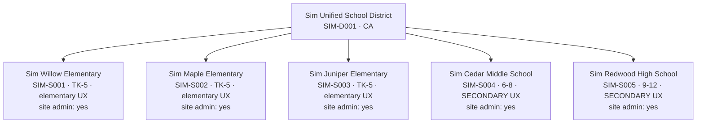

# Sim District — Specification

> **Status: spec approved; scripts implemented** (`scripts/sim-district/` —
> manifest, seed, teardown, verify; see §8). The first production seed is
> pending: run `npm run sim:reset -- --yes` locally (requires
> `SIM_DISTRICT_PASSWORD` alongside the Supabase env vars in `.env.local`),
> or add those env vars to the Claude remote environment so resets can run
> autonomously during verification sessions.
> This spec defines the permanent simulated district that lives in the
> production database so cross-role features can be exercised end-to-end
> (backend + frontend) by a human or by Claude Code, without real users.
>
> Companion to `docs/ARCHITECTURE.md` (roles, scoping, RLS, scheduling, CARE).
> After implementation this doc becomes the living reference for the sim
> district: persona cards, credentials pointers, and the verification
> workflow.

---

## 1. Purpose & non-goals

**Purpose.** Speddy spans many user types (district admins, site admins,
providers, SEAs, teachers) whose interactions can't be tested from one seat.
The sim district is a persistent, identifiably-fake, fully-deletable tenant in
the production database that:

- exercises the **real** RLS policies, triggers, cron jobs, and deployed
  config — not a copy of them;
- gives every feature a ready-made cast of personas to walk through flows
  role-by-role (via Playwright for the UI, Supabase queries for the DB);
- can be reset to a known state before any verification run;
- can be deleted entirely, at any time, by construction.

**Non-goals.**

- Not a performance / load-testing fixture (data volumes are deliberately small).
- Not a demo environment for prospects (that can be a later fork of this work).
- Not a way to test **schema migrations** — migrations can't be scoped to one
  district and stay under the existing stop-and-discuss rule.
- Not a substitute for real-user feedback on UX; it tests role/scope/flow
  **correctness**, not desirability.

---

## 2. Safety invariants (guardrails)

These are the rules that make "fake data in prod" survivable. Every script and
every future addition to the sim district must preserve all seven.

1. **Everything is manifest-keyed.** Every sim row either carries a
   manifest-owned ID — fixed in the manifest, or deterministically derived
   from the manifest's UUIDv5 namespace + natural keys, so the full set is
   enumerable from the manifest without DB access — or foreign-keys
   (directly or transitively) to one. The single exception: **auth users**,
   whose UUIDs Supabase assigns at creation. Their manifest-owned identity
   is the sim-domain **email**; teardown and verify resolve email → id at
   runtime and treat the resolved ids as manifest-owned. No other
   exceptions, no ad-hoc rows.
2. **No unscoped writes, ever.** Seed/teardown scripts never issue a delete or
   update whose WHERE clause is not an equality match on a manifest-owned
   identity — a fixed manifest ID, a `SIM-` district/school id, or the
   auth-user id of a sim persona. (The existing `scripts/seed.js` violates
   this by design — it wipes whole tables with the service role. Deleting it
   is a **blocking prerequisite** of the implementation PR: the invariant is
   not satisfied while that script exists.)
3. **Shared reference data is read-only.** `states`, real rows in
   `districts`/`schools`, `assessment_types`, `material_constraints`,
   `school_year_config`, `holidays` (global rows) are never written by sim
   scripts. The sim district writes only rows it owns.
4. **The manifest declares every table the sim may touch — in two sets.**
   *Seeded* tables (rows planted by `seed.ts` with fixed manifest IDs) and
   *swept* tables (rows the app itself creates during verification runs,
   cleaned by FK-equality to sim identities). Adding a table to either set is
   a reviewable diff to the manifest, not a silent script change.
5. **Sim identities are fake by construction.** No sim user is ever
   `is_speddy_admin`. No real person's name or email. No real student data is
   ever copied in — all student content is fictional (see naming conventions).
6. **Credentials are never committed.** The sim password secret lives in
   `.env.local` (`SIM_DISTRICT_PASSWORD`); docs reference the env var only.
7. **Teardown is verified, not assumed.** After teardown, a verify pass counts
   rows referencing any manifest ID across all declared tables and must find
   zero (auth users included).

---

## 3. Identity & namespace

Four conventions make sim data recognizable at a glance in any UI list, log,
or query result — and collision-proof against real NCES/CDS data:

| Thing | Convention | Example |
|---|---|---|
| District/school IDs (`varchar` PKs) | `SIM-` prefix (NCES/CDS ids are numeric — collision impossible) | `SIM-D001`, `SIM-S001` |
| Org display names | Start with `Sim ` | `Sim Willow Elementary` |
| People (profiles, teachers, student_details, CARE names) | Surname ends `-Sim` | `Rachel Okafor-Sim` |
| Emails | All under one sim domain | `rsp.willow@sim.speddy.test` |
| Domain-row UUIDs (students, sessions, …) | Fixed in the manifest, or UUIDv5-derived from the manifest's namespace + natural key — either way enumerable from the manifest alone | stable across reseeds |

**Email domain — recommendation: `sim.speddy.test`.** `.test` is an
IETF-reserved TLD: mail is undeliverable by design, and nobody can ever own
it. No flow requires the sim to *receive* email (users are created with
`email_confirm: true` via the admin API; passwords are set directly, so no
reset emails are needed). `profiles.district_domain` becomes
`sim.speddy.test`, which keeps any email-domain-matching logic self-contained
— sim users can never domain-match a real user. There is **no real-inbox
fallback**: every sim email lives under the sim domain, no exceptions
(anything else would contradict invariant 5 and could route future
notifications to a real mailbox). If a feature someday needs to test actual
mail delivery, that is a §10 lifecycle decision — design per-channel
suppression first — not a standing carve-out.
*Implementation prerequisite:* verify app-side email validation accepts
`.test` addresses. If anything rejects them, that is an implementation
**blocker** to surface to the owner — fix the over-strict validator (`.test`
is an RFC-reserved TLD) or explicitly re-decide the namespace together;
never a silent fallback to a different domain.

**Auth users** are keyed by email in the manifest (Supabase assigns their
UUIDs at creation; a lookup helper resolves email → id at runtime). All other
seeded rows use fixed manifest UUIDs so tests and docs can reference stable
IDs forever.

**Per-persona passwords, one secret.** A single `SIM_DISTRICT_PASSWORD`
secret lives in `.env.local` (and in the local env Claude Code runs with);
each persona's actual password is derived from it deterministically (HMAC of
the persona email, shaped to satisfy the password policy — exact scheme in
`manifest.ts`). No two personas share a password — a leaked provider
credential doesn't unlock admin accounts — yet there is exactly one secret to
manage, and rotation is re-running `sim:reset` with a new value.

---

## 4. District shape

One unified district, **five schools** — sized to mirror real local CA
districts (owner decision, 2026-07-10):



| Field | District | Willow | Maple | Juniper | Cedar | Redwood |
|---|---|---|---|---|---|---|
| `id` | `SIM-D001` | `SIM-S001` | `SIM-S002` | `SIM-S003` | `SIM-S004` | `SIM-S005` |
| `name` | Sim Unified School District | Sim Willow Elementary | Sim Maple Elementary | Sim Juniper Elementary | Sim Cedar Middle School | Sim Redwood High School |
| type / span | `Unified`, `CA` | `Elementary`, TK–5 | `Elementary`, TK–5 | `Elementary`, TK–5 | `Middle`, 6–8 | `High`, 9–12 |

**Why this shape:**

- **Three elementaries** make district-level surfaces behave like a real
  district (rollups, pickers, cross-school staffing comparisons) instead of a
  toy, and give itinerant providers realistic multi-site assignments.
- **Every site is fully staffed** — a site admin at all five schools and RSP
  coverage everywhere (owner correction, 2026-07-10: unstaffed sites are the
  rare exception in reality, so the sim doesn't model them). What varies is
  the staffing *pattern*: Willow runs one at-cap RSP; Maple and Juniper each
  combine a full-time RSP with a shared two-site itinerant RSP — the
  configuration the owner sees in real local districts.
- **Willow** is the main stage — full elementary scheduling surface
  (Schedule, Bell Schedules, Special Activities, Plan), the SEA, and the
  single at-cap RSP caseload (§6).
- **Cedar (6–8)** and **Redwood (9–12)** exercise the trimmed secondary UX
  (`isSecondarySchool`, ARCHITECTURE §9), the "Case Manager" teacher view,
  and the SPE-193/SPE-194 territory at both middle- and high-school level.
- District sits under real `CA` (states are shared reference data; CARE
  Lane B's 15-day timeline is CA Ed Code-based).

*Deliberately absent for now:* a K-8 combined site (the "classified
elementary by product decision" classification edge) — add a sixth school
when work targets that logic. *TK note:* the schools span TK–5, but seeded
students only use grade values the app demonstrably supports — whether `TK`
works as a `grade_level` (students, bell schedules) is verified at
implementation; if it doesn't, TK-age students are seeded as `K` and the gap
is logged as a product ticket rather than papered over.

---

## 5. Personas

**Eighteen login personas + eighteen record-only teachers.** Every persona
earns its place one of two ways: it exercises a distinct scoping rule or UX
branch, **or** it exists because real districts are staffed that way (owner
rule, 2026-07-10: every site has a site admin and RSP coverage — unstaffed
sites are the rare exception, so the sim doesn't model them).

### Login personas

| # | Name | Role | School(s) | Email (localpart) | Exists to exercise |
|---|---|---|---|---|---|
| 1 | Dana Alvarez-Sim | `district_admin` | whole district | `district.admin` | District-wide `admin_permissions` scope; rollups across 5 schools and 8 providers |
| 2 | Priya Natarajan-Sim | `site_admin` | Willow | `siteadmin.willow` | School-scoped admin: teacher accounts, student CRUD, master schedule |
| 3 | Elena Rodriguez-Sim | `site_admin` | Maple | `siteadmin.maple` | Admin over a school staffed by a full-time **and** an itinerant RSP |
| 4 | Kwame Mensah-Sim | `site_admin` | Juniper | `siteadmin.juniper` | Same multi-provider staffing view from the second elementary |
| 5 | Marcus Webb-Sim | `site_admin` | Cedar | `siteadmin.cedar` | Admin portal on a secondary (middle) site — admin UX is *not* trimmed; verifies that |
| 6 | Naomi Castillo-Sim | `site_admin` | Redwood | `siteadmin.redwood` | Admin portal on a high school; grades 9–12 rosters |
| 7 | Rachel Okafor-Sim | `resource` | Willow | `rsp.willow` | Single-site RSP **at the CA statutory cap (28 students)** — the densest realistic schedule; supervises the SEA; bell schedules, groups |
| 8 | Alicia Grant-Sim | `resource` | Maple | `rsp.maple` | Full-time RSP #2 (26 students); cross-provider district rollups |
| 9 | Derek Holloway-Sim | `resource` | Juniper | `rsp.juniper` | Full-time RSP #3 (24 students); rounds out one-per-elementary coverage |
| 10 | Maria Vasquez-Sim | `resource` | Maple + Juniper | `rsp.itinerant` | **The owner-described pattern:** a two-site itinerant RSP with ~10 students per school, layered on top of each site's full-timer |
| 11 | Hannah Cho-Sim | `resource` | Cedar | `rsp.cedar` | Middle-school case manager — secondary-only provider at 6–8 |
| 12 | Victor Chen-Sim | `resource` | Redwood | `rsp.redwood` | High-school case manager — secondary-only provider at 9–12 (with Hannah: the trimmed UX as a provider's *entire* experience, at both secondary levels) |
| 13 | Tomás Reyes-Sim | `speech` | Willow (primary) + Juniper + Cedar | `slp.itinerant` | **3-site itinerant near the 55-case SLP average (48)**: `provider_schools` M:N + `is_primary`, `user_site_schedules` workdays, school switcher, mixed elementary/secondary UX |
| 14 | Jun Park-Sim | `ot` | Maple (primary) + Redwood | `ot.itinerant` | **Both UXes on one login** — elementary UX at Maple, trimmed secondary UX at Redwood (§9's exact scenario); OT service type |
| 15 | Leah Kim-Sim | `sea` | Willow | `sea.willow` | `delivered_by='sea'` delegation (`assigned_to_sea_id`); lesson **view-only** RLS; no schedule editing |
| 16 | Nora Ellison-Sim | `teacher` (gr 3) | Willow | `teacher.willow.1` | Teacher dashboard with a roster (`students.teacher_id`); linked `teachers.account_id`; submits CARE Lane A referral |
| 17 | David Osei-Sim | `teacher` (gr 5) | Willow | `teacher.willow.2` | Teacher **empty state** — zero SPED students |
| 18 | Fatima Haddad-Sim | `teacher` (gr 7) | Cedar | `teacher.cedar` | Secondary teacher view: "Case Manager" label, accommodations-first student page |

### Record-only teachers (no login)

`teachers` rows with `account_id = NULL`, `created_by_admin = true` — the
"teacher exists as a record, not an account" state that admin rosters and the
(currently broken, SPE-95) invite flow deal with. **Eighteen across all five
schools** (5 at Willow, 4 at Maple, 4 at Juniper, 2 at Cedar, 3 at Redwood),
so every school's roster looks staffed and every seeded student has a
homeroom teacher to hang off. Names (all `-Sim`) and grade assignments live
in the manifest.

**Deliberately absent from v1:** `counseling`, `psychologist`,
`specialist`, `intervention` personas (they behave identically to the seeded
provider roles at the RLS/delivery layer — `delivered_by='specialist'`); a
high-school **teacher login** (record-only HS teachers hold the rosters;
Fatima covers the secondary teacher UX); a second district; a state-scoped
admin. Each is a small manifest addition when a feature actually targets it.

---

## 6. Students & caseloads

**202 student rows** across eight caseloads, sized to CA reality (owner
decisions, 2026-07-10): California caps resource specialist caseloads at
**28** (Ed Code §56362 — a hard per-provider cap) and sets a **55-case
average** for SLPs (Ed Code §56363.3 — a SELPA-wide average, not a
per-provider cap; local plans may allow more); OT has no CA statutory cap
(seeded at a typical ~18). The sim deliberately seeds the lead RSP **at
cap** — if Speddy
strains anywhere at legal caseload sizes (students list, schedule grid,
dashboards), the sim district should be the first place that shows, not a
real school.

Students are provider-owned rows (`students.provider_id`), so "one child on
two caseloads" is genuinely two rows — the sim reflects the model as it
exists, including that quirk:

| Caseload | School(s) | Count | Notable rows |
|---|---|---|---|
| Rachel (RSP) | Willow | **28 — at the CA cap** | spread TK/K–5 across Nora + 5 record-only teachers; 3 in Nora's class; **1 with zero scheduled sessions** (unscheduled alert); 2 in a group session |
| Alicia (RSP) | Maple | 26 | full-time caseload #2 |
| Derek (RSP) | Juniper | 24 | full-time caseload #3 |
| Maria (RSP, itinerant) | Maple 10 · Juniper 10 | 20 | the owner-described two-site RSP pattern, layered over each site's full-timer |
| Hannah (RSP) | Cedar | 18 | secondary-only site: full caseload/goals/accommodations data, **no session instances** (see §7) |
| Victor (RSP) | Redwood | 20 | secondary-only site: same posture as Hannah, at 9–12 |
| Tomás (SLP) | Willow 15 · Juniper 15 · Cedar 18 | **48 (of the 55 average)** | 2 Willow students are the "same child" as Rachel rows (cross-provider identity quirk, on purpose); Cedar students feed Fatima's gr-7 roster alongside Hannah's |
| Jun (OT) | Maple 8 · Redwood 10 | 18 | elementary + high-school split on one login |

**The manifest holds generator rules, not 126 hand-written rows.** Per
caseload: counts, grade distributions, teacher assignments, and
minutes/frequency mixes — plus an explicit list of the edge-case rows above.
Student UUIDs are UUIDv5 of a fixed namespace + natural key
(`student:willow:rsp:007`), so generated rows keep stable, greppable IDs
across reseeds without hand-maintaining a giant list. Because the namespace
and natural keys live in the manifest, preflight, teardown, and verify
enumerate exactly the same derived ID set — generated rows sit inside the
same safety contract (invariants 1–2) as hand-fixed ones.

Field conventions:

- `initials` only in `students` (as the model intends); fictional full names +
  DOBs live in `student_details` with `-Sim` surnames.
- Both scoping systems set on every row: legacy text (`school_site`,
  `school_district`) **and** structured FKs (`school_id`, `district_id`,
  `state_id`), plus `teacher_name` text **and** `teacher_id` FK — mirroring
  the dual-system reality (ARCHITECTURE §3).
- `sessions_per_week` 1–3, `minutes_per_session` 20–30, varied per caseload
  rules.
- `student_details` for ~60 students: 2–3 `iep_goals`, `accommodations`,
  `upcoming_iep_date` / `upcoming_triennial_date` spread across the next 12
  months (feeds the IEP-meetings feature), a few stale `goals_iep_date`
  values.

---

## 7. Seeded domain data

Small but representative; exact values live in the manifest.

| Table | What gets seeded |
|---|---|
| `bell_schedules` | Willow, Maple, Juniper: each grade × Mon–Fri (AM block, recess, lunch, PM block). Cedar & Redwood: **none** (secondary — surface hidden). `school_year` from a manifest constant. |
| `school_hours` | Per provider per **elementary** site they serve (table is provider-scoped). |
| `special_activities` | Each elementary: PE / Music / Library entries against its teachers (school-wide visibility). |
| `user_site_schedules` | Tomás: Willow Mon–Tue, Juniper Wed, Cedar Thu–Fri. Jun: Maple Mon–Wed, Redwood Thu–Fri. Maria: Maple Mon–Wed, Juniper Thu–Fri. |
| `schedule_sessions` | **Elementary sites only** (see policy below): templates matching each student's `sessions_per_week`, plus instances **2 weeks back / 2 weeks forward** of the seed date (weekday-aligned) — 136 elementary-caseload students (Rachel 28 + Alicia 26 + Derek 24 + Maria 20 + Tomás 30 + Jun 8) × 1–3/wk over 4 weeks ≈ 900–1,300 dated instances, trivial for the DB, realistic for the UI. Includes: sessions delegated to Leah (`delivered_by='sea'`, `assigned_to_sea_id`), group sessions (`group_id`/`group_name`/`group_color`), 1 `manually_placed`, past instances partially completed with `session_notes`. `service_type` matches provider role. |
| `attendance` | Marked for most past-week instances (mix of present/absent with `absence_reason`). |
| `teachers` | 3 linked (teacher login personas via `account_id`) + 18 record-only, across all five schools. |
| `care_referrals` + case tree | 6 referrals across Willow, Cedar, and Redwood: **(a)** Lane A `teacher_concern` from Nora, `pending`; **(b)** Lane A `active` with `care_cases` row, 2 meeting notes, 1 action item assigned to Rachel, status history; **(c)** Lane B `parent_written_request` → born `initial` with case + `ap_due_date = request_received_date + 15 days`; **(d)** one `closed` (full lifecycle); **(e)** one **soft-deleted** (`deleted_at` set — verifies list exclusion); **(f)** one at Redwood referred by Naomi (secondary-site referral). Student names are free-text fictional (`Maya Torres-Sim`), loosely matching seeded students. Referrers spread across teacher/provider/admin. |
| `admin_permissions` | Dana → district scope; Priya → Willow; Elena → Maple; Kwame → Juniper; Marcus → Cedar; Naomi → Redwood. |
| `provider_schools` | Rachel → Willow (primary). Alicia → Maple (primary). Derek → Juniper (primary). Maria → Maple (primary) + Juniper. Hannah → Cedar (primary). Victor → Redwood (primary). Tomás → Willow (primary) + Juniper + Cedar. Jun → Maple (primary) + Redwood. Legacy text + FK ids both set. |

**Secondary-site session policy.** Speddy's scheduling surfaces are hidden on
secondary sites today (client-side, SPE-193), so the sim matches the
product's posture: Hannah's Cedar caseload, Victor's Redwood caseload, and
the secondary halves of Tomás/Jun carry full student, goal, and
accommodation data plus `sessions_per_week` metadata, but **no session
instances** are seeded there — the sim only contains states reachable
through real product use. When secondary scheduling becomes real (SPE-194
territory), the generator gains those sites — and the sim is already shaped
to test it.

**Deliberately NOT seeded in v1** — features under test should create their
own data *through the app*, so creation flows get exercised too:

| Skipped | Why |
|---|---|
| `lessons`, `worksheets`, `exit_tickets`, `progress_checks` | AI-generated content; AI is gated off (`AI_FEATURES_ENABLED`), and generation costs real API tokens |
| Chat (`conversations`, `messages`, …) | Cross-role feature best created live during its own tests |
| IEP meetings (`iep_meetings`, `student_parent_contacts`, tokens, availability) | Feature in active development — **prime first customer** of the sim district; its tests create this data through the UI |
| Staffing (`staff`, `staff_hours`, `yard_duty_*`, `instruction_schedules`, rotations) | Site-admin master-schedule surface; add to the manifest when a feature there needs it |
| `todos`, `documents`, `curriculum_tracking`, `calendar_events`, `api_keys`, `teams` | Personal/auxiliary; trivial manifest additions later |
| `analytics_events`, `audit_logs`, logs | Never seeded; sim-generated rows are swept by teardown (user-keyed) |

**The teardown contract covers verification-created rows too.** Rows the app
creates during a verification run (an IEP meeting scheduled through the UI, a
chat thread, sign-in log entries) belong to the sim from the moment a sim
identity creates them. Before a verification run exercises a new feature, its
tables join the manifest's **swept** set — cleaned by FK-equality to sim
identities (persona user ids, student ids, `SIM-` school/district ids) — and
`verify.ts` scans both seeded and swept sets for leftovers. A feature whose
rows are *not* reachable by sim-identity FK must add an explicit sim marker
as part of its verification setup, before the run happens. The manifest's two
declared-table sets are the authoritative version of this split; this section
summarizes intent.

---

## 8. Mechanics: `scripts/sim-district/`

```
scripts/sim-district/
  manifest.ts    ← THE single source of truth: every fixed ID, persona,
                    roster, schedule, and the declared-tables list
  seed.ts        ← full reset: teardown + seed (idempotent by construction)
  teardown.ts    ← delete ONLY by manifest-owned identities (fixed IDs +
                    sim-identity FK sweeps); children → parents → auth users
  verify.ts      ← post-seed sanity counts; post-teardown orphan scan across
                    seeded AND swept tables (must be 0); always read-only
```

npm scripts: `sim:reset`, `sim:teardown`, `sim:verify` (all `npx tsx`).
Env requirements are scoped per command: all three need
`NEXT_PUBLIC_SUPABASE_URL` + `SUPABASE_SERVICE_ROLE_KEY`;
`SIM_DISTRICT_PASSWORD` is required **only** by `sim:reset` (it sets persona
passwords) — read-only `sim:verify` and delete-only `sim:teardown` never
receive the credential secret.

**Preflight, before any write.** Scripts hard-fail unless: **(a)** the
project ref extracted from `NEXT_PUBLIC_SUPABASE_URL` equals the ref pinned
in `manifest.ts` — env vars alone don't prove which database you're pointed
at; **(b)** the sim sentinel checks out — district `SIM-D001` exists with
the exact expected name; on first seed, sentinel-absent is **not** taken as
proof of emptiness — bootstrap requires a manifest-wide zero-state check
(no SIM-owned IDs and no sim-domain auth users anywhere), so a half-failed
prior seed is a preflight failure to clean up via teardown, never something
to seed over; and **(c)** the destructive scripts (`sim:teardown`,
`sim:reset`) were invoked with an explicit `--yes` flag. `sim:verify` is
read-only and always safe to run.

**Concurrency.** All sim writers are operator-controlled — verification runs
and open sim browser sessions. Production cron jobs only *delete* aged rows;
they never create sim data. So v1's rule is operational, not mechanical:
don't run teardown mid-verification, and close sim sessions first. Teardown
is idempotent — if `verify` finds stragglers from a forgotten session, re-run
it. A teardown lock / app-level maintenance mode is deliberately out of scope
until sim runs become automated or concurrent (e.g. CI), where a real race
would exist.

**Fidelity ladder** (which creation path each layer uses):

1. **Auth users + profiles** → `auth.admin.createUser` with
   `email_confirm: true` and role metadata (the live
   `on_auth_user_created → handle_new_user` trigger creates the skeleton
   profile — verified against the prod DB), then the
   `create_profile_for_new_user` RPC (`INSERT … ON CONFLICT (id) DO UPDATE`)
   enriches it, resolving the structured FK ids by school/district name.
   This is the exact two-step sequence the real admin creation routes use
   (`app/api/admin/create-teacher-account`, `app/api/admin/district/*`).
   Seed order matters: schools are seeded before users so name→id resolution
   works; afterwards the seed **asserts** the resolved FK ids equal the
   manifest values rather than trusting the name matcher blindly.
2. **Domain rows** (students, sessions, bell schedules, CARE, …) →
   service-role inserts with fixed manifest UUIDs, always setting **both**
   legacy-text and structured-FK scoping fields.
3. **Flows under active test** → never pre-seeded; driven through the real
   UI/API as a sim persona during the verification run itself.

**Determinism.** All IDs and rosters are constant. The only moving part is
dates: session instances/attendance are planted relative to the seed date
(2 weeks back / 2 weeks forward); `school_year` and IEP dates come from
manifest constants reviewed yearly. Reseeding shifts the date window,
nothing else.

**Legacy cleanup (one-time, part of first implementation PR):**

- Delete `scripts/seed.js` — **blocking prerequisite** (invariant 2): its
  unscoped service-role table wipes + unchecked errors are a live footgun
  with no remaining purpose.
- The three Hayward Unified logins (`district-test@husd.us`,
  `admin-test@husd.us`, `provider-test@husd.us`) **stay** — owner decision,
  2026-07-10: they were handed to a **prospective customer** for future
  hands-on testing. From now on they are customer-facing demo accounts, not
  internal test accounts — sim tooling never touches them and verification
  runs never log into them. Consequence: `scripts/create-test-accounts.ts`
  is still **deleted** — re-running it wipes and recreates those three auth
  users, which would reset the customer's passwords and orphan any data she
  creates. The accounts stay; the reset tool goes. (Hayward district/school
  reference rows were never in question — shared reference data.)

---

## 9. How a verification run works

The loop this district exists for — the owner asks *"run feature X through
the sim district"* and gets back a defensible *"everything checks out"* (or
a precise account of what doesn't):

1. **Reset:** `npm run sim:reset -- --yes` → known-good state, stable IDs.
2. **Walk the personas:** for each affected persona, drive the real UI with
   Playwright — log in with the persona's derived password, perform the
   flow, assert what they **see and can do**, and equally what they **must
   not** see (the SEA edit-block, the cross-school leak, the
   secondary-hidden nav).
3. **Check the backend:** assert DB state underneath via Supabase
   (RLS-relevant rows, triggers fired, scoping columns correct).
4. **Report:** the Sim Run Report (below).

**The deliverable — a Sim Run Report.** Every run ends with the same
artifact, so "checks out" always means the same thing:

- **Scope:** the change under test, which personas are affected, and which
  flows were walked. Any affected persona *not* walked is listed as
  **not covered** — never silently implied to pass.
- **Per persona:** positive assertions (what they saw and did, screenshots
  where useful) **and negative assertions** (what they must not see or do).
  Negative space is mandatory, not optional — most multi-role bugs are
  leaks, and a run that only checks happy paths proves nothing about
  scoping.
- **DB layer:** the rows/RLS effects verified underneath the UI.
- **Verdict:** pass / fail per persona. Anything ambiguous is flagged for a
  human call, never rounded up to a pass.

**Where it points:**

- **Pre-merge code** → `localhost:3000` (branch build) against the prod DB +
  sim district. No new environments, but new code is exercised before it
  ships. *(Migrations excluded — existing stop-and-discuss rule.)*
- **Post-merge** → the production URL, same personas, as deploy verification.

**First candidate:** the IEP-meetings feature (SPE-206/SPE-208 just landed;
its tables are empty in prod). It spans site-admin rules, provider scheduling,
teacher availability, and parent confirmation — a perfect cross-role shakeout.

---

## 10. Lifecycle: when the calculus changes

Triggers to revisit this spec (tracked here so they don't rely on memory):

| Trigger | Action |
|---|---|
| **First real district onboards** | **Blocking precondition, not a nice-to-have:** add the `districts.is_test` flag (migration — discuss first) and wire pickers, analytics, and exports to exclude the sim structurally *before* any real user can see a picker. Re-evaluate whether the sim should move to a Supabase branch. Until that day, name/ID conventions suffice — no one but us sees the pickers, and the flag would be speculative schema surface. *Note:* a prospective customer already holds the Hayward-scoped demo logins (§8), so this trigger is closer than "zero users" suggests — the moment she begins actively testing, treat it as fired. |
| **AI features enabled** (SPE-174) | Sim-driven generation burns real API budget; keep generation steps deliberate and budgeted in verification runs. |
| **Billing / payments return** | Sim users need an explicit exemption path before any billing integration ships. |
| **Outbound email / notifications ship** | Re-confirm the sim domain can never receive or leak mail; decide per-channel whether sim users are suppressed or plus-addressed. |
| **Secondary rostering ships (SPE-194)** | Today the sim mirrors the current one-teacher-per-student model even at Cedar/Redwood — a known simplification the owner has flagged (real secondary students have a teacher per period). When multi-teacher rostering lands, the sim gains per-period teacher assignments and the secondary session seeding switches on (§7). |
| **Any new integration** | Standing question in its design: *"what does the sim district do here?"* |

---

## 11. Decisions log & remaining questions

**Resolved 2026-07-10 (owner review):**

1. **Email domain:** `@sim.speddy.test`, exclusively (no real-inbox
   fallback).
2. **Shape:** 5 schools — 3 elementary (TK–5), 1 middle (6–8), 1 high
   (9–12) — mirroring the owner's local CA districts (§4).
3. **Naming:** "Sim Unified" + botanical school names — approved.
4. **History depth:** 2 weeks back / 2 weeks forward — approved.
5. **Caseloads at CA scale:** RSP seeded at the 28-student statutory cap;
   SLP at 48 against CA's 55-case average threshold (§56363.3); OT ~18.
   Standing requirement: the sim stays valid at legal caseload maxima —
   realism is the point (§6).
6. **Multi-site providers:** SLP across 3 sites, OT across 2 (one
   elementary + one secondary) — very common in real districts (§5).
7. **Deferred roles** (`psychologist`, `counseling`, `intervention`):
   confirmed deferred until a feature targets them.
8. **Standing quality bar:** the district must "live and breathe" like a
   real district — the owner asks for a feature run, and gets back a Sim Run
   Report (§9) they can trust without re-checking by hand.
9. **Full staffing everywhere (round 2):** every site has a site admin;
   every elementary has a full-time RSP, plus a fourth RSP splitting Maple
   and Juniper at ~10 students each — the pattern the owner sees in real
   districts. The earlier "no-site-admin" and "RSP vacancy" edge cases were
   dropped as unrealistic. Cedar and Redwood each carry a secondary RSP
   (case manager) to honor the every-site-has-an-RSP rule.
10. **SLP/OT presence at secondary sites:** kept deliberately — it buys the
    both-UXes-on-one-login coverage (§5 #13–14) and speech/OT services do
    continue at secondary when IEPs require them, at the modest volumes
    seeded here. Owner flagged uncertainty; swappable without ripple if a
    realism review says otherwise.
11. **Secondary multi-teacher reality:** the one-teacher-per-student model
    is a known gap the owner wants baked in eventually — tracked as SPE-194
    and now a named lifecycle trigger (§10).

12. **Hayward logins stay** (resolved 2026-07-10): the three `@husd.us`
    demo accounts were given to a prospective customer for future testing
    and remain untouched — customer-facing from now on, never used by sim
    tooling or verification runs. `scripts/create-test-accounts.ts` is
    still deleted (re-running it would reset her credentials and orphan
    her data — §8). Standing isolation assertion: nothing sim-namespaced
    may ever be reachable from Hayward-scoped accounts (enforced by
    school/district scoping; spot-checked in runs that touch
    district-wide surfaces).
13. **Secondary session policy confirmed** (resolved 2026-07-10): the sim
    shows exactly what a production user would experience — no seeded
    session instances at secondary sites while the product hides
    scheduling there (§7).

**Still open:** none — the spec is implementation-ready.

---

*Source of truth once implemented: `scripts/sim-district/manifest.ts` (IDs,
personas, declared tables); this doc (intent, guardrails, workflow);
`docs/ARCHITECTURE.md` (the domain model the sim exercises).*
