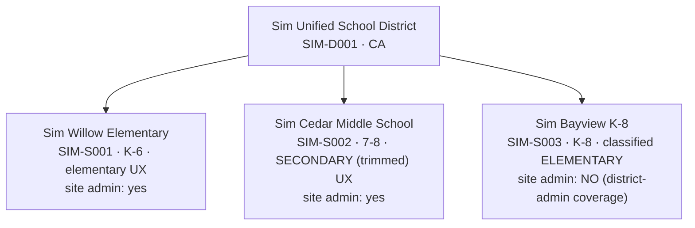

# Sim District — Specification

> **Status: DRAFT — for review.** Nothing in this document is implemented yet.
> This spec defines the permanent simulated district that lives in the
> production database so cross-role features can be exercised end-to-end
> (backend + frontend) by a human or by Claude Code, without real users.
>
> Companion to `docs/ARCHITECTURE.md` (roles, scoping, RLS, scheduling, CARE).
> After implementation this doc becomes the living reference for the sim
> district: persona cards, credentials pointers, and the verification
> workflow.

---

## 1. Purpose & non-goals

**Purpose.** Speddy spans many user types (district admins, site admins,
providers, SEAs, teachers) whose interactions can't be tested from one seat.
The sim district is a persistent, identifiably-fake, fully-deletable tenant in
the production database that:

- exercises the **real** RLS policies, triggers, cron jobs, and deployed
  config — not a copy of them;
- gives every feature a ready-made cast of personas to walk through flows
  role-by-role (via Playwright for the UI, Supabase queries for the DB);
- can be reset to a known state before any verification run;
- can be deleted entirely, at any time, by construction.

**Non-goals.**

- Not a performance / load-testing fixture (data volumes are deliberately small).
- Not a demo environment for prospects (that can be a later fork of this work).
- Not a way to test **schema migrations** — migrations can't be scoped to one
  district and stay under the existing stop-and-discuss rule.
- Not a substitute for real-user feedback on UX; it tests role/scope/flow
  **correctness**, not desirability.

---

## 2. Safety invariants (guardrails)

These are the rules that make "fake data in prod" survivable. Every script and
every future addition to the sim district must preserve all seven.

1. **Everything is manifest-keyed.** Every sim row either carries a fixed ID
   declared in the manifest or foreign-keys (directly or transitively) to one.
   No exceptions, no ad-hoc rows.
2. **No unscoped writes, ever.** Seed/teardown scripts never issue a delete or
   update whose WHERE clause is not an equality match on a manifest-owned
   identity — a fixed manifest ID, a `SIM-` district/school id, or the
   auth-user id of a sim persona. (The existing `scripts/seed.js` violates
   this by design — it wipes whole tables — and is removed as part of this
   work.)
3. **Shared reference data is read-only.** `states`, real rows in
   `districts`/`schools`, `assessment_types`, `material_constraints`,
   `school_year_config`, `holidays` (global rows) are never written by sim
   scripts. The sim district writes only rows it owns.
4. **The manifest declares every table the sim may touch — in two sets.**
   *Seeded* tables (rows planted by `seed.ts` with fixed manifest IDs) and
   *swept* tables (rows the app itself creates during verification runs,
   cleaned by FK-equality to sim identities). Adding a table to either set is
   a reviewable diff to the manifest, not a silent script change.
5. **Sim identities are fake by construction.** No sim user is ever
   `is_speddy_admin`. No real person's name or email. No real student data is
   ever copied in — all student content is fictional (see naming conventions).
6. **Credentials are never committed.** The shared sim password lives in
   `.env.local` (`SIM_DISTRICT_PASSWORD`); docs reference the env var only.
7. **Teardown is verified, not assumed.** After teardown, a verify pass counts
   rows referencing any manifest ID across all declared tables and must find
   zero (auth users included).

---

## 3. Identity & namespace

Four conventions make sim data recognizable at a glance in any UI list, log,
or query result — and collision-proof against real NCES/CDS data:

| Thing | Convention | Example |
|---|---|---|
| District/school IDs (`varchar` PKs) | `SIM-` prefix (NCES/CDS ids are numeric — collision impossible) | `SIM-D001`, `SIM-S001` |
| Org display names | Start with `Sim ` | `Sim Willow Elementary` |
| People (profiles, teachers, student_details, CARE names) | Surname ends `-Sim` | `Rachel Okafor-Sim` |
| Emails | All under one sim domain | `resource.willow@sim.speddy.test` |
| Domain-row UUIDs (students, sessions, …) | Fixed UUIDs checked into the manifest | stable across reseeds |

**Email domain — recommendation: `sim.speddy.test`.** `.test` is an
IETF-reserved TLD: mail is undeliverable by design, and nobody can ever own
it. No flow requires the sim to *receive* email (users are created with
`email_confirm: true` via the admin API; passwords are set directly, so no
reset emails are needed). `profiles.district_domain` becomes
`sim.speddy.test`, which keeps any email-domain-matching logic self-contained
— sim users can never domain-match a real user. There is **no real-inbox
fallback**: every sim email lives under the sim domain, no exceptions
(anything else would contradict invariant 5 and could route future
notifications to a real mailbox). If a feature someday needs to test actual
mail delivery, that is a §10 lifecycle decision — design per-channel
suppression first — not a standing carve-out.
*Implementation prerequisite:* verify app-side email validation accepts
`.test` addresses; if anything rejects them, fall back to a subdomain we own
(e.g. `sim.speddy.app`) with no MX record — still never a personal inbox.

**Auth users** are keyed by email in the manifest (Supabase assigns their
UUIDs at creation; a lookup helper resolves email → id at runtime). All other
seeded rows use fixed manifest UUIDs so tests and docs can reference stable
IDs forever.

**Per-persona passwords, one secret.** A single `SIM_DISTRICT_PASSWORD`
secret lives in `.env.local` (and in the local env Claude Code runs with);
each persona's actual password is derived from it deterministically (HMAC of
the persona email, shaped to satisfy the password policy — exact scheme in
`manifest.ts`). No two personas share a password — a leaked provider
credential doesn't unlock admin accounts — yet there is exactly one secret to
manage, and rotation is re-running `sim:reset` with a new value.

---

## 4. District shape

One district, three schools, chosen so the org chart itself is a test matrix:



| Field | District | Willow | Cedar | Bayview |
|---|---|---|---|---|
| `id` | `SIM-D001` | `SIM-S001` | `SIM-S002` | `SIM-S003` |
| `name` | Sim Unified School District | Sim Willow Elementary | Sim Cedar Middle School | Sim Bayview K-8 |
| `state_id` | `CA` (real state — required for state-scoped pickers/flows) | — | — | — |
| `school_type` | `Unified` (district_type) | `Elementary` | `Middle` | `K-8` |
| `grade_span` | — | K–6 | 7–8 | K–8 |

**Why these three:**

- **Willow** is the main stage — Speddy is elementary-first, so the full
  scheduling surface (Schedule, Bell Schedules, Special Activities, Plan)
  lives here.
- **Cedar** is secondary → exercises the trimmed provider/teacher/SEA UX
  (`isSecondarySchool`, ARCHITECTURE §9), the "Case Manager" teacher view, and
  the known gaps SPE-193/SPE-194 whenever we work in that area.
- **Bayview** is the classification edge case: K-8 is **elementary by product
  decision** despite spanning middle grades. It also deliberately has **no
  site admin**, so district-admin-only coverage paths get exercised.
- District sits under real `CA` (states are shared reference data; CARE
  Lane B's 15-day timeline is CA Ed Code-based).

---

## 5. Personas

Ten login personas + four record-only teachers. Every persona exists to
exercise a specific scoping rule or UX branch — if a persona doesn't earn its
place with a distinct behavior, it's not in v1.

### Login personas

| # | Name | Role | School(s) | Email (localpart) | Exists to exercise |
|---|---|---|---|---|---|
| 1 | Dana Alvarez-Sim | `district_admin` | whole district | `district.admin` | District-wide `admin_permissions` scope; cross-school rollups; sole admin coverage for Bayview |
| 2 | Priya Natarajan-Sim | `site_admin` | Willow | `siteadmin.willow` | School-scoped admin: teacher accounts, student CRUD, master schedule |
| 3 | Marcus Webb-Sim | `site_admin` | Cedar | `siteadmin.cedar` | Admin portal on a **secondary** site (admin UX is *not* trimmed — verifies that) |
| 4 | Rachel Okafor-Sim | `resource` | Willow | `resource.willow` | Single-site provider; largest caseload; supervises the SEA (delegated sessions); bell schedules, groups |
| 5 | Tomás Reyes-Sim | `speech` | Willow (primary) + Bayview | `speech.itinerant` | Itinerant: `provider_schools` M:N + `is_primary`, `user_site_schedules` workdays, school switcher, cross-school caseload |
| 6 | Jun Park-Sim | `ot` | Bayview (primary) + Cedar | `ot.itinerant` | **Both UXes on one login** — elementary UX at Bayview, trimmed secondary UX at Cedar (§9's exact scenario) |
| 7 | Leah Kim-Sim | `sea` | Willow | `sea.willow` | `delivered_by='sea'` delegation (`assigned_to_sea_id`); lesson **view-only** RLS; no schedule editing |
| 8 | Nora Ellison-Sim | `teacher` (gr 3) | Willow | `teacher.willow.1` | Teacher dashboard with a roster (`students.teacher_id`); linked `teachers.account_id`; submits CARE Lane A referral |
| 9 | David Osei-Sim | `teacher` (gr 5) | Willow | `teacher.willow.2` | Teacher **empty state** — zero SPED students |
| 10 | Fatima Haddad-Sim | `teacher` (gr 7) | Cedar | `teacher.cedar` | Secondary teacher view: "Case Manager" label, accommodations-first student page |

### Record-only teachers (no login)

`teachers` rows with `account_id = NULL`, `created_by_admin = true` — the
"teacher exists as a record, not an account" state that admin rosters and the
(currently broken, SPE-95) invite flow deal with:

| Name | School | Grade |
|---|---|---|
| Omar Bautista-Sim | Willow | K |
| Grace Lindqvist-Sim | Willow | 1 |
| Henry Adeyemi-Sim | Cedar | 8 |
| Ines Moreau-Sim | Bayview | 2 |

**Deliberately absent from v1:** `counseling`, `psychologist`,
`specialist`, `intervention` personas (they behave identically to the seeded
provider roles at the RLS/delivery layer — `delivered_by='specialist'`); a
second district; a state-scoped admin. Each is a small manifest addition when
a feature actually targets it.

---

## 6. Students & caseloads

**15 student rows** across three caseloads. Students are provider-owned rows
(`students.provider_id`), so "one child on two caseloads" is genuinely two
rows — the sim reflects the model as it exists, including that quirk:

| Caseload | School | Count | Notable rows |
|---|---|---|---|
| Rachel (resource) | Willow | 6 (K–5) | 3 in Nora's class (`teacher_id` → Nora); 2 with record-only teachers; **1 with zero scheduled sessions** (unscheduled alert); 1 in a group session |
| Tomás (speech) | Willow | 3 | 1 is the "same child" as a Rachel student (same initials + teacher — the cross-provider identity quirk, on purpose) |
| Tomás (speech) | Bayview | 2 | grades 1 and 6 (K-8 span) |
| Jun (ot) | Bayview | 2 | — |
| Jun (ot) | Cedar | 2 | grade 7, both in Fatima's class → feeds her secondary roster |

Field conventions:

- `initials` only in `students` (as the model intends); fictional full names +
  DOBs live in `student_details` with `-Sim` surnames.
- Both scoping systems set on every row: legacy text (`school_site`,
  `school_district`) **and** structured FKs (`school_id`, `district_id`,
  `state_id`), plus `teacher_name` text **and** `teacher_id` FK — mirroring
  the dual-system reality (ARCHITECTURE §3).
- `sessions_per_week` 1–3, `minutes_per_session` 20–30, varied.
- `student_details` for ~8 of 15: 2–3 `iep_goals`, `accommodations`,
  `upcoming_iep_date` / `upcoming_triennial_date` spread across the next 12
  months (feeds the IEP-meetings feature), one stale `goals_iep_date`.

---

## 7. Seeded domain data

Small but representative; exact values live in the manifest.

| Table | What gets seeded |
|---|---|
| `bell_schedules` | Willow: grades K–6 × Mon–Fri (AM block, recess, lunch, PM block). Bayview: K–8 equivalent. Cedar: **none** (secondary — surface hidden). `school_year` from a manifest constant. |
| `school_hours` | Per provider per school for Willow + Bayview (table is provider-scoped). |
| `special_activities` | Willow: PE / Music / Library for Nora + record-only teachers (school-wide visibility). |
| `user_site_schedules` | Tomás: Willow Mon–Wed, Bayview Thu–Fri. Jun: Bayview Mon–Tue, Cedar Wed–Thu. |
| `schedule_sessions` | Templates matching each student's `sessions_per_week`, plus instances **2 weeks back / 2 weeks forward** of the seed date (weekday-aligned). Includes: 1 session delegated to Leah (`delivered_by='sea'`, `assigned_to_sea_id`), 1 group session (2–3 students, `group_id`/`group_name`/`group_color`), 1 `manually_placed`, past instances partially completed with `session_notes`. `service_type` matches provider role. |
| `attendance` | Marked for most past-week instances (mix of present/absent with `absence_reason`). |
| `teachers` | 4 linked (login personas 8–10 + `account_id`) + 4 record-only. |
| `care_referrals` + case tree | 5 referrals: **(a)** Lane A `teacher_concern` from Nora, `pending`; **(b)** Lane A `active` with `care_cases` row, 2 meeting notes, 1 action item assigned to Rachel, status history; **(c)** Lane B `parent_written_request` → born `initial` with case + `ap_due_date = request_received_date + 15 days`; **(d)** one `closed` (full lifecycle); **(e)** one **soft-deleted** (`deleted_at` set — verifies list exclusion). Student names are free-text fictional (`Maya Torres-Sim`), loosely matching seeded students. Referrers spread across teacher/provider/admin. |
| `admin_permissions` | Dana → district scope; Priya → Willow; Marcus → Cedar. |
| `provider_schools` | Rachel → Willow (primary). Tomás → Willow (primary) + Bayview. Jun → Bayview (primary) + Cedar. Legacy text + FK ids both set. |

**Deliberately NOT seeded in v1** — features under test should create their
own data *through the app*, so creation flows get exercised too:

| Skipped | Why |
|---|---|
| `lessons`, `worksheets`, `exit_tickets`, `progress_checks` | AI-generated content; AI is gated off (`AI_FEATURES_ENABLED`), and generation costs real API tokens |
| Chat (`conversations`, `messages`, …) | Cross-role feature best created live during its own tests |
| IEP meetings (`iep_meetings`, `student_parent_contacts`, tokens, availability) | Feature in active development — **prime first customer** of the sim district; its tests create this data through the UI |
| Staffing (`staff`, `staff_hours`, `yard_duty_*`, `instruction_schedules`, rotations) | Site-admin master-schedule surface; add to the manifest when a feature there needs it |
| `todos`, `documents`, `curriculum_tracking`, `calendar_events`, `api_keys`, `teams` | Personal/auxiliary; trivial manifest additions later |
| `analytics_events`, `audit_logs`, logs | Never seeded; sim-generated rows are swept by teardown (user-keyed) |

**The teardown contract covers verification-created rows too.** Rows the app
creates during a verification run (an IEP meeting scheduled through the UI, a
chat thread, sign-in log entries) belong to the sim from the moment a sim
identity creates them. Before a verification run exercises a new feature, its
tables join the manifest's **swept** set — cleaned by FK-equality to sim
identities (persona user ids, student ids, `SIM-` school/district ids) — and
`verify.ts` scans both seeded and swept sets for leftovers. A feature whose
rows are *not* reachable by sim-identity FK must add an explicit sim marker
as part of its verification setup, before the run happens. The manifest's two
declared-table sets are the authoritative version of this split; this section
summarizes intent.

---

## 8. Mechanics: `scripts/sim-district/`

```
scripts/sim-district/
  manifest.ts    ← THE single source of truth: every fixed ID, persona,
                    roster, schedule, and the declared-tables list
  seed.ts        ← full reset: teardown + seed (idempotent by construction)
  teardown.ts    ← delete ONLY by manifest-owned identities (fixed IDs +
                    sim-identity FK sweeps); children → parents → auth users
  verify.ts      ← post-seed sanity counts; post-teardown orphan scan across
                    seeded AND swept tables (must be 0); always read-only
```

npm scripts: `sim:reset`, `sim:teardown`, `sim:verify`
(all `npx tsx`, all requiring `NEXT_PUBLIC_SUPABASE_URL`,
`SUPABASE_SERVICE_ROLE_KEY`, `SIM_DISTRICT_PASSWORD` from `.env.local`).

**Preflight, before any write.** Scripts hard-fail unless: **(a)** the
project ref extracted from `NEXT_PUBLIC_SUPABASE_URL` equals the ref pinned
in `manifest.ts` — env vars alone don't prove which database you're pointed
at; **(b)** the sim sentinel checks out — district `SIM-D001` exists with the
exact expected name (or, on first seed only, is absent); and **(c)** the
destructive scripts (`sim:teardown`, `sim:reset`) were invoked with an
explicit `--yes` flag. `sim:verify` is read-only and always safe to run.

**Concurrency.** All sim writers are operator-controlled — verification runs
and open sim browser sessions. Production cron jobs only *delete* aged rows;
they never create sim data. So v1's rule is operational, not mechanical:
don't run teardown mid-verification, and close sim sessions first. Teardown
is idempotent — if `verify` finds stragglers from a forgotten session, re-run
it. A teardown lock / app-level maintenance mode is deliberately out of scope
until sim runs become automated or concurrent (e.g. CI), where a real race
would exist.

**Fidelity ladder** (which creation path each layer uses):

1. **Auth users + profiles** → `auth.admin.createUser` with
   `email_confirm: true` and role metadata (the live
   `on_auth_user_created → handle_new_user` trigger creates the skeleton
   profile — verified against the prod DB), then the
   `create_profile_for_new_user` RPC (`INSERT … ON CONFLICT (id) DO UPDATE`)
   enriches it, resolving the structured FK ids by school/district name.
   This is the exact two-step sequence the real admin creation routes use
   (`app/api/admin/create-teacher-account`, `app/api/admin/district/*`).
   Seed order matters: schools are seeded before users so name→id resolution
   works; afterwards the seed **asserts** the resolved FK ids equal the
   manifest values rather than trusting the name matcher blindly.
2. **Domain rows** (students, sessions, bell schedules, CARE, …) →
   service-role inserts with fixed manifest UUIDs, always setting **both**
   legacy-text and structured-FK scoping fields.
3. **Flows under active test** → never pre-seeded; driven through the real
   UI/API as a sim persona during the verification run itself.

**Determinism.** All IDs and rosters are constant. The only moving part is
dates: session instances/attendance are planted relative to the seed date
(2 weeks back / 2 weeks forward); `school_year` and IEP dates come from
manifest constants reviewed yearly. Reseeding shifts the date window,
nothing else.

**Legacy cleanup (one-time, part of first implementation PR):**

- Delete `scripts/seed.js` (unscoped table wipes + unchecked errors — a
  service-role footgun with no remaining purpose).
- Absorb and remove the Hayward Unified test accounts
  (`scripts/create-test-accounts.ts`: `district-test@husd.us`,
  `admin-test@husd.us`, `provider-test@husd.us`) — they live inside a **real**
  district's namespace on a **real** district's email domain, which is exactly
  what the sim district exists to avoid. The script is retired in favor of
  `sim:reset`. (The real Hayward district/school reference rows stay — they're
  legitimate reference data.)

---

## 9. How a verification run works

The loop this district exists for, e.g. "we changed X — verify it across
roles":

1. **Reset:** `npm run sim:reset` → known-good state, stable IDs.
2. **Walk the personas:** for each affected persona, drive the real UI with
   Playwright — log in (`SIM_DISTRICT_PASSWORD`), perform the flow, assert
   what they **see and can do**, and equally what they **must not** see
   (the SEA edit-block, the cross-school leak, the secondary-hidden nav).
3. **Check the backend:** assert DB state underneath via Supabase
   (RLS-relevant rows, triggers fired, scoping columns correct).
4. **Report:** persona-by-persona pass/fail, with screenshots where useful.

**Where it points:**

- **Pre-merge code** → `localhost:3000` (branch build) against the prod DB +
  sim district. No new environments, but new code is exercised before it
  ships. *(Migrations excluded — existing stop-and-discuss rule.)*
- **Post-merge** → the production URL, same personas, as deploy verification.

**First candidate:** the IEP-meetings feature (SPE-206/SPE-208 just landed;
its tables are empty in prod). It spans site-admin rules, provider scheduling,
teacher availability, and parent confirmation — a perfect cross-role shakeout.

---

## 10. Lifecycle: when the calculus changes

Triggers to revisit this spec (tracked here so they don't rely on memory):

| Trigger | Action |
|---|---|
| **First real district onboards** | **Blocking precondition, not a nice-to-have:** add the `districts.is_test` flag (migration — discuss first) and wire pickers, analytics, and exports to exclude the sim structurally *before* any real user can see a picker. Re-evaluate whether the sim should move to a Supabase branch. Until that day, name/ID conventions suffice — no one but us sees the pickers, and the flag would be speculative schema surface. |
| **AI features enabled** (SPE-174) | Sim-driven generation burns real API budget; keep generation steps deliberate and budgeted in verification runs. |
| **Billing / payments return** | Sim users need an explicit exemption path before any billing integration ships. |
| **Outbound email / notifications ship** | Re-confirm the sim domain can never receive or leak mail; decide per-channel whether sim users are suppressed or plus-addressed. |
| **Any new integration** | Standing question in its design: *"what does the sim district do here?"* |

---

## 11. Open questions for review

1. **Email domain:** `@sim.speddy.test` (recommended: undeliverable by
   design, self-contained `district_domain`) vs. plus-addressing on
   `bstew510@gmail.com` (real inbox for every persona, but
   `district_domain` becomes `gmail.com`)?
2. **Size:** 3 schools / 10 logins / 15 students — right ballpark for v1, or
   trim/grow anywhere?
3. **Names & shape:** happy with "Sim Unified" / Willow-Cedar-Bayview and the
   persona roster? (Pure taste — easy to change now, annoying later since IDs
   and docs will reference them.)
4. **History depth:** seed 2 weeks of past sessions + attendance (recommended
   — feeds dashboards/attendance widgets), or start schedules future-only?
5. **Hayward cleanup:** retire the three `@husd.us` test accounts in the same
   PR that first seeds the sim district (recommended), or keep both alive
   during a transition period?
6. **Additional provider roles** (`psychologist`, `counseling`,
   `intervention`): agree to defer until a feature targets them?

---

*Source of truth once implemented: `scripts/sim-district/manifest.ts` (IDs,
personas, declared tables); this doc (intent, guardrails, workflow);
`docs/ARCHITECTURE.md` (the domain model the sim exercises).*
